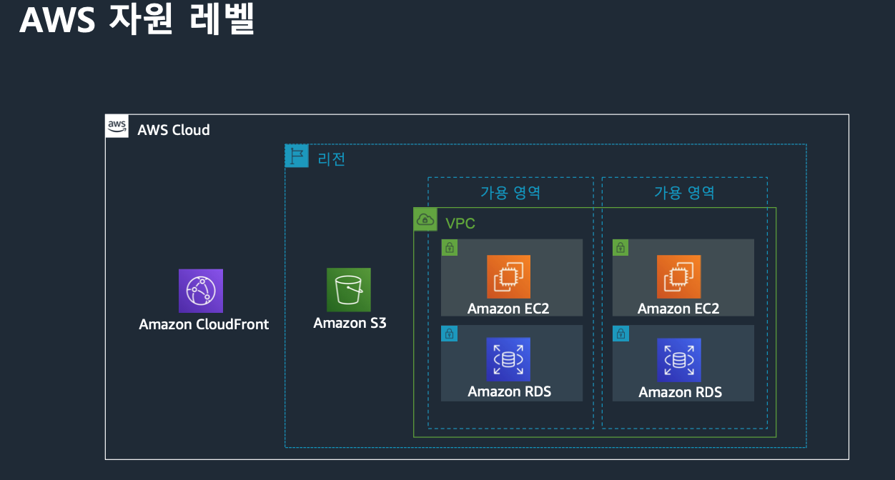

# General Immersion Day(10/18) 정리

# Infra Overview

## 리전(Region)과 가용영역(Availability Zone)

데이터센터의 모음 또는 그룹을 의미하며, AWS가 전 세계에서 데이터 센터를 클러스터링하는 물리적 위치를 뜻합니다.

2022년 현재 27개의 리전, 87개 가용영역(논리적 데이터 센터)이 존재합니다.

AWS 리전은 가용성, 확장성, 내결함성을 위해서 다중 가용역역으로 구성되며,따라서 리전내에 여러개의 가용영역(AZ)이 존재합니다. 가용영역은 완전히 격리된 환경에 구축되어 앞서 말한 가용성, 확장성, 내결함성을 충족하도록 설계됩니다.

## 콘텐츠 전송 네트워크(CDN)

최종 사용자에게 더 짧은 지연 시간으로 콘텐츠를 전송하기 위해 AWS CloudFront라는 CDN을 구축했습니다. CDN을 통해서 고객이 실제로 위치한 가장 가까운 곳에 캐싱을 제공하도록 합니다.

## 글로벌 네트워크

대양 횡단 케이블로 연결된 이중화된 100GbE로 구축했으며, 대륙횡단 케이블을 직접 설치하고 운용합니다.

## 전용 연결(Direct Connect)

데이터 센터, 사무실 또는 코로케이션 환경과 AWS 리전 사이에 직접 연결을 제공합니다.

# AWS Network

## VPC

Virtual Private Cloud의 약자이며 사용자가 정의한 가상의 네트워크 공간을 의미합니다.

IP와 Subnet의 범위, 라우팅 테이블 정의 등 완전한 네트워크 제어가 가능합니다.

VPC 내의 모든 EC2 인스턴스들은 Private IP가 부여되며, 이 뜻은 모든 EC2는 VPC내에 속해야함을 의미합니다.

물론 EC2 인스턴스에 Public IP를 할당할 수도 있습니다.(여기선 비용이 발생합니다.) 앞서 말한 CDN은 어떤 리전에도 속해있지 않습니다. S3는 VPC에 속하지 않고, 리전안에만 속해있습니다. 환경을 구성할때 이런 부분을 먼저 파악하고 작업해야합니다.

VPC안에 서브넷은 항상 있어야합니다.

서울에는 총 6개의 가용영역(AZ)이 있습니다. 그중 2개는 Wave length라 부르며 이동 통신사의 국사안에 존재한다.(SKT에 2개) Wave length는 자율 주행서비스처럼 고속 인터넷이 필요한 서비스를 위해 만들어 졌습니다.

VPC를 생성하는데 있어 첫번째 작업은 CIDR(Classless Inter-Domain Routing) 블록 주소 대역을 설정하는 것입니다. CIDR 방식을 통해 VPC 범위를 설정하고 같은 방법으로 VPC내의 Subnet을 구성할 수 있습니다.

그다음 인터넷 게이트웨이를 생성합니다. 인터넷 게이트웨이를 통해서 VPC의 내부 자원을 외부로 보낼 수 있습니다. 

Private Subnet이 외부와 통신하기 위해 Public Subnet에 NAT Gateway를 구성할 수 있습니다. (Private Subnet과 외부 자원이 직접 통신하는것은 보안상 적절하지 않습니다.)

# AWS Compute

## Elastic Compute Cloud(EC2)

Amazon Elastic Compute Cloud를 줄여서 EC2라고 부릅니다. EC2는 하이퍼바이저를 통해 가상화된 운영환경을 제공하는 기술.

EC2는 기본적으로 AMI와 EBS를 통해 구성됩니다.

- Amazon Machine Image(AMI)
    - 루트 볼륨을 구성하는 템플릿입니다. 즉, EC2 생성을 위한 이미지를 뜻합니다. (OS, 어플리케이션 등)
- Elastic Block Storage(EBS)
    - EC2 인스턴스에서 사용할 물리적 스토리지를 뜻합니다. 하나의 EBS 볼륨은 하나의 인스턴스에만 연결됩니다.
    - 스냅샷을 통해 특정 시점 백업이 가능합니다.
    

EC2의 상태는 크게 아래 3개로 구성됩니다.

- 실행중(Running)
- 정지됨(Stopped)
    - 정지됨 상태는 EBS 볼륨을 루트로 사용하는 인스턴스만 가질 수 있는 상태입니다. EC2가 정지 되었더라도 EBS 볼륨에 대한 과금은 발생 될 수 있습니다.
    - 정지됨에서 실행중으로 갈때 새로운 물리 서버를 찾는 과정이 있는데 이때 이전에 썻던 물리 서버를 사용하지 않게된다. IP의 변경이 발생할 수 있습니다.
- 종료됨(Terminated)
    - 인스턴스가 완전히 제거된 상태를 뜻하며, 시작이나, 정지가 불가능합니다.

네이밍을 통해 EC2자원의 특징을 파악할 수 있습니다. 

예를 들어 M5d.xlarge라는 자원이 있다면 아래와 같이 문자열 자리별로 인스턴스 유형을 파악할 수 있습니다. 

상세한 정보는 아래 사이트에서 확인 가능합니다. AWS에선 매년 개선된 인스턴스를 만들어 내기 때문에 가능하면 최신 세대의 인스턴스를 선택하는것이 비용절감에 효과적입니다.

**https://aws.amazon.com/ko/ec2/instance-types/**

## Elastic Load Balancing(ELB)

애플리케이션 트래픽을 분산해주는 역할을 하는 Computing 서비스입니다.

종류로는 Application, Network, Classic으로 총 3개가 있습니다. 

각 종류별 특징을 살펴보면 아래와 같습니다.

- Application Load Balaner
    - Layer 7(HTTP, HTTPS) 로드밸런싱을 담당합니다.
    - EC2, Container, AWS Lambda, Private IP주소에 대한 로드 밸런싱을 지원합니다.
- Network Load Balaner
    - Layer 4(TCP, UDP)의 로드밸런싱을 담당합니다.
    - EC2, Container, Private 주소에 대한 로드 밸런싱을 지원합니다.
- Classic Load Balaner
    - Layer 4,7을 모두 커버하는 로드 밸런서 입니다. (잘 사용하지 않는지 수업에서 별다른 언급이 없었습니다.)

## EC2 Auto Scaling

EC2 Auto Scaling를 통해 변화하는 수요에 동적으로 대응하고 비용을 최적화합니다.

## User Data

EC2의 User Data 기능을 통해서 인스턴스 실행시 쉘 스크립트를 실행할 수 있습니다. 

## Launch templates

Launch templates을 작성해서 EC2 인스턴스를 생성할 수 있습니다.

## CloudWatch

CloudWatch를 통해 AWS의 리소스 및 애플리케이션을 모니터링 할수 있습니다.

# AWS Database

쿼리 응답 시간 = I/O 타임 + cpu 타임 + 대기 이벤트

좋은 쿼리 = 적은 데이터 블럭을 빠른 I/O로 읽는 것

## 데이터 트렌드

매 5년마다 약 10배 증가하는 데이터가 증가하고 있으며, DevOps 도입으로 인한 데이터베이스에 대한 변화율이 증가 하고 있습니다.

## Amazon RDS

Amazon RDS는 가장 많이 선호하는 6가지 데이터베이스( Amazon Aurora, MySQL, PostgreSQL, MariaDB, SQLServer, Oracle)엔진을 갖춘 관계형 데이터 베이스입니다. 

몇 번의 클릭만으로 하드웨어 프로비저닝, 패치, 백업, 복구, 확장, 고가용성 등의 작업이 가능합니다. 또한, Built-in 된 모니터링 및 보안 기능을 제공합니다.

물리적으로 분리된 가용 영역에 standby 데이터베이스를 운영하여 가용성을 높입니다. (다중 AZ방식)

또한 읽기전용 복제본 생성을 통해서 읽기 업무에 대한 워크로드 부하를 완화합니다. 이 기능을 통해서 다른 지역의 애플리케이션에 데이터를 제공할 수 있으며, 장애 발생시엔 빠른 복구를 위해 읽기 전용 복제본을 마스터로 승격할 수 있습니다. (읽기전용 복제본 생성방식)

다중 AZ방식과 읽기전용 복제 방식의 특징은 아래와 같습니다.

# AWS Storage

## Elastic Block Store(EBS)

EBS는 AWS에서 제공하는 블록 스토리지입니다.

EC2에서 사용하도록 설계된 되었으며, EBS 볼륨을 통해서 파일 시스템을 생성하거나 블록 디바이스 자체로 활용합니다.

고성능 대규모 데이터처리, 트랜잭션 집약적인 워크로드 처리를 위해 사용됩니다.

EC2는 데이터 손실 방지를 위해 가용 영역 내에서 자동으로 볼륨을 복제합니다. 

## Elastic File System(EFS)

EFS는 AWS에서 제공하는 파일 스토리지입니다. 디렉토리 구조로 파일을 저장하며, 스토리지 레벨에서 파일 시스템을 생성합니다. 

## Simple Storage Service(S3)

S3는 AWS에서 제공하는 오브젝트 스토리지입니다. REST 기반의 API 호출을 통해서 데이터에 접근할 수 있습니다.

S3의 데이터는 3곳 이상의 물리적으로 분리된 가용 영역에 저장되어 있습니다. 또한 S3는 Multi-destination 복제를 통해 오브젝트를 동일 리전 또는 다른 리전에 복사 합니다.

S3의 내구성을 99.999999999%입니다.

