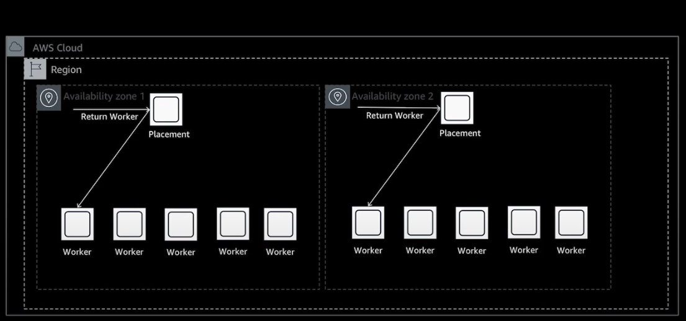
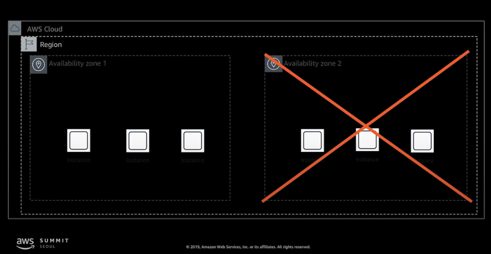
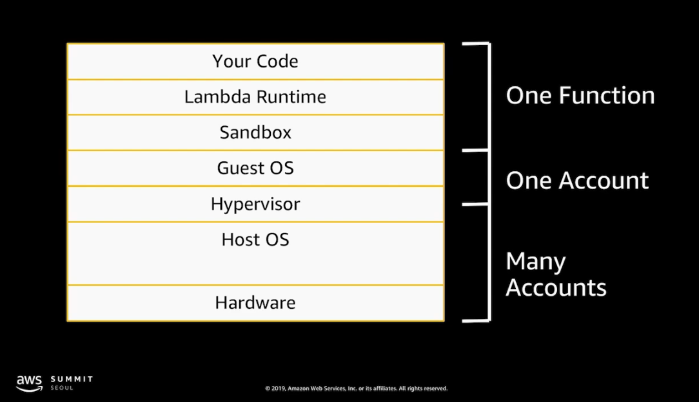
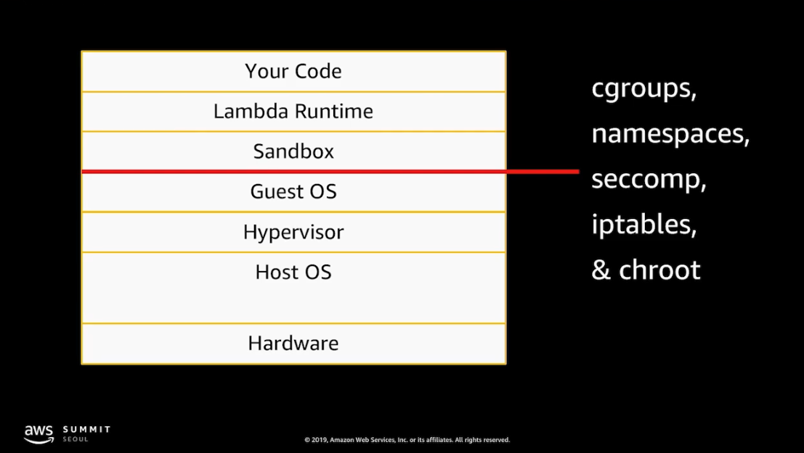
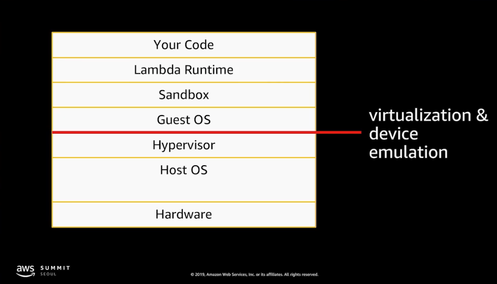
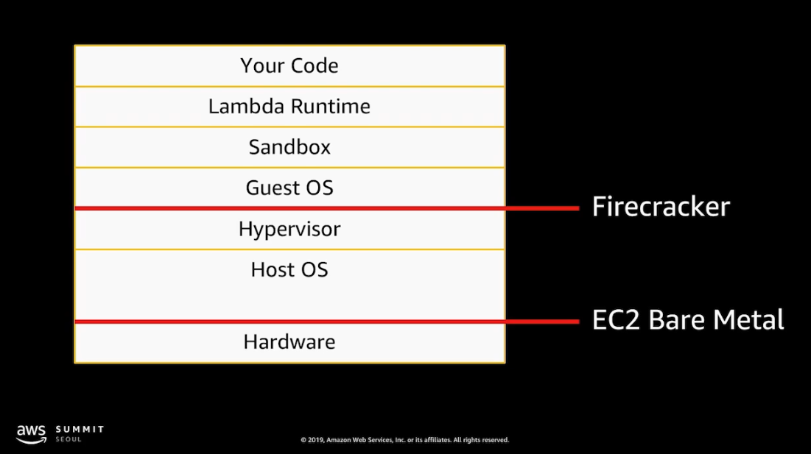

# AWS Lambda 내부 동작 방식 및 활용 방법 자세히 살펴보기

원본 링크 - https://www.youtube.com/watch?v=0PRjqEQ2J3g

# Lambda 서비스의 구성

# Lambda의 Autoscaling
- 아래는 Placement를 사용했을때 동작을 그린것이다.
- Worker manager가 worker로 바로 요청을 보내는게 아니라 Placement에게 보낸다.
- Placement는 worker가 얼마나 바쁜지 일을 줘도되는지 안되는지 모니터링을 하는 역할을 한다.
- Placement가 적합한 worker가 무엇인지 worker manager에게 알려주고 worker manager는 front end에게 실행가능한 worker를 전달한다

- Placement 그룹은 함수 실행이 완료된 worker를 반납하는 역할을 수행한다.

# Handling Failures
- 장애 발생에 대해서 방어처리가 되어있음.

# Isolation
- 완전히 분리되고, 항상 안전한 환경에서 실행.

- cgroup - control group의 약자

