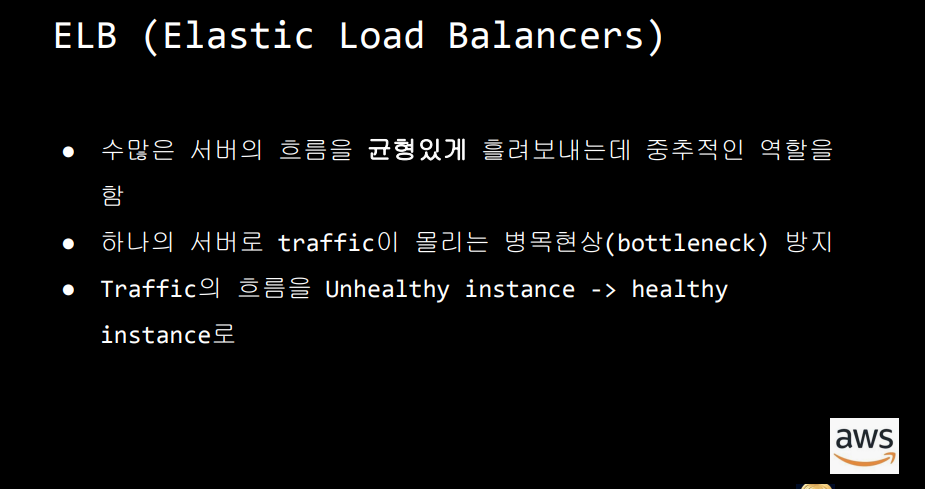
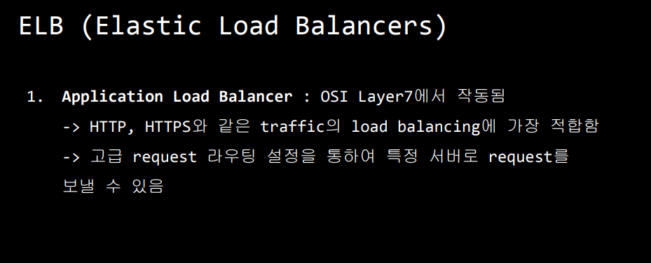
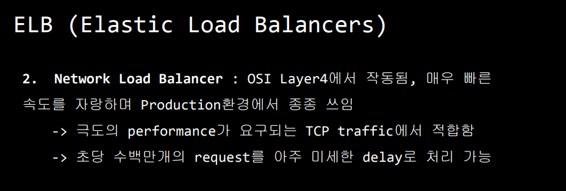
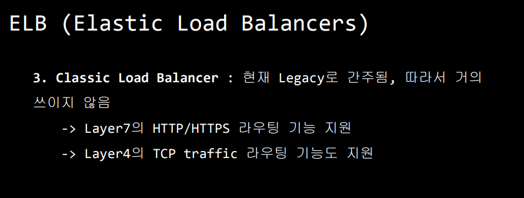
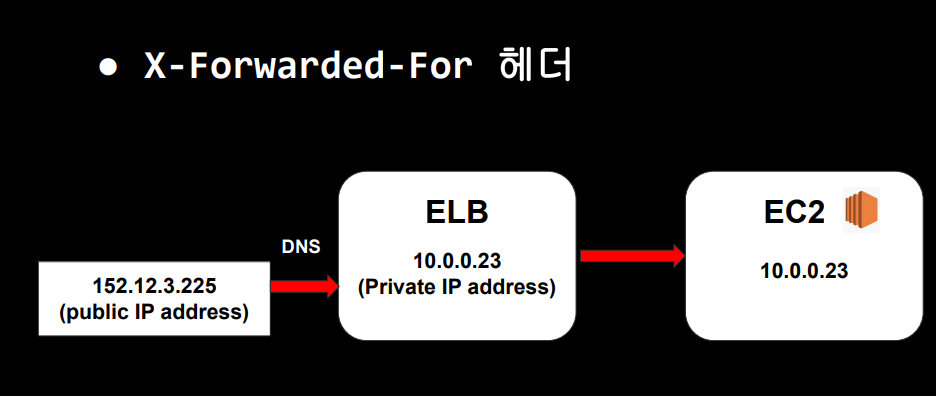

Aws ID : 92SooJong
7qMgvYL36d/RcvqBP4fsJoNI0Pc/07nGYmlTrZZx

# 개요
- Amazon Web Service
- 클라우드 컴퓨팅
- 서버리스(Serverless) 기능 지원
    - 클라우드가 서버를 작동하고 메모리 할당을 효율적으로 수행함.

# 계정 만들기
- 사용하는 만큼 비용 지불 (As You Pay Go)
- Free-tier는 일종의 데모버전 ( 무료 )
- 루트(Root) 사용자. 전지전능한 사용자. 권한부여나 다른 사용자를 만듦.

# IAM이란?
- IAM은 Identity and Access Management의 약자이다.
- 유저를 관리하고 접근 레벨 및 권한에 대한 관리를 해준다.
- 다른 유저를 생성할 수 있는데 유저에 대한 접근키와 비밀키를 제공한다. 접근키는 user_id , 비밀키는 password라고 생각하면 된다.
- Granular Permission(세밀한 접근) 테이블 생성, 삭제와 같은 세부적인 권한을 부여할 수 있다.
- 비밀번호를 수시로 변경 가능케 해준다.
- Multi-Factor Authentication(다중 인증) 기능. 비밀번호 뿐만아니라 페북,구글을 통해 추가적인 사용자 인증을 수행함.
- 유저뿐만 아니라 그룹,유저,역할, 정책을 생성할 수 있다.
    - 그룹 : 하나 또는 다수의 유저가 존재
    - 유저 : 패스
    - 역할 : 하나 혹은 다수의 정책을 지정할 수 있다.(정책의 집합체) 유저는 역할을 가짐으로써 권한을 부여받는다.
    - 정책 : JSON 형태로 된 다큐먼트를 가르키며, 접근에 대한 세부적인 설정을 가진 문서라고 보면된다.
- IAM은 Universal하다. (지역설정이 필요없다.)

# IAM 정책 시뮬레이터
- 개발환경(Staging or Develop)에서 실제환경(Production)으로 빌드하기전 IAM 정책이 잘 작동되는지 테스트하기 위함
- IAM과 관련된 문제들을 디버깅하기에 최적화된 툴이다. ( 이미 실제로 유저에 부여된 다양한 정책들도 테스트 가능 )
- ( 정책시뮬레이터 캡쳐본 첨부하기 )

# IAM 실습하기
- 액세스 키 – 프로그래밍 방식 액세스
    - 액세스 키 ID 및 비밀 액세스 키를 부여받는다.
    - 해당 키를 통해서 서비스나 개발 도구에 접근 가능함.
- 암호 – AWS 관리 콘솔 액세스
  

- 비밀 액세스키는 한번 잃어버리면 찾을 수 없다. 사용자를 다시 만들어야함!
  

- 그룹을 생성한다. ( 이후 사용자와 그룹을 매핑한다 )
  

- 역할을 생성하는 화면
    - 역할은 사용자가 어떤 서비스를 이용할지 셋팅할 수 있다.
    - (역할 사진)

- 정책을 생성하는 화면
- 리소스 선택에서는 서비스에서 사용가능할 기능들을 선택하는 곳이다.

# EC2란?
- Elastic Compute Cloud
- 지불 방법은 On-demand(시간 단위로 가격이 고정되어 있음) , Reserved(한정된 EC2 용량 사용 가능, 크기 조절 불가), Spot(입찰 가격 적용, 인스턴스의 시작과 끝기간이 전혀 중요하지 않을때 사용 )
- EC2를 사용하기 위해 EBS라는 디스크 볼륨을 요구한다.
- EBS는 EC2에 부착되어 있는 하드디스크라 생각하면 된다.

# EBS
- Elastic Block Storage
- 저장 공간이 생성되어지며 EC2에 부착된다.
- 디스크 볼륨 위에 File System이 생성된다.
- EBS는 특정 Availability Zone(AZ)에 생성된다.
    - 일종의 Disaster Recovery
    - 리전내 다른 AZ로 복사된다.
- EBS 볼륨 타입

# ELB
인스턴스가 셧다운되거나 시간초과 같은 현상이 발생했을때 적절히 다른곳으로 흘려보내줌.

## ELB 종류
커스터마이징을 통해 특정서버로 Request를 보낼 수 있다.

레이어4는 Transport이며, TCP의 트래픽을 정리하는데 적합함.

- EC2는 Private IP address만 볼수 있음!!
- 따라서 출처가 어디인지 어디서 흘러들어 왔는지 전혀 알 수 없다.
- 하지만 X-Forwarded-For 헤더를 통해 어떤 public IP 주소를 통해서 왔는지 알 수 있다.

# Route 5
