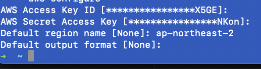

# 2023-09-04

`2023-09-04 11:37:36.407  WARN [ main] com.amazonaws.util.EC2MetadataUtils      [410] : Unable to retrieve the requested metadata (/latest/dynamic/instance-identity/document). Failed to connect to service endpoint:`

에러가 발생하는 경우 `aws configure`를 통해서 Access Key를 세팅해주면 되는데 여기서 region name을 꼭 입력해줘야 한다!!

