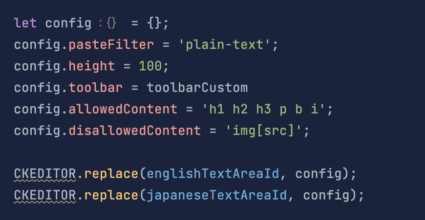

# 2023-10-04
Javascript에서 영문과 숫자만 입력되었는지 확인하는 코드

```javascript
function isDigitAndEnglish(text) {
    let regex = /^[a-zA-Z0-9]+$/;
    return regex.test(text);
}
```

# 2023-10-06

https://stackoverflow.com/questions/68907511/duplicate-key-attempted-merging-values-x-and-x

# 2023-10-10

JQuery Selector로 복수개의 element를 가져왔다면 toArray 처리를 해줘야 올바르게 forEach문을 사용할 수 있음.

ck editor에서 사진을 허용하지 않도록 하기위해 찾아본 자료들
- https://ckeditor.com/docs/ckeditor4/latest/guide/dev_disallowed_content.html
- https://ckeditor.com/docs/ckeditor4/latest/guide/dev_acf.html
- https://ckeditor.com/docs/ckeditor4/latest/api/CKEDITOR_config.html#cfg-pasteFilter


# 2023-10-12

사진 업로드 기능을 사용하기 위해 아래와 같이 코드를 작성함.
이때 용량이 큰 사진을 업로드하면 종종 uploadVideo function에 이벤트가 firing 되지 않는 현상이 있었음.
```html
<input type="file" name="file" onchange="uploadVideo(this)"/>
```

다음과 같이 코드를 수정해서 문제를 해결함.(원인은 좀더 찾아보겠음)

`onclick="this.value = null"` 를 추가함
```html
<input type="file" name="file" onclick="this.value = null" onchange="uploadVideo(this)"/>
```

## 개발 공부거리
- Multi DB 연결환경에서 Transaction 분리를 위한 예제 코드 작성
