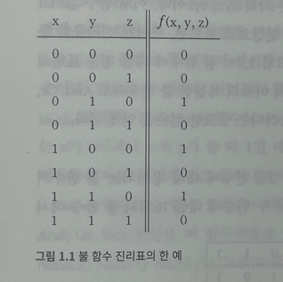

# 1장 불 논리

# 1.1.1 불 대수

- 불 대수는 `참/거짓` `1/0` `on/off` 같은 불(또는 2진수) 값을 다루는 대수학이다.
- 불 함수는 2진수를 입력받아 2진수를 출력하는 함수다.
- 컴퓨터는 2진수를 표현하고 처리하는 하드웨어다.

## 진리표(truth table)

- 앞의 세 열은 함수 입력값이 될 수 있는 모든 2진 값 조합을 나타낸다.
- 마지막 열은 입력값에 대한 결과다.



## 불 표현식

- 불 함수는 진리표 말고도 입력값에 대한 불 연산으로도 표기가 가능하다.
- 대표적으로 `And` `Or` `Not` 이 있다.
- 위 진리표를 불 표현식으로 나타내면 아래와 같다.

$$
f(x,y,z) = (x+y)\cdot \bar{z}
$$

## 정준 표현

- 모든 불 함수는 `정준 표현(canonical representation)` 이 불리는 불 표현식으로 표현 가능하다.
- 위 진리표에서 함수값이 1인 세번째 행을 보자. x,y,z 값에 따라 항을 만들수 있다.

$$
x=0,y=1, z=0
\\ \bar{x}y\bar{z}로\;표현 가능
$$

- 같은 방식으로 함수값이 1인 5행과 7행을 항으로 만들어보자.

$$
x=1,y=0, z=0
\\ x\bar{y}\bar{z}로\;표현 가능
\\ \;
\\ x=0,y=1, z=0
\\ xy\bar{z}로\;표현 가능
$$

- 위 항들을 모두 Or 연산으로 묶으면, 주어진 진리표와 동등한 불 표현식을 얻게 된다.
- 위에서 살펴본 진리표와 동등한 표현식을 얻을 수 있게된다.
- 이에 대한 정준 표현식은 다음과 같다.

$$
f(x,y,z)=\bar{x}y\bar{z}+x\bar{y}\bar{z}+
xy\bar{z}
$$

- 여기에서 알 수 있듯이 아무리 복잡한 불 함수라도 `And` `Or` `Not` 세 가지 불 연산만으로 표현이 가능하다는 중요한 결론을 얻게 된다!!

## 2-입력 불 함수

- 위 진리표에서도 알 수 있듯이 n개의 2진 변수에 대해 정의되는 불 함수의 2^행의개수 이다.
- 아래는 2개의 2진 변수에 대해 정의한 불 함수이다.
- 오른쪽은 x,y의 입력값을 나타낸다.
- 왼쪽은 각 함수마다 기능을 묘사하는 이름이 기록되어있다.


- `Nor` 함수는 `Not-Or`의 준말로, x와 y값에 Or를 취한 후 그 결괏값을 반전한 것이다.
- `Xor` 함수는 `배타적 논리합(exclusive or)` 의 준말로 두 변수의 진리값이 서로 반대면 1, 그렇지 않으면 0인 함수이다.
- 역으로 두 변수의 진리값이 같을 때 결괏값이 1인 `등가함수(equivalence function)`도 있다.
- `If-x-then-y` 함수는 x가 0이거나, x와 y가 둘다 1일 때 1을 반환하는 함수다. ( x는 y를 함축한다)
- `Nand` 는 `Not-And` 의 준말이다. x와 y값에 And를 취한 후 그 결괏값을 반전한 것이다.
- `Nand` 와 `Nor` 는 흥미로운 점이 있는데 각 함수만 가지고 `And` `Or` `Not` 을 만들어 낼 수 있다는 점이다.
- 예시. x Or y = `(x Nand x) Nand ( y Nand y)`
- 모든 불 함수는 And, Or, Not 연산으로만 이루어진 정준 표현식으로 바꿔 쓸 수 있으므로, 결국 모든 불 함수는 Nand 연산만으로 표현할 수 있다는 이야기가 된다.
- Nand로 동작하는 하드웨어가 있다면 어떠한 불 함수도 하드웨어로 구현 가능하다는 뜻이된다.

# 1.1.2 게이트 논리

- 게이트(gate)는 불 함수를 구현한 물리적 장치다.
- 복잡한 불 함수를 더 단순한 함수로 표현할 수 있는 것처럼, 복잡한 게이트는 더 기초적인 게이트로 구성할 수 있다.
- 가장 단순한 형태의 게이트들은 `트랜지스터`라 불리는 아주 작은 스위치 장치들을 특정한 구조로 연결해서 특정 기능을 하도록 만든 것들이다.
- `기본 게이트`는 아래와 같다. 상세한 구현 방식은 물리학자, 전기공학자의 영역이고 컴퓨터 과학자들은 추상적인 불 대수와 게이트 논리만 신경쓰면된다.


- 하드웨어 설계자는 이런 기본 게이트들이 서로 연결된 `조합 게이트` 를 통해 더 복잡한 기능을 구현한다.

## 기본 게이트와 조합 게이트

- 모든 논리 게이트는 입력 및 출력 신호 형태가 같으므로(0 또는 1), 서로 연달아 이으면 더 복잡한 조합 게이트를 만들어 낼 수 있다.
- 3-입력을 구현한다고 하면 아래와 같이 게이트 논리를 구성할 수 있다. (이런걸 논리 설계라고도 한다.)
- 논리 설계란 게이트를 서로 연결해서 더 복잡한 기능을 하는 조합 게이트를 만드는 기술이다.


- 인터페이스는 구현 보다는 바깥에 노출된 입력핀과 출력 핀만 그린것이다.
- 구현은 내부 아키텍쳐까지 모두 표현한다.
- 추상적인 규격 부품으로만 활용하려는 사람에게는 인터페이스 단계만으로 충분하다.
- Xor 게이트 예제를 만들어보자.
- 접두어 표기법으로 나타내면 Xor(a,b) = Or( (And(a,Not(b)), And(Not(a),b) )로 표현할 수 있다. 이를 구현하면 다음과 같다.


1.1.3은 별 내용 없어서 생략함.

# 1.1.4 하드웨어 기술 언어

- 오늘날 하드웨어 설계자들은 더 이상 맨손으로 뭔가를 만들지는 않는다.
- 대신 하드웨어 기술 언어(Hardware Description Language) 도구를 사용해서 칩 아키텍처를 설계하고 최적화한다.

## Xor 게이트의 HDL 구현

- 예제로 제공하는 Xor 구현 프로그램이다.


# 1.1.5 실습을 위한 하드웨어 시뮬레이션 세팅

아래 사이트에 접속한다.

[](https://www.nand2tetris.org/)

Software 탭에서 실습 툴을 다운로드 받는다.


윈도우에서 하드웨어 시뮬레이터를 실행하기 위해 다운받은 파일의 tools 폴더의 `HardwareSimulator.bat` 을 실행한다.


직접 구현한 Chip을 호출할 수 있다. (확장자 .hdl)

작성한 Script를 호출해서 테스트 코드를 구성할 수 있다.(확장자 .tst)


1.2.1은 NAND에 대한 단순 명세이므로 생략한다.

# 1.2.2 기본 논리 게이트 구현

## Not 게이트


## And 게이트


## Or 게이트


## Xor 게이트


## Mux 게이트(멀티플렉서)


## DMux


## 멀티비트 Not

```java
// This file is part of www.nand2tetris.org
// and the book "The Elements of Computing Systems"
// by Nisan and Schocken, MIT Press.
// File name: projects/01/Not16.hdl

/**
 * 16-bit Not:
 * for i=0..15: out[i] = not in[i]
 */

CHIP Not16 {
    IN in[16];
    OUT out[16];

    PARTS:
    // Put your code here:
    Not(in=in[0],out=out[0]);
    Not(in=in[1],out=out[1]);
    Not(in=in[2],out=out[2]);
    Not(in=in[3],out=out[3]);
    Not(in=in[4],out=out[4]);
    Not(in=in[5],out=out[5]);
    Not(in=in[6],out=out[6]);
    Not(in=in[7],out=out[7]);
    Not(in=in[8],out=out[8]);
    Not(in=in[9],out=out[9]);
    Not(in=in[10],out=out[10]);
    Not(in=in[11],out=out[11]);
    Not(in=in[12],out=out[12]);
    Not(in=in[13],out=out[13]);
    Not(in=in[14],out=out[14]);
    Not(in=in[15],out=out[15]);

}
```


## 멀티비트 And

```java
// This file is part of www.nand2tetris.org
// and the book "The Elements of Computing Systems"
// by Nisan and Schocken, MIT Press.
// File name: projects/01/And16.hdl

/**
 * 16-bit bitwise And:
 * for i = 0..15: out[i] = (a[i] and b[i])
 */

CHIP And16 {
    IN a[16], b[16];
    OUT out[16];

    PARTS:
    // Put your code here:
    And(a=a[0],b=b[0],out=out[0]);
    And(a=a[1],b=b[1],out=out[1]);
    And(a=a[2],b=b[2],out=out[2]);
    And(a=a[3],b=b[3],out=out[3]);
    And(a=a[4],b=b[4],out=out[4]);
    And(a=a[5],b=b[5],out=out[5]);
    And(a=a[6],b=b[6],out=out[6]);
    And(a=a[7],b=b[7],out=out[7]);
    And(a=a[8],b=b[8],out=out[8]);
    And(a=a[9],b=b[9],out=out[9]);
    And(a=a[10],b=b[10],out=out[10]);
    And(a=a[11],b=b[11],out=out[11]);
    And(a=a[12],b=b[12],out=out[12]);
    And(a=a[13],b=b[13],out=out[13]);
    And(a=a[14],b=b[14],out=out[14]);
    And(a=a[15],b=b[15],out=out[15]);
}
```


## 멀티비트 Or

```java
// This file is part of www.nand2tetris.org
// and the book "The Elements of Computing Systems"
// by Nisan and Schocken, MIT Press.
// File name: projects/01/Or16.hdl

/**
 * 16-bit bitwise Or:
 * for i = 0..15 out[i] = (a[i] or b[i])
 */

CHIP Or16 {
    IN a[16], b[16];
    OUT out[16];

    PARTS:
    // Put your code here:
    Or(a=a[0],b=b[0],out=out[0]);
    Or(a=a[1],b=b[1],out=out[1]);
    Or(a=a[2],b=b[2],out=out[2]);
    Or(a=a[3],b=b[3],out=out[3]);
    Or(a=a[4],b=b[4],out=out[4]);
    Or(a=a[5],b=b[5],out=out[5]);
    Or(a=a[6],b=b[6],out=out[6]);
    Or(a=a[7],b=b[7],out=out[7]);
    Or(a=a[8],b=b[8],out=out[8]);
    Or(a=a[9],b=b[9],out=out[9]);
    Or(a=a[10],b=b[10],out=out[10]);
    Or(a=a[11],b=b[11],out=out[11]);
    Or(a=a[12],b=b[12],out=out[12]);
    Or(a=a[13],b=b[13],out=out[13]);
    Or(a=a[14],b=b[14],out=out[14]);
    Or(a=a[15],b=b[15],out=out[15]);
}
```


## 멀티비트 Mux

```java
// This file is part of www.nand2tetris.org
// and the book "The Elements of Computing Systems"
// by Nisan and Schocken, MIT Press.
// File name: projects/01/Mux16.hdl

/**
 * 16-bit multiplexor:
 * for i = 0..15 out[i] = a[i] if sel == 0
 *                        b[i] if sel == 1
 */

CHIP Mux16 {
    IN a[16], b[16], sel;
    OUT out[16];

    PARTS:
    // Put your code here:
    Mux(a=a[0],b=b[0],sel=sel,out=out[0]);
    Mux(a=a[1],b=b[1],sel=sel,out=out[1]);
    Mux(a=a[2],b=b[2],sel=sel,out=out[2]);
    Mux(a=a[3],b=b[3],sel=sel,out=out[3]);
    Mux(a=a[4],b=b[4],sel=sel,out=out[4]);
    Mux(a=a[5],b=b[5],sel=sel,out=out[5]);
    Mux(a=a[6],b=b[6],sel=sel,out=out[6]);
    Mux(a=a[7],b=b[7],sel=sel,out=out[7]);
    Mux(a=a[8],b=b[8],sel=sel,out=out[8]);
    Mux(a=a[9],b=b[9],sel=sel,out=out[9]);
    Mux(a=a[10],b=b[10],sel=sel,out=out[10]);
    Mux(a=a[11],b=b[11],sel=sel,out=out[11]);
    Mux(a=a[12],b=b[12],sel=sel,out=out[12]);
    Mux(a=a[13],b=b[13],sel=sel,out=out[13]);
    Mux(a=a[14],b=b[14],sel=sel,out=out[14]);
    Mux(a=a[15],b=b[15],sel=sel,out=out[15]);
}
```


