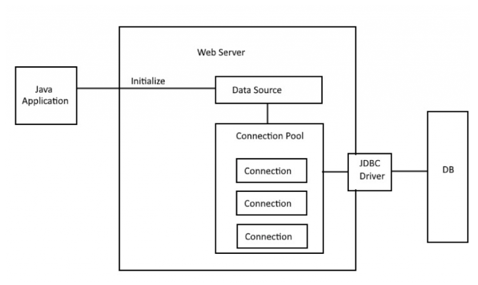

Connection pooling means a pool of Connection Objects.

Connection pooling is based on an object pool design pattern.

The cost of creating new objects is higher So application creates an object in advance and place them in Pool.

Whenever application requires objects, it(application) acquires them from the pool rather than creating a new one.

We can create our own implementations of Connection pooling.

Any connection pooling framework needs to do three tasks.

- Creating Connection Objects
- Manage usage of created Objects and validate them.
- Release/Destroy Objects

Following 3 Connection Pooling are commonly used in Java Application

- Apache Commons DBCP2
- HikariCP
- C3P0

### Data Source

Data Source is entry point to Connection Pool

Data source has url, username, password and etc. for data connection

Data source creates connection pool