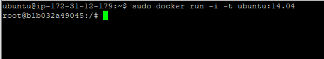

# 2.2 도커 컨테이너 다루기

## 컨테이너 실행해보기

- `run` 명령어를 사용해서 우분투 14.04 컨테이너 실행하기
    
    ```bash
    docker run -i -t ubuntu:14.04
    ```
    
- 로컬에 설치된 이미지가 없기 때문에 내려받아서 컨테이너를 실행 시켜줌.
- 사용자 이름을 보면 알 수 있듯이 컨테이너 내부에 들어온것을 볼수 있다.
- `-i` 옵션으로 상호 입출력을 가능하게 한다.
- `-t` 옵션으로 tty를 활성화 해서 bash shell을 사용할 수 있도록 한다.
- 두 옵션이 없으면 shell을 정상적으로 사용할 수 없게 된다.



- `create` 명령어를 사용해서 centos 컨테이너를 생성한다.
- `--name` 옵션을 통해서 컨테이너의 이름을 설정한다.


- `start` 명령어를 통해 컨테이너를 실행한다.
- `attach` 명령어를 통해 컨테이너 내부로 들어간다.


- `run` 명령어는 `start` 와 `attach` 명령어를 실행해준다.
- 반대로 `create` 명령어를 실행하지 않고 컨테이너 생성까지만 수행한다.
- `run` 과 `create` 는 기본적으노 `pull` 명령어와 `create` 명령어를 수행한다.
- `pull` 은 이미지가 존재하지 않을때 원격 저장소에서 이미지를 가져올 수 있도록 하며, `create` 는 이미지로 컨테이너를 만드는 일을 수행한다.

## 조회, 삭제, 종료

- `exit` 입력 또는 `Ctrl + D` 를 입력하면 된다.
- 이때 컨테이너가 중단되는 것에 주의한다.
- `Ctrl + P, Q` 를 입력하면 컨테이너를 정지하지 않고 빠져나올 수 있다.(3개를 동시에 누르는게 아니라 P먼저 누르고 Q를 눌러야 함)

- 도커 엔진에 존재하는 이미지의 목록 조회는 `images` 명령어를 사용한다.

```bash
docker images
```

- 실행중인 컨테이너 목록 확인은 `ps` 명령어를 사용한다.
- COMMAND는 컨테이너가 실행될때 수행할 명령어를 뜻한다.


- 정지된 컨테이너까지 조회하려면 `-a` 옵션을 사용하면 된다.
- 컨테이너를 중지하려면 `stop` 명령어를 사용하면 된다.


- 컨테이너 삭제는 `rm` 명령어를 사용하면 된다.


- 일괄중지는 `sudo docker stop $(sudo docker ps -a -q)` 명령어를 사용한다.
- 일괄삭제는 `sudo docker rm $(sudo docker ps -a -q)` 명령어를 사용한다.


## 컨테이너 외부 노출

- 테스트를 위한 우분투 컨테이너를 실행한다.

```bash
sudo docker run -i -t --name network_test ubuntu:14.04
```

- 컨테이너에서 `ifconfig` 명령어를 실행한다.
- 컨테이너는 기본적으로 172.17.0.x IP를 할당받는다.
- 컨테이너는 외부에서 접속은 불가능 하며 호스트에서만 접근이 가능한 상태다.


- 외부 노출을 위해 eth0의 IP와 포트를 호스트의 IP와 포트에 바인딩 해야한다.
- `-p` 옵션을 사용해서 `[호스트의 포트]:[컨테이너의 포트]` 형태로 바인딩한다.
- `-p` 옵션을 여러번 사용해서 포트를 여러개 바인딩 할수도 있다.
- 단순히 `-p 80` 과 같이 입력할 수 있는데 이때는 호스트의 포트가 랜덤으로 배정되기 때문에 `ps` 명령어를 통해서 확인해야한다.

```bash
sudo docker run -i -t --name mywebserer -p 80:80 ubuntu:14.04
```

- 우분투 컨테이너에 아파치 웹서버를 설치하고 실행한다.

```bash
apt-get update
apt-get install apache2 -y
service apache2 start
```

- 웹 브라우저를 통해 접속해본다.


## 샘플 애플리케이션 구축

- 데이터베이스와 웹서버를 하나의 컨테이너로 관리하기 보단 나눠서 컨테이너를 생성하고 관리하도록 하자.
- mysql 컨테이너를 실행한다.
- `-d` 옵션은 컨테이너를 백그라운드에서 동작하는 애플리케이션으로써 실행하도록 한다.
- `-e` 옵션은 컨테이너 내부의 환경변수를 설정한다.
- `--link` 옵션을 통해서 컨테이너간 네트워킹이 가능하도록 해준다. 컨테이너의 IP는 동적으로 할당되기 때문에 alias를 사용해서 연결한다. 컨테이너가 실행중이지 않다면 에러가 발생한다.
- 추후 삭제될 가능성이 높은 옵션이므로 브리지 네트워크 기능으로 연결하도록 하자.

```bash
sudo docker run -d \
--name wordpressdb \
-e MYSQL_ROOT_PASSWORD=password \
-e MYSQL_DATABASE=wordpress \
mysql:5.7
```

- wordpress 웹서버 컨테이너를 실행한다.

```bash
sudo docker run -d \
-e WORDPRESS_DB_HOST=mysql \
-e WORDPRESS_DB_USER=root \
-e WORDPRESS_DB_PASSWORD=password \
--name wordpress \
--link wordpressdb:mysql \
-p 80 \
wordpress
```

- wordpress 웹 서버 컨테이너와 바인딩된 호스트의 IP를 확인한다.


- 정상적으로 접속된다.


## 컨테이너 입출력

- `-d` 옵션으로 `run` 을 실행하면 입출력이 없는 상태로 컨테이너를 실행한다.
- 컨테이너 내부에서 프로그램이 터미널을 차지하는 foreground로 실행되기 때문이다.
- 따라서 `-d` 옵션을 사용한 컨테이너는 반드시 컨테이너 내에서 foreground로 프로그램이 실행되도록 해야한다.(터미널에 프로그램을 할당해야한다.) 그렇지 않은 경우는 컨테이너가 즉시 종료 된다.
- ubuntu 컨테이너를 `-d` 옵션을 걸어서 실행하면 아래처럼 바로 종료된다.


- MySql 컨테이너에 `-i -t` 옵션을 걸면 컨테이너로 접속해서 컨테이너에서 foreground로 실행되고 있는 프로그램을 확인할 수 있다. 상호 입출력은 불가능하고 단순히 foreground로 구동되는 프로그램의 로그만 볼 수있다.

```bash
sudo docker run -i -t \
--name mysql_attach_test \
-e MYSQL_ROOT_PASSWORD=password \
-e MYSQL_DATABASE=wordpress \
mysql:5.7
```


- 컨테이너 내부에서 `echo ${환경변수명}` 명령어를 입력하면 환경변수 확인이 가능하다.
- `echo` 명령어를 사용하기 위해선 상호 입출력이 가능한 shell이 컨테이너에서 실행되어야한다. 위의 mysql 컨테이너는 이미 attach로 접근해도 foreground로 프로그램이 이미 실행중이다. 따라서 `exec` 명령어를 사용하도록 한다.
- `exec` 명령어를 사용하면 컨테이너 내보의 shell을 사용할 수 있다.

```bash
sudo docker exec -i -t mysql_attach_test /bin/bash
```


- `mysql -u root -p` 를 통해 password가 올바르게 적용되었는지 확인해본다.


- `exit` 명령어로 빠져나와도 컨테이너가 종료되지 않는다.


## 도커 볼륨

- 이미 생성된 이미지는 어떠한 경우로도 변경되지 않는다.
- mysql 컨테이너를 생성했다면, 컨테이너에 운영중 생성된 데이터들이 저장된다. 이때 컨테이너를 삭제하면 컨테이너에 존재하던 데이터도 함께 삭제된다.
- 컨테이너에 있는 데이터의 영속성을 확보하기 위해 볼륨을 활용한다.

### 호스트 볼륨 공유

- `-v` 옵션을 통해 호스트의 `/home/wordpress_db` 디렉터리와 컨테이너의 `/var/lib/mysql` 을디렉터리를 공유한도록 한다.
- 호스트에 해당 디렉터리가 없다면 자동으로 생성해준다.
- 이미 호스트에 존재하는 디렉터리인 경우 호스트의 디렉터리를 컨테이너 디렉터리에 덮어쓰기 한다. 즉, 호스트가 우선순위가 더 높다.

```bash
sudo docker run -d \
--name wordpressdb_hostvolume \
-e MYSQL_ROOT_PASSWORD=password \
-e MYSQL_DATABASE=wordpress \
-v /home/wordpress_db:/var/lib/mysql \
mysql:5.7
```

- wordpress 웹서버 컨테이너를 실행한다.

```bash
sudo docker run -d \
-e WORDPRESS_DB_PASSWORD=password \
--name wordpress_hostvolume \
--link wordpressdb_hostvolume:mysql \
-p 80 \
wordpress
```


### 볼륨 컨테이너

- `-v` 옵션을 사용하는 컨테이너와 연결하는 방법이다. 한마디로 `-v` 옵션을 사용하는 컨테이너를 브리지로 사용하는것이다
- `--volumes-from` 옵션을 사용하면 된다.


### 도커 볼륨

- `volume create` 명령어를 통해 도커 자체에서 제공하는 볼륨 기능을 사용할 수 있다.
- 해당 볼륨은 도커 엔진에 의해 제어된다.

```bash
sudo docker volume create --name myvolume
```

- 여러 종류의 스토리지를 사용할 수 있으며, 아래는 호스트(local)의 스토리지를 사용하도록 한다.

```bash
sudo docker volume ls
```


- myvolume_1,myvolume_2 컨테이너가 myvolume 볼륨 컨테이너를 사용하도록 한다.
- myvolume_1 컨테이너에 접속해서 /root 디렉토리 아래에 파일을 생성하면, myvolume_2 컨테이너의 /root 디렉토리 파일에서 확인이 가능하게 된다.

```bash
sudo docker run -i -t --name myvolume_1 \
-v myvolume:/root/ \
ubuntu:14.04
```

```bash
sudo docker run -i -t --name myvolume_2 \
-v myvolume:/root/ \
ubuntu:14.04
```

- `inspect` 명령어를 통해서 도커 볼륨이 호스트의 어떤 디렉터리에서 저장되고 있는지 확인할 수 있다.

```bash
sudo docker inspect --type volume myvolume
```


## 도커 네트워크

- 호스트에서 `ifconfig` 명령어를 입력하면 실행중인 컨테이너의 개수 만큼 veth가 생성된것을 확인할 수 있다.


- eth0는 공인 IP 또는 내부 IP가 할당되어 실제로 외부와 통신할 수 있는 호스트의 네트워크 인터페이스이다.
- docker0는 eth0와 veth의 중간 다리 역할을 한다.
- 컨테이너는 호스트의 veth… 과 연결되며 veth…은 docker0와 연결되어 외부와 통신할 수 있게된다. (docker0는 호스트의 eth0와 연결!)


### 도커 네트워크 기능

- 컨테이너를 생성하면 docker0 브리지를 통해서 외부와 통신할 수 있는 환경을 제공받는다.
- 사용자의 선택에 따라 여러 네트워크 드라이버 사용이 가능하다.
- 대표적으로 브리지(bridge), 호스트(host), 논(none), 컨테이너(container), 오버레이(overlay)가 있다.
- `docker network ls` 명령어를 통해 사용가능한 네트워크를 확인할 수 있다.
- 이미 bridge, host, none이 존재하는걸 확인할 수 있다.


- bridge 네트워크는 컨테이너를 생성할 때 자동으로 연결되는 docker0 브리지를 활용하도록 설정되어있다.
- 이 네트워크는 172.17.0.x IP대역을 순차적으로 할당한다.
- `docker network inspect` 명령어를 통해 네트워크의 자세한 정보를 확인할 수 있다.브리지 네트워크
    
    
    

### 브리지 네트워크

- `docker network create --driver bridge mybridge` 명령어를 사용하면 기존의 docker0 브리지가 아닌 새로운 브리지 네트워크 생성이가능하다. (mybridge 브리지 네트워크 생성)
    
    
    
- 컨테이너 생성시에 `--net` 옵션을 사용해서 생성한 브리지 사용이 가능하다.
    
    ```yaml
    docker run -i -t --name mynetwork_container \
    --net mybridge \
    ubuntu:14.04
    ```
    
    
    
- `connect` `disconnect` 명령어를 통해서 컨테이너에 네트워크를 유동적으로 붙였다 뗐다 할수 있다.
- 다만 브리지 네트워크, 오버레이 네트워크와 같이 특정 IP 대역을 갖는 네트워크 모드에서만 사용이 가능하다.
- 아래와 같이 다양한 옵션을 사용해서 원하는 대역폭이나 gateway를 설정할 수 있다.( `--subnet` 과 `--ip-range` 는 같은 대역을 가져야 한다. )
    
    ```yaml
    docker network create --driver=bridge \
    --subnet=172.72.0.0/16 \
    --ip-range=172.72.0.0/24 \
    --gateway=172.72.0.1 \
    my_custom_network
    ```
    

### 호스트 네트워크

- 호스트의 네트워크 환경을 그대로 쓰는 방식이다.
- 별도의 네트워크 생성이 필요 없으며, 기존의 host라는 이름의 네트워크를 그대로 사용한다.
    
    ```yaml
    docker run -i -t --name network_host \
    --net host \
    ubuntu:14.04
    ```
    
- 컨테이너에서 ifconfig를 수행하면 호스트의 네트워크가 정보가 출력된다.
- 사실상 호스트에서 서비스를 구동하는 것과 같은 효과를 가지게 된다.
    
    
    

### 논 네트워크

- none은 아무런 네트워크를 쓰지않는 것을 뜻한다.
    
    ```yaml
    docker run -i -t --name network_none \
    --net none \
    ubuntu:14.04
    ```
    
    
    

### 컨테이너 네트워크

- 다른 컨테이너의 네트워크 네임스페이스 환경을 공유할 수 있다.
- 공유되는 속성으로는 내부IP, 네트워크 인터페이스의 맥(MAC) 주소 등이 있다.
- `--net container:[다른 컨테이너의 ID]` 와 같이 작성하면 된다.
    
    ```yaml
    docker run -i -t -d --name network_container_1 ubuntu:14.04
    
    docker run -i -t -d --name network_container_2 \
    --net container:network_container_1 \
    ubuntu:14.04
    ```
    
- 두 컨테이너의 네트워크가 같은 것을 확인할 수 있다.
    
    
    
- 컨테이너 네트워크의 구조를 그림으로 표현하면 아래와 같다.
    
    
    

### 브리지 네트워크와 --net-alias

- 브리지 타입의 네트워크와 `--net-alias` 옵션을 함께 사용하면 특정 호스트 이름으로 컨테이너 여러 개에 접근 할 수 있다.
    
    ```yaml
    docker run -i -t -d --name network_alias_container_1 \
    --net mybridge \
    --net-alias alicek106 \
    ubuntu:14.04
    
    docker run -i -t -d --name network_alias_container_2 \
    --net mybridge \
    --net-alias alicek106 \
    ubuntu:14.04
    
    docker run -i -t -d --name network_alias_container_3 \
    --net mybridge \
    --net-alias alicek106 \
    ubuntu:14.04
    ```
    
- 위 명령어를 그림으로 나타내면 아래와 같다.
- mybridge 라는 네트워크에 속한 3개의 컨테이너는 `--net-alias` 옵션에 alicek106이라는 값을 입력했다.
- 이 컨테이너의 IP는 DNS서버에 alicek106이라는 호스트 이름으로 등록된다.
- mybridge 네트워크에 속한 컨테이너에게 alicek106이라는 호스트 이름으로 접근하면 도커 내장 DNS는 라운드로빈 방식으로 컨테이너의 IP리스트를 반환한다.
- ping은 IP 리스트에서 첫번째 IP를 사용하므로 매번 다른 IP를 응답하게 된다. ( DNS 서버는 라운드 로빈방식으로 컨테이너의 IP 리스트를 반환하기 때문이다. )
    
    
    

### MacVLAN 네트워크

- 호스트의 네트워크 인터페이스 카드를 가상화해 물리 네트워크 환경을 컨테이너에게 동일하게 제공하는 방식이다.
- MacVLAN을 사용하면 컨테이너도 가상의 Mac 주소를 가지게 된다.
- 덕분에 해당 네트워크에 연결된 다른 장치와의 통신이 가능하게 된다.
- 다만, 컨테이너A는 서버2,컨테이너B와 통신이 가능하지만 서버1(자신의 호스트)과는 통신이 불가능하다.
    
    
    

## 컨테이너 로깅