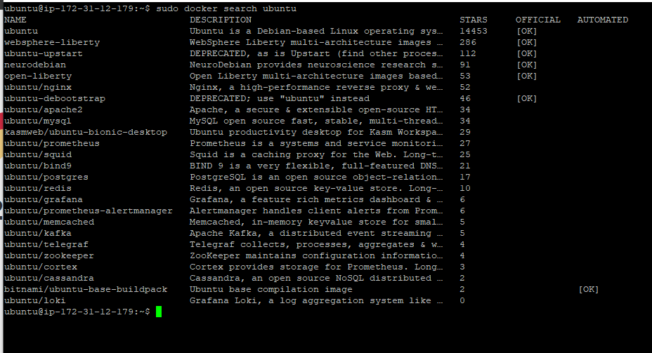

# 2.3 도커 이미지

## 이미지 검색

- 도커는 Docker Hub라는 중앙 이미지 저장소에서 이미지를 내려받는다.
- `search` 명령어를 통해 도커 이미지를 검색할 수 있습니다.



## 이미지 생성

- 샘플 컨테이너를 생성하고 커스터마이징 해본다.

```bash
sudo docker run -i -t --name commit_test ubuntu:14.04
```


- `commit` 명령어를 통해서 컨테이너를 이미지로 만들수 있다.
- `-a` 옵션은 author를 뜻한다. `-m` 은 커밋 메시지를 뜻한다.
- commit_test 컨테이너를 이름은 commit_test이고 태그가 first인 이미지로 생성한다.

```bash
sudo docker commit \
-a "soojong" -m "my first commit" \
commit_test \
commit_test:first
```


- 한단계 더 나아가서 commit_test 이미지로 또다른 이미지를 만들어 보자.

```bash
sudo docker run -i -t --name commit_test2 commit_test:first
```

- 컨테이너 실행후 second 파일을 생성한다.


- commit_test2 컨테이너로 이미지를 만든다.

```bash
sudo docker commit \
-a "soojong" -m "my second commit" \
commit_test2 \
commit_test:second
```


## 이미지 구조

- 이미지의 관계는 git의 commit 처럼 관리되기때문에 ubuntu:14.04의 용량이 190MB라도 commit_test:first 이미지의 용량은 190MB가 아닌 추가된 파일의 용량이 된다.
- ubuntu:14.04 이미지의 용량 + 추가된 파일의 용량
- 아래는 ubuntu:14.04의 이미지 ID와 Layer 정보이다.


- 아래는 commit_test:first 이미지의 ID와 Layer 정보다.


- 아래는 commit_test:second 이미지의 ID와 Layer 정보다.


## 이미지 삭제

- `rmi` 명령어를 사용해서 이미지를 삭제한다.

```bash
sudo docker rmi commit_test:first
```

- 이미지를 사용중인 컨테이너가 존재하면 아래와 같은 에러가 발생한다.


- 먼저 컨테이너를 중단 및 삭제한다.

```bash
sudo docker stop commit_test2 && sudo docker rm commit_test2
```

- 아래와 같이 Untagged 문구가 뜨면 이름만 삭제한다는 뜻이다.
- 삭제하고 싶은 이미지를 사용해서 만들어진 또다른 이미지가 있기때문이다.


- Delete 문구가 출력되면 실제로 이미지 레이어가 삭제됐음을 의미한다.


## 이미지 배포

- `TODO - 배포 수행시 작성하기!`