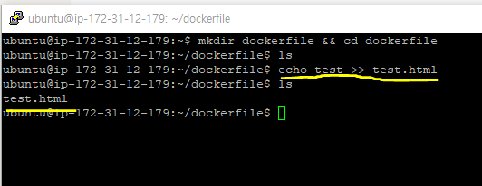

# 2.4 Dockerfile

- 새로운 이미지를 생성하기 위해 사용하는 일련의 명령어를 실행할 수 있도록 해주는 파일
- 컨테이너에서 수앵해야 할 작업을 명시하고 이미지를 생성한다.

## Dockerfile 작성

- 샘플 파일을 생성한다.



- Dockerfile을 작성한다.
- `FROM` 은 생성할 이미지의 베이스가 될 이미지를 뜻한다. Dockerfile에 반드시 한 번 이상 입력해야한다.
- `MAINTAINER` 은 이미지를 생성한 개발자의 정보를 나타낸다.
- `LABEL` 은 이미지의 메타데이터를 뜻한다.
- `RUN` 이미지를 만들기 위해 컨테이너 내부에서 명령어를 실행한다.
- `RUN ["실행가능한 파일","명령줄 인자1","명령줄 인자 2, ... ]` 형태로 작성가능하다.
- `ADD` 는 파일을 이미지에 추가한다. Dockerfile이 존재하는 위치에서 test.html을 가져와서 컨테이너에 있는 /var/www/html 경로에 마운트한다.
- `WORKDIR` 는 명령어를 실행할 디렉터리 위치를 나타낸다. Bash Shell에서 `cd` 명령어를 입력하는것과 같은 효과가 있다.
- `EXPOSE` 는 컨테이너에서 사용할 포트를 나타낸다. 호스트의 포트 80번과 바인딩 되는게 아님을 기억하자!!
- `CMD` 는 컨테이너가 시작될 때마다 실행할 명령어를 설정한다. Dockerfile에서 한번만 사용할 수 있다. 만약 컨테이너를 생성할때 명령어를 입력한다면 Dockerfile에 작성한 CMD 명령어는 무시된다.

```bash
# vi Dockerfile

FROM ubuntu:14.04
MAINTAINER soojong
LABEL "purpose"="practice"
RUN apt-get update
RUN apt-get install apache2 -y
ADD test.html /var/www/html
WORKDIR /var/www/html
RUN ["/bin/bash","-c","echo hello >> test2.html"]
EXPOSE 80
CMD apachectl -DFOREGROUND
```


## Dockerfile 빌드

- `build` 명령어를 사용한다.
- `./` 경로에 있는 Dockerfile을 빌드한다.
- `./` 경로가 빌드 컨텍스트가 된다. ( Dockerfile이 위치한곳이 빌드 컨텍스트 )
- `-t` 옵션을 통해서 이미지의 이름을 지정한다.

```bash
sudo docker build -t mybuild:0.0 ./
```

- 이미지 빌드를 시작할때 가장먼저 빌드 컨텍스트에 있는 파일들을 읽는다.
- 가능하면 빌드 컨텍스트에는 필요한 파일만 두는게 좋다.
- 아니면 .dockerignore 파일을 컨텍스트 빌드에 작성하도록 한다.


- 각 Step은 Dockerfile에 작성된 명령어를 의미한다. 각 Step이 실행될때 마다 새로운 컨테이너가 하나씩 생성되며 이를 이미지로 커밋한다. 이미지의 빌드가 완료되면 임시로 생성된 컨테이너들은 모두 삭제된다.
  
