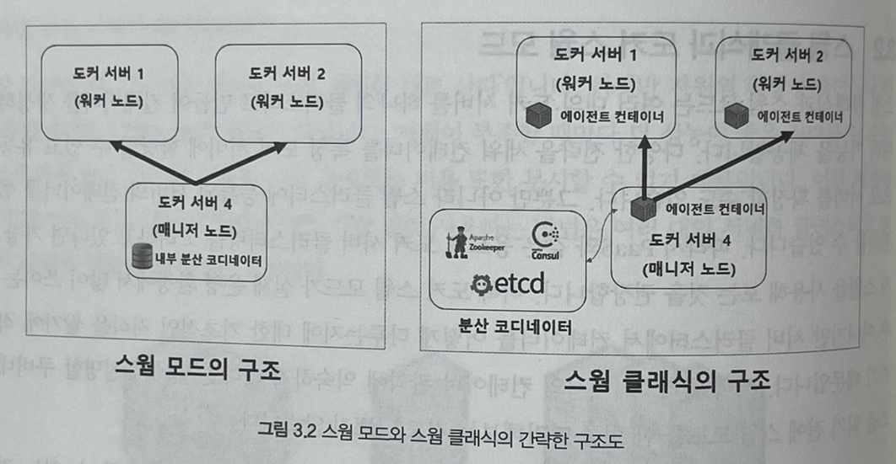

# 3.2 스웜 클래식과 도커 스웜 모드

- 스웜 클래식과 스웜 모드는 여러 대의 도커 서버를 하나의 클러스터로 만들어 컨테이너를 생성하는 여러 기능을 제공한다.
- 개발자는 다양한 전략을 세워 컨테이너를 특정 도커 서버에 할당 할수 있도록 할 수 있다.
- 스웜 클러스터에 등록된 서버를 손쉽게 관리할 수 있다.
- 도커 스웜 모드가 실제 운영 환경에서 많이 쓰이진 않는다.

# 도커 스웜의 종류

## 컨테이너로서의 스웜

- 도커 1.6 버전부터 사용 가능
- 스웜 클래식이라고도 부름
- 스웜 클래식은 여러 대의 도커 서버를 하나의 지점에서 사용하도록 단일 접근점을 제공하는 방식이다.
- 스웜 클래식은 `docker run` `docker ps` 등 일반적인 도커 명렁어와 도커 API로 클러스터의 서버를 제어하고 관리할 수 있는 기능을 제공한다.
- 스웜 클래식은 분산 코디네이터, 에이전트 등이 별도로 실행돼야 한다.

## 도커 스웜 모드

- 도커 1.12 이후부터 사용 가능
- 스웜 모드라고 줄여서 부름
- 스웜 모드는 마이크로서비스 아키텍처의 컨테이너를 다루기 위한 클러스터링 기능에 초점을 맞춘다.
- 같은 컨테이너를 동시에 여러 개 생성해 필요에 따라 유동적으로 컨테이너의 수를 조절할 수 있다.
- 컨테이너로의 연결을 분산하는 로드밸런싱 기능을 자체적으로 지원한다.
- 스웜 몯가 서비스 확장성과 안정성 등 스웜 클래식에 비해 뛰어나다.
- 스웜 모드는 클러스터링을 위한 모든 도구가 도커 엔진 자체에 내장돼 있다.

# 참고

