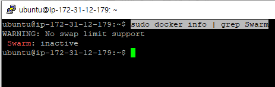

# 3.3 스웜모드

- docker info 명령어를 통해 도커 엔진의 스웜 모드 클러스터 정보를 확인한다.

```bash
sudo docker info | grep Swarm
```

- 현재는 스웜 모드를 사용하지 않기 때문에 비활성화 상태이다.



# 3.3.2 도커 스웜 모드 클러스터 구축

- 아래와 같이 3개의 ubuntu 인스턴스를 만든다.


- `docker swarm init` 명령어를 통해 클러스터의 매니저를 지정한다.

```bash
sudo docker swarm init --advertise-addr [매니저노드 IP]
```

- 워커 노드들은 매니저를 지정할때 출력되는 명령어를 통해 클러스터에 등록할 수 있다.


- 매니저 노드를 지정할때 제공되는 `docker swarm join` 명령어를 통해서 워커노드가 특정 클러스터에 합류할 수 있다.

```bash
sudo docker swarm join \
--token SWMTKN-1-1lpyxejpu56s8sdyngbekh4cze636ba3lbtrgqppor1lc6nxlr-25nigv1hhe8q33twg1d6ckfzm \
54.180.138.249:2377
```


- `docker node ls` 명령어를 통해서 현재 클러스터에 존재하는 노드를 모두 확인할 수 있다.
- `docker node ls` 명령어는 매니저 노드에서만 실행가능하다.
- `*` 표시는 매니저 노드를 의미한다.


- 매니저 노드 중에서 클러스터의 리더가 선출된다.
- 고가용성을 보장하기 위해 매니저를 추가해야할 경우 `docker swarm join-token manager` 명령어를 통해 매니저 등록을 위한 명령어와 토큰 정보를 제공받을 수 있다.


- 보안을 위해 토큰은 주기적으로 갱신하는게 좋으며, `docker swarm join-token --rotate manager` 명령어를 통해 매니저 노드를 추가하기 위한 토큰을 변경할 수 있다.


- 클러스터에서 워커 노드를 제거하기 위해서 워커노드 접속후 `docker swarm leave` 명령어를 사용하면된다.


- 하지만 노드를 조회 해보면 단지 워커 노드가 down되었을 뿐이다.


- 따라서 매니저 노드에서 `docker node rm [호스트명 또는 ID의 앞자리 일부]` 명령어를 사용해서 워커 노드를 제거 해줘야한다.


- 매니저 노드를 제거하려면 `docker swarm leave --force` 명령어를 사용하면된다.
- 워커 노드를 매니저 노드로 변경하려면 `docker node promote` 명령어를 사용하면 된다.
- 매니저 노드를 워커 노드로 변경하려면 `docker node demote` 명령어를 사용하면 된다.

# 3.3.3 스웜 모드 서비스

- 스웜 모드에서 제어하는 단위는 컨테이너가 아닌 서비스이다. (컨테이너를 그룹한 개념)
- 서비스를 제어하면 해당 서비스 내의 컨테이너에 같은 명령이 수행된다.
- 따라서 서비스내에 컨테이너는 1개 이상 존재할 수 있다.
- 컨테이너들은 각 워커 노드와 매니저 노드에 할당된다.
- 이러한 컨테이너들을 태스크(Task)라고 부른다.

- ubuntu:14.04 이미지로 서비스를 생성하고 컨테이너 수를 3으로 설정한다면, 아래와 같이 각 노드에 Replica가 생성된다.


- 만약 노드중 하나가 다운된다면 총 컨테이너 레플리카 수를 맞추기 위해서 아래와 같이 같은 노드에 2개의 컨테이너가 존재하게 된다.
- 서비스는 롤링 업데이트 기능을 제공함으로써 다운 타임을 최소화한다.


## 서비스 생성해보기

- 서비스를 제어하는 도커 명령어는 전부 매니저 노드에서만 사용할 수 있다.
- `docker service create` 명령어를 통해 서비스를 생성할 수 있다.
- 서비스내의 컨테이너는 detached 모드로 동작이 가능한 이미지를 사용해야한다.

```bash
sudo docker service create \
ubuntu:14.04 \
/bin/sh -c "while true; do echo hello world; sleep 1; done"
```


- `docker service ls` 명령어를 통해 클러스터 내의 서비스 목록을 확인할 수 있다.


- `docker service ps [서비스 이름]` 을 통해 서비스의 자세한 내용을 확인할 수 있다.


- `docker service rm [서비스 이름]` 을 통해서 서비스를 삭제할 수 있다.


## nginx 웹 서버 서비스 생성하기

- 아래 명령어를 통해  2개의 replica를 가지는 nginx 서비스를 생성한다.

```bash
sudo docker service create --name myweb \
--replicas 2 \
-p 80:80 \
nginx
```


- manager 노드와 worker1 노드에 위에서 생성한 서비스가 구동중인걸 확인할 수 있다.


- `docker service scale [서비스명]=[replica 개수]` 명령어를 통해 서비스 replica 개수를 수정할 수있다.


- 글로벌 모드 `--mode global` 를 사용하면 replica를 지정하지 않아도 모든 노드에 1개의 서비스가 실행된다.

```bash
sudo docker service create --name global_web \
--mode global \
nginx
```

- 각 노드별로 1개의 global_web 서비스가 실행된것을 확인할 수 있다.

