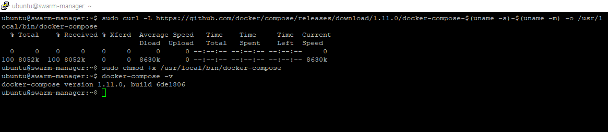

# 4.2 도커 컴포즈 설치

# 0.도커 컴포즈를 사용하는 이유

- 여러 개의 컨테이너가 하나의 애플리케이션으로 동작할때 컨테이너를 한번에 생성해야한다.
- 여러 개의 컨테이너를 하나의 서비스로 정의해 컨테이너 묶음으로 관리할 수있도록 한다.

# 1. 설치

- 현재 ubuntu 계정이 sudo 없이 docker에 접근할 수 있도록 설정한다.

```bash
sudo usermod -aG docker ${USER}
sudo su -
su - ubuntu
groups ubuntu
```

- 아래 명령어를 통해 도커 컴포즈 1.1 버전을 다운로드 받는다.

```bash
sudo curl -L https://github.com/docker/compose/releases/download/1.11.0/docker-compose-$(uname -s)-$(uname -m) -o /usr/local/bin/docker-compose
```

- `docker-compose -v` 명령어를 통해서 정상적으로 설치되었는지 확인한다.

