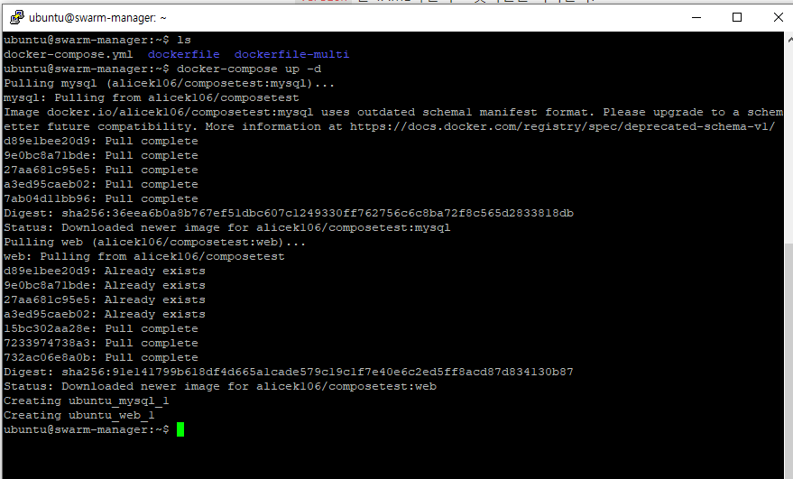

# 4.3 도커 컴포즈 사용

# 4.3.1 도커 컴포즈 기본 사용법

- 도커 컴포즈는 컨테이너의 설정이 정의된 YAML 파일을 읽어서 컨테이너를 생성한다.
- 아래와 같이 docker-compose.yml 파일을 작성한다.
- `version` 은 YAML파일의 포맷버전을 의미한다.
- `services` 생성될 컨테이너를 묶는 단위를 의미한다.
- `web` `mysql` 생성될 서비스의 이름이다. 해당 항목 아래에 컨테이너가 생성될 때 필요한 옵션을 지정할 수 있다.

```bash
version: '3.0'
services:
  web:
    image: alicek106/composetest:web
    ports:
      - "80:80"
    links:
      - mysql:db
    command: sh -c 'echo "ServerName localhost" >> /etc/apache2/apache2.conf && cat /etc/apache2/apache2.conf && apachectl -D FOREGROUND'
  mysql:
    image: alicek106/composetest:mysql
    command: mysqld
```

- `docker-compose up -d` 명령어를 통해 컨테이너를 생성한다.
- 교재대로 하면 apache 서버가 실행되지 않았다. 위처럼 직접 ServerName을 localhost로 지정해주니 정상적으로 실행이 됐다.
- 정상적으로 2개의 컨테이너가 생성되었다.



- `docker ps --format "table {{.Names}}\t{{.Image}}\t{{.Ports}}"` 를 통해 조회해본다.
- 컨테이너 이름은 `[프로젝트 이름]_[서비스 이름]_[서비스내 컨테이너 번호]` 로 자동 생성된다.
- 프로젝트 이름을 따로 지정하지 않는다면 docker-compose.yml 파일이 존재하던 디렉터리 명이 프로젝트 이름이 된다.


- 정상적으로 서비스하는 사이트에 접속이 된다.


- 서비스 내에는 여러개의 컨테이너가 존재할 수 있으며, replication을 지원한다.
- `docker-compose scale [서비스명]=[개수]` 명령어를 통해 특정 서비스를 복사할 수 있다.
- 이유는 모르겠지만 2개중 1개의 서비스가 종료되어 버렸다.


- `docker-compose down` 명령어를 사용하면 모든 서비스를 중단하고 컨테이너를 삭제한다.


- `-p` 옵션을 통해 프로젝트 명을 지정할 수 있다. 따라서 똑같은 docker-compose.yml을 실행하더라도 분리된 운영이 가능해진다.
- 조회 및 삭제시에도 `-p` 옵션을 사용해서 프로젝트에 대한 개별적인 제어가 가능하다.


# 4.3.2 도커 컴포즈 활용

### 버전

- `version: '3.0'` 과 같이 작성한다.
- 도커 컴포즈 버전 1.10에선 YAML 3.0 문법 사용이 가능하다.

### 서비스 정의

- 생성할 컨테이너의 옵션을 정의한다.
- 각 서비스는 컨테이너로 구현된다.
- `image` 옵션은 서비스의 컨테이너를 생성할 때 쓰일 이미지의 이름을 설정한다.

```yaml
services:
  my_container_1:
    image: ...
  my_container_2:
    image: ...
```

- `links` 옵션은 다른 서비스에 서비스명만으로 접근할 수 있도록 한다.
- 아래와 같이 작성하며, `[SERVICE:ALIAS]` 형태로 작성하면 별칭으로도 접근이 가능하게된다.

```yaml
services:
  web:
    links:
      - db
      - db:database
      - redis
```

- `environment` 옵션은 서비스의 컨테이너 내부에서 사용할 환경변수를 지정한다.
- 아래와 같이 2가지 방식을 허용한다.

```yaml
services:
  web:
    environment:
      - MYSQL_ROOT_PASSWORD=mypassword
    또는
		environment:
      - MYSQL_ROOT_PASSWORD: mypassword
```

- `command` 옵션은 컨테이너가 실행될 때 수행할 명령어를 설정한다.
- 아래와 같이 2가지 방식을 허용한다.

```yaml
services:
  web:
    image: alicek106/composetest:web
    command: apachectl -DFOREGROUND
    또는
		image: alicek106/composetest:web
		command: [apachectl, -DFOREGROUND]
```

- `depends_on` 옵션은 특정 컨테이너에 대한 의존관계를 설정한다. 이 항목에 명시된 컨테이너가 먼저 실행되고 나서 현재 컨테이너가 실행된다.
- 아래와 같이 작성하면 된다.
- 주의할 점은 순서만 보장하며, 실행이 완료되었는지는 확인하지 않는다.

```yaml
services:
  web:
    image: alicek106/composetest:web
    depends_on:
      - mysql
  mysql:
    image: alicek106/composetest:mysql
```

- `ports` 명령어는 서비스의 컨테이너를 개방할 포트를 설정한다.
- 호스트의 특정 포트를 서비스의 컨테이너에 연결하면 `scale` 명령어로 서비스의 컨테이너의 수를 늘릴수 없다.

```yaml
services:
  web:
    image: alicek106/composetest:web
      ports:
        - "8080"
				- "8081-8085"
				- "80:80"
```

- `build` 명령어는 Dockerfile에서 이미지를 빌드해 서비스의 컨테이너를 생성하도록 한다.
- `build` 에 정의된 dockerfile을 사용해서 `image` 에 정의된 이름으로 이미지를 만든다.
- 주의할 점은 Dockerfile을 수정해도 새로운 이미지를 생성하지 않는다. `--build` 옵션을 통해서 매번 이미지를 빌드할 수 있도록 할 수 있다.

```yaml
services:
  web:
    build: ./composetest
    image: alicek106/composetest:web
	  또는 
    build: ./composetest
		context: ./composetest
	  dockerfile: myDockerfile
		args:
			HOST_NAME: web
			HOST_CONFIG: self_config
```

- `extends` 다른 YAML 파일이나 현재 YAML 파일에서 서비스 속성을 상속받게 설정한다.
- 아래와 같이 `extends` 명령어를 통해 설정을 상속 받을 수 있다.

```yaml
version: '3.0'
	services:
		web:
			extends:
				file: extend_compose.yml
				service: extend_web
```

- extend_compose.yml 파일은 아래와 같다고 가정했다.

```yaml
version: '3.0'
	services:
		extend_web:
			image: ubuntu:14.04
			ports:
				- "80:80"
```

- 다음과 같이 1개의 yml 파일 안에서도 `extends` 가 가능하다.

```yaml
version: '3.0'
	services:
		web:
			extends:
				service: extend_web
		extend_web:
			image: ubuntu:14.04
			ports:
				- "80:80"
```

### 네트워크 정의

- `driver` 를 통해 기본으로 제공하는 브리지 타입의 네트워크가 아닌 원하는 네트워크를 사용하도록 설정할 수 있다.
- 아래는 overlay 방식의 네트워크를 mynetwork로 정의해서 서비스가 사용하는 예제이다.

```yaml
version: '3.0'
	services:
		myservice:
			image: nginx
			networks:
				- mynetwork
networks:
	mynetwork:
		driver: overlay
		driver_opts:
			subnet: "255.255.255.0"
			IPAdress: "10.0.0.2"
```

- `ipam(IP Address Manager)` 는 subnet, ip 범위 등을 설정할 수 있다.

```yaml
version: '3.0'
	...
networks:
	ipam:
		driver: mydriver
		config:
			subnet: 172.20.0.0/16
			ip_range: 172.20.5.0/24
			gateway: 172.20.5.1
```

- `external` 명령어를 통해 프로젝트를 생성할때마다 새로운 네트워크를 생성하는것이 아닌 기존의 네트워크를 사용할 수 있도록 한다.
- `external` 은 기존의 준비된 네트워크를 사용하기 때문에 `drvier,driver_ops, ipam` 옵션과 함께 사용이 불가능하다.

```yaml

services:
	web:
		image: alicek106/composetest:web
		networks:
			- alicek106_network
networks:
	alicek106_network:
		external: true

```

### 볼륨 정의

- `driver` 명령어는 볼륨을 생성할 때 사용될 드라이버를 설정합니다.

```yaml
version: '3.0'
services:
	...
volumes:
	driver: flocker
		driver_opts:
			opt: "1"
			opt2 : 2
```

- `external` 명령어를 사용하면 기존 볼륨을 사용하도록 설정할 수 있다.

```yaml
services:
	web:
		image: alicek106/composetest:web
		volumes:
			- myvolume:/var/www/html
volumes:
	myvolume:
		external: true
```

### YAML 파일 검증하기

- `docker-compose config` 명령어를 사용해서 YAML 파일의 오타나, 파일 포맷 등을 검사할 수 있습니다.