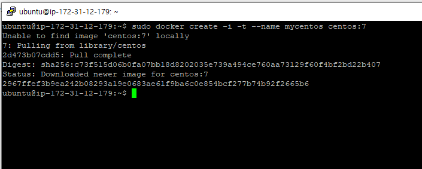
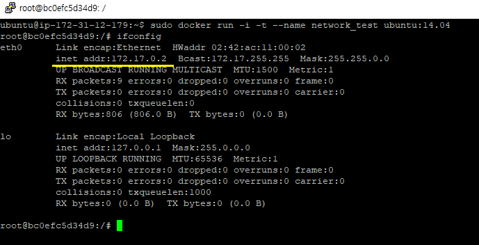
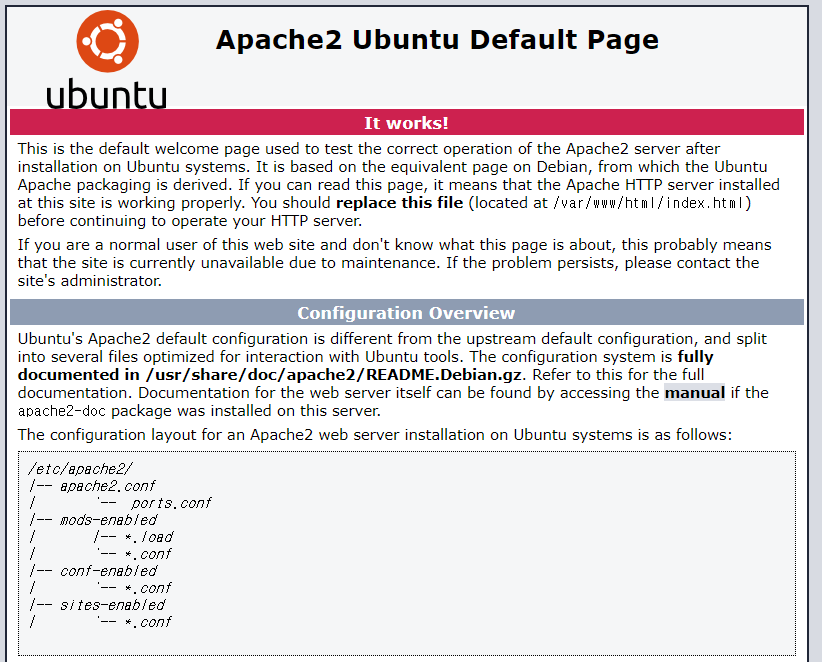
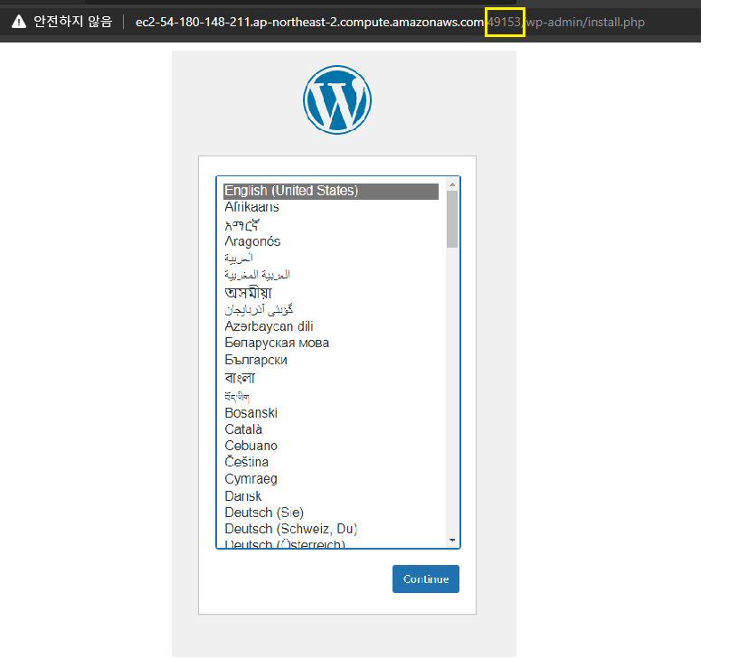
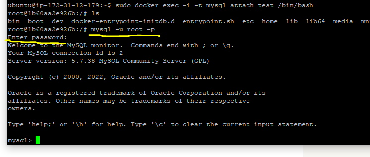

# 02. 도커 엔진

# 2.2 도커 컨테이너 다루기

## 컨테이너 실행해보기

- `run` 명령어를 사용해서 우분투 14.04 컨테이너 실행하기
    
    ```bash
    docker run -i -t ubuntu:14.04
    ```
    
- 로컬에 설치된 이미지가 없기 때문에 내려받아서 컨테이너를 실행 시켜줌.
- 사용자 이름을 보면 알 수 있듯이 컨테이너 내부에 들어온것을 볼수 있다.
- `-i` 옵션으로 상호 입출력을 가능하게 한다.
- `-t` 옵션으로 tty를 활성화 해서 bash shell을 사용할 수 있도록 한다.
- 두 옵션이 없으면 shell을 정상적으로 사용할 수 없게 된다.


- `create` 명령어를 사용해서 centos 컨테이너를 생성한다.
- `--name` 옵션을 통해서 컨테이너의 이름을 설정한다.



- `start` 명령어를 통해 컨테이너를 실행한다.
- `attach` 명령어를 통해 컨테이너 내부로 들어간다.


- `run` 명령어는 `start` 와 `attach` 명령어를 실행해준다.
- 반대로 `create` 명령어를 실행하지 않고 컨테이너 생성까지만 수행한다.
- `run` 과 `create` 는 기본적으노 `pull` 명령어와 `create` 명령어를 수행한다.
- `pull` 은 이미지가 존재하지 않을때 원격 저장소에서 이미지를 가져올 수 있도록 하며, `create` 는 이미지로 컨테이너를 만드는 일을 수행한다.

## 조회, 삭제, 종료

- `exit` 입력 또는 `Ctrl + D` 를 입력하면 된다.
- 이때 컨테이너가 중단되는 것에 주의한다.
- `Ctrl + P, Q` 를 입력하면 컨테이너를 정지하지 않고 빠져나올 수 있다.(3개를 동시에 누르는게 아니라 P먼저 누르고 Q를 눌러야 함)

- 도커 엔진에 존재하는 이미지의 목록 조회는 `images/docker-engine` 명령어를 사용한다.

```bash
docker images/docker-engine
```

- 실행중인 컨테이너 목록 확인은 `ps` 명령어를 사용한다.
- COMMAND는 컨테이너가 실행될때 수행할 명령어를 뜻한다.


- 정지된 컨테이너까지 조회하려면 `-a` 옵션을 사용하면 된다.
- 컨테이너를 중지하려면 `stop` 명령어를 사용하면 된다.


- 컨테이너 삭제는 `rm` 명령어를 사용하면 된다.


- 일괄중지는 `sudo docker stop $(sudo docker ps -a -q)` 명령어를 사용한다.
- 일괄삭제는 `sudo docker rm $(sudo docker ps -a -q)` 명령어를 사용한다.


## 컨테이너 외부 노출

- 테스트를 위한 우분투 컨테이너를 실행한다.

```bash
sudo docker run -i -t --name network_test ubuntu:14.04
```

- 컨테이너에서 `ifconfig` 명령어를 실행한다.
- 컨테이너는 기본적으로 172.17.0.x IP를 할당받는다.
- 컨테이너는 외부에서 접속은 불가능 하며 호스트에서만 접근이 가능한 상태다.



- 외부 노출을 위해 eth0의 IP와 포트를 호스트의 IP와 포트에 바인딩 해야한다.
- `-p` 옵션을 사용해서 `[호스트의 포트]:[컨테이너의 포트]` 형태로 바인딩한다.
- `-p` 옵션을 여러번 사용해서 포트를 여러개 바인딩 할수도 있다.
- 단순히 `-p 80` 과 같이 입력할 수 있는데 이때는 호스트의 포트가 랜덤으로 배정되기 때문에 `ps` 명령어를 통해서 확인해야한다.

```bash
sudo docker run -i -t --name mywebserer -p 80:80 ubuntu:14.04
```

- 우분투 컨테이너에 아파치 웹서버를 설치하고 실행한다.

```bash
apt-get update
apt-get install apache2 -y
service apache2 start
```

- 웹 브라우저를 통해 접속해본다.



## 샘플 애플리케이션 구축

- 데이터베이스와 웹서버를 하나의 컨테이너로 관리하기 보단 나눠서 컨테이너를 생성하고 관리하도록 하자.
- mysql 컨테이너를 실행한다.
- `-d` 옵션은 컨테이너를 백그라운드에서 동작하는 애플리케이션으로써 실행하도록 한다.
- `-e` 옵션은 컨테이너 내부의 환경변수를 설정한다.
- `--link` 옵션을 통해서 컨테이너간 네트워킹이 가능하도록 해준다. 컨테이너의 IP는 동적으로 할당되기 때문에 alias를 사용해서 연결한다. 컨테이너가 실행중이지 않다면 에러가 발생한다.
- 추후 삭제될 가능성이 높은 옵션이므로 브리지 네트워크 기능으로 연결하도록 하자.

```bash
sudo docker run -d \
--name wordpressdb \
-e MYSQL_ROOT_PASSWORD=password \
-e MYSQL_DATABASE=wordpress \
mysql:5.7
```

- wordpress 웹서버 컨테이너를 실행한다.

```bash
sudo docker run -d \
-e WORDPRESS_DB_HOST=mysql \
-e WORDPRESS_DB_USER=root \
-e WORDPRESS_DB_PASSWORD=password \
--name wordpress \
--link wordpressdb:mysql \
-p 80 \
wordpress
```

- wordpress 웹 서버 컨테이너와 바인딩된 호스트의 IP를 확인한다.


- 정상적으로 접속된다.



## 컨테이너 입출력

- `-d` 옵션으로 `run` 을 실행하면 입출력이 없는 상태로 컨테이너를 실행한다.
- 컨테이너 내부에서 프로그램이 터미널을 차지하는 foreground로 실행되기 때문이다.
- 따라서 `-d` 옵션을 사용한 컨테이너는 반드시 컨테이너 내에서 foreground로 프로그램이 실행되도록 해야한다. 그렇지 않은 경우는 컨테이너가 즉시 종료 된다.
- ubuntu 컨테이너를 `-d` 옵션을 걸어서 실행하면 아래처럼 바로 종료된다.


- MySql 컨테이너에 `-i -t` 옵션을 걸면 컨테이너로 접속해서 컨테이너에서 foreground로 실행되고 있는 프로그램을 확인할 수 있다. 상호 입출력은 불가능하고 단순히 foreground로 구동되는 프로그램의 로그만 볼 수있다.

```bash
sudo docker run -i -t \
--name mysql_attach_test \
-e MYSQL_ROOT_PASSWORD=password \
-e MYSQL_DATABASE=wordpress \
mysql:5.7
```


- 컨테이너 내부에서 `echo ${환경변수명}` 명령어를 입력하면 환경변수 확인이 가능하다.
- `echo` 명령어를 사용하기 위해선 상호 입출력이 가능한 shell이 컨테이너에서 실행되어야한다. 위의 mysql 컨테이너는 이미 attach로 접근해도 foreground로 프로그램이 이미 실행중이다. 따라서 `exec` 명령어를 사용하도록 한다.
- `exec` 명령어를 사용하면 컨테이너 내보의 shell을 사용할 수 있다.

```bash
sudo docker exec -i -t mysql_attach_test /bin/bash
```


- `mysql -u root -p` 를 통해 password가 올바르게 적용되었는지 확인해본다.



- `exit` 명령어로 빠져나와도 컨테이너가 종료되지 않는다.

