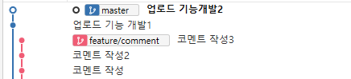

# Rebase

# 기초

다음과 같이 `master` 브랜치와 `feature/comment` 브랜치가 존재한다.

여기서 master 브랜치로 이동후 `git rebase master` 명령어를 입력한다. 원격 master 브랜치에 변화가 없다면 아래와 같이 up-to-date를 확인할 수 있다.

이후 `git rebase master feature/comment` 명령어를 수행한다.

소스트리로 결과를 확인한다.

`feature/comment` 모든 커밋 이력이 `master` 브랜치 이후로 붙어버린다. 주의할 점은 먼저 나온 브랜치가 구버전의 커밋이 된다는 점이다. 위 예시에서 master 브랜치가 먼저 나왔기 때문에 구버전이 된다.

`git merge` 명령어와 달리 병합을 수행했음에도 1개의 줄기만 있는것을 확인할 수 있다. `git merge` 를 수행하면 아래와 같이 2개의 브랜치가 하나로 합쳐지는 형태의 그래프가 그려진다.

# 충돌해소

`master`브랜치를 기준으로 `feature/upload` 브랜치를 생성했다.

의도적으로 `master`의 `업로드 기능개발 commit`, `feautre/upload`의 `새로운 업로드 개발 commit`이 충돌이 발생하도록 했다.

여기서 `git rebase master feature/upload` 명령어를 수행한다. 충돌로 인해 아래와 같이 출력된다.

`git status` 를 수행하면 아래와 같이 출력된다.

소스트리에선 아래와 같이 표기된다.

충돌이 발생한 파일을 확인하면 아래와 같이 충돌 지점을 표시해준다.

파일을 수정하고 `git add` 명령어를 수행한다.

`git rebase --continue` 명령어를 수행하면 아래와 같이 commit 메시지를 입력할 수 있는 창이 뜬다.

commit 메시지를 입력하면 아래의 문구를 확인할 수 있다.

충돌이 발생했던 commit은 충돌을 해소하면서 작성한 commit 메시지로 변경되었다. 수정된 commit의 메시지가 `feature/upload` 브랜치의 commit임에 유의한다. (rebase 명령어를 보면 기준이 `feature/upload` 로 작성되어 있기 때문이다.)

