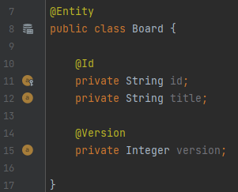

# 16.1 트랜잭션과 락

# 16.1.1 트랜잭션과 격리 수준

트랜잭션은 기본적으로 ACID중 원자성, 일관성, 지속성은 만족한다. 여기서 다루기 피곤한 녀석이 격리성이다. 단순히 트랜잭션 간에 간섭이 없도록 격리성을 분리해버리면 테이블 접근이 제한적이기때문에 동시성 처리 성능이 떨어지게된다.

## 격리수준(Isolation Level)

동시성 처리를 위해서 대부분의 Database는 `READ COMMITED`를 기본으로한다

### READ UNCOMMITTED

- 커밋하지 않은 데이터를 읽을 수 있다.
- 트랜잭션1이 데이터를 변경하는 로직을 수행하더라도 트랜잭션2는 데이터를 읽을수 있다. 이를 DIRTY READ라 한다.

### READ COMMITED

- 커밋한 데이터만 읽을 수 있다.
- 트랜잭션1이 회원A를 조회중일때, 트랜잭션2가 회원A 정보를 수정하고 커밋을 하면 트랜잭션 1이 다시 회원 A를 조회했을때 수정된 데이터가 조회된다. 하나의 트랜잭션에서 같은 회원A 정보를 읽지 못하는 현상이 발생하게된다. 이를 NON-REPEATABLE READ라 한다.

### REPEATABLE READ

- 한 번 조회한 데이터를 반복해서 조회해도 같은 데이터가 조회된다.
- 트랜잭션 1이 10살 이하의 회원을 조회했는데 트랜잭션 2가 5살 회원을 추가하고 커밋하면 트랜잭션1이 다시 10살 이하의 회원을 조회했을 때 회원 하나가 추가된 상태로 조회된다. 이처럼 반복 조회시 결과 집합(개수)가 달라지는 것을 PHANTOM READ라고한다.

### SERIALIZABLE

- 가장 엄격한 트랜잭션 격리 수준이다.
- PHANTOM READ가 발생하지 않으나 동시성 처리 성능이 급격히 떨어진다.

# 16.1.2 낙관적 락과 비관적 락 기초

- JPA의 영속성 컨텍스트(1차 캐시)를 적절히 활용하면 데이터베이스 트랜잭션이 `READ COMMITTED` 격리 수준이어도 애플리케이션 레벨에서 반복 가능한 읽기가 가능하다. (엔티티가 아닌 스칼라 값을 읽는 경우는 예외.)
- JPA는 데이터베이스 트랜잭션 격리 수준을 READ COMMITTED 정도로 가정한다.
- 일부 로직에 더 높은 격리 수준이 필요하다면 낙관적 락과 비관적 락 중 하나를 사용하면 된다.

## 낙관적 락

- 트랜잭션 대부분은 충돌이 발생하지 않는다고 낙관적으로 가정하는 방법이다.
- 데이터베이스가 제공하는 락 기능을 사용하는 것이 아니라 JPA가 제공하는 버전 관리 기능을 사용한다.
- 낙관적 락은 트랜잭션을 커밋하기 전까지는 트랜잭션의 충돌을 알 수 없다.

## 비관적 락

- 트랜잭션의 충돌이 발생하낟고 가정하고 우선 락을 걸고 보는 방법이다.
- 이것은 데이터베이스가 제공하는 락 기능을 사용한다.
- 대표적으로 `select for update` 구문이 있다.

## 두 번의 갱신 분실 문제(second lost updates problem)

- A와 B가 공지사항의 내용을 수정하는 경우 A가 수정후 Commit을 했다.
- 이후 B가 Commit을 한다면 A의 내용은 무시된다.
- 이 문제를 해결하는 3가지 방법은 아래와 같다.
  - 마지막 커밋만 인정하기
  - 최초 커밋만 인정하기
  - 충돌하는 갱신 내용 병합하기
- 기본값은 마지막 커밋만 인정하기이다.
- JPA가 제공하는 버전 관리 기능을 사용하면 손쉽게 최초 커밋만 인정하기를 구현할 수 있다.

# 16.1.3 @Version

- `@Version` 어노테이션은 `Long, Integer, Short, Timestap` 타입에만 적용이 가능하다.
- 버전 관리 기능을 사용하기 위해서 버전 관리용 필드를 추가해야한다.
- 엔티티를 수정할 때 마다 버전이 하나씩 자동으로 증가한다.
- 엔티티를 수정할 때 조회 시점의 버전과 수정 시점의 버전이 다르면 예외가 발생한다.

  

- 아래와 같이 트랜잭션 A에서 board의 버전이 변경되는 경우 예외가 발생한다.
- 트랜잭션2에 의해 테이블의 version은 2로 변경되었다. 트랜잭션이 1이 테이블에 저장하려고 할때 version이 1이기 때문에 예외가 발생한다.
- **버전 정보를 사용하면 최초 커밋만 인정하기**가 적용된다.

  ```java
  // 트랜잭션 1조회 title="제목A", version=1
  Board board = em.find(Board.class,id);

  // 트랜잭션 2에서 해당 게시글이 수정되었다.
  // title = "제목C" , version=2로 변경

  board.setTitle("제목B"); // 트랜잭션1 데이터 수정

  save(board);
  tx.commit(); // 예외 발생, 데이터베이스 version=2, 엔티티 version=1
  ```

# 16.1.4 JPA 락 사용

- JPA를 사용할때 추천하는 방법은 READ COMMITTED 트랜잭션 격리 수전 + 낙관적 버전 관리이다.
- `em.find(Board.class, id, LockModeType.OPTIMISTIC);` 과 같은 형태로 Lock을 걸 수 있다.
- 아래와 같은 방법도 사용가능하다.
  ```java
  Board board = em.find(Board.class,id);
  ...
  em.lock(board, LockModeType.OPTIMISTIC);
  ```

# 16.1.5 JPA 낙관적 락

- JPA가 제공하는 낙관적 락은 `@Version`을 사용한다
- 낙관적 락은 트랜잭션을 커밋하는 시점에 충돌을 알 수 있다는 특징이 있다.

## NONE

- 락 옵션을 적용하지 않아도 엔티티에 `@Version` 이 적용된 필드만 있으면 낙관적 락이 적용된다.
- 조회한 엔티티를 수정할 때 다른 트랜잭션에 의해 변경(삭제)되지 않도록 하기 위해서 사용한다.
- 조회 시점부터 수정 시점까지를 보장한다.
- 엔티티를 수정할 때 버전을 체크하면서 버전을 증가시킨다.(자동으로 Update 쿼리가 날라감)
- 두 번의 갱실 분실 문제를 예방한다.

## OPTIMISTIC

- 엔티티를 조회만 해도 버전을 체크한다.
- NONE은 안정적 수정을 보장, OPTIMISTIC은 안정적 조회를 보장
- 한 번 조회한 엔티티는 트랜잭션을 종료할 때까지 다른 트랜잭션에서 변경하지 않음을 보장한다.
- 조회한 엔티티는 트랜잭션이 끝날 때까지 다른 트랜잭션에 의해 변경되지 않아야 한다.
- 트랜잭션을 커밋할때 버전 정보를 조회해서 현재 엔티티의 버전과 같은지 확인한다. (버전 조회를 위한 SELECT 쿼리문 실행)
- OPTIMISTIC 옵션은 DIRTY READ와 NON-REPEATABLE READ를 방지한다.

## OPTIMISTIC_FORCE_INCREMENT

- 낙관적 락을 사용하면서 버전 정보를 강제로 증가시킨다.
- 게시물과 첨부파일 엔티티가 일대다 관계를 가지는 경우, 첨부파일 엔티티 정보만 변경하면 첨부파일 엔티티의 버전만 올라가게 된다.
- 이때 게시물 엔티티의 버전을 강제로 증가시키키 위해 OPTIMISTIC_FORCE_INCREMENT를 사용한다.
- 엔티티를 수정하지 않아도 트랜잭션을 커밋할 때 UPDATE 쿼리를 사용해서 버전 정보를 강제로 증가 시킨다.
- 조회후 추가로 엔티티를 수정하게 된다면 버전은 2가 증가헤 된다.

# 16.1.6 JPA 비관적 락

- 데이터베이스 트랜잭션 락 메커니즘에 의존하는 방법이다.
- SQL의 `select for update` 구문을 사용하며, 버전정보는 사용하지 않는다.
- 비관적 락의 장점은 다음과 같다.
  - 엔티티가 아닌 스칼라 타입을 조회할 때도 사용할 수 있다.
  - 데이터를 수정하는 즉시 트랜잭션 충동을 감지할 수 있다.

## PESSIMISTIC_WRITE

- 데이터베이스에 쓰기 락을 걸때 사용한다.
- 데이터베이스의 select for update를 사용해서 락을 건다.
- NON-REPEATABLE READ를 방지한다.
- 락이 걸린 로우는 다른 트랜잭션이 수정할 수 없다.

## PESSIMISTIC_READ(잘 사용하진 않음..)

- 데이터를 반복 읽기만 하고 수정하지 않는 용도로 락을 걸 때 사용한다.
- MySQL의 경우 lock in share mode
- PostgreSQL의 경우 for share

## PESSIMISTIC_FORCE_INCREMENT

- 비관적 락중 유일하게 버전 정보를 사용한다.
- 비관적 락이지만 버전 정보를 강제로 증가시킨다.
- 하이버네이트는 nowait를 지원하는 데이터베이스에 대해서 for update nowait옵션을 적용한다.
- nowait를 지원하지 않으면 for update가 사용된다.

# 16.1.7 비관적 락과 타임아웃

- 비관적 락을 사용하면 락을 획득할 때까지 트랜잭션이 대기한다.
- 무한정 기다릴 수 없기때문에 타임아웃 시간을 줄 수 있다.
- 타임아웃은 데이터베이스 특성에 따라 동작하지 않을 수 있다.

```java
Map<String,Object> properties = new HashMap<String,Object>();

// 타임아웃 10초 설정
properties.put("javax.persistence.lock.timeout",10000);

Board board = em.find(Board.class, "boardId",LockModeType.PESSIMISTIC_WRITE,properties);

```
