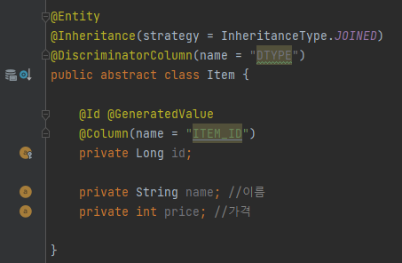

# 7.1 상속 관계 매핑

# 조인 전략

- 슈퍼타입 역할을 할 엔티티를 만든다.
- `@Inheritance` 어노테이션을 통해서 매핑전략을 지정할 수 있다. 현재 예시에선 조인 전략을 사용하므로 `InheritanceType.JOINED` 로 전략을 지정한다.
- `@DiscriminatorColumn` 어노테이션을 통해서 자식 엔티티를 구분하기 위한 컬럼을 생성한다.

- 자식 엔티티는 부모 엔티티인 Item을 상속한다.
- `@DiscriminatorValue` 어노테이션을 통해 엔터티 구분을 위한 코드를 지정한다.

- `@PrimaryKeyJoinColumn` 어노테이션을 통해 부모 엔터티에서 제공하는 PK명을 수정할 수 있다.

- 물리테이블과 컬럼은 아래와 같이 생성된다.

### 장점

- 테이블 정규화
- 외래 키 참조 무결성 제약조건 활용 가능
- 저장공간의 효율성

### 단점

- 조회시 Join을 사용하므로 성능 저하 발생가능성이 높아짐
- 조회 쿼리가 복잡하다.
- 데이터 등록시 Insert문이 두번 실행된다.

# 단일 테이블 전략

- `@Inheritance` 어노테이션을 통해서 매핑전략을 지정할 수 있다. 현재 예시에선 단일 테이블 전략을 사용하므로 `InheritanceType.SINGLE_TABLE` 전략을 사용한다.

- 단일 테이블 전략이므로 이전처럼 Book 엔터티에 독립적인 PK컬럼명을 지정할 수 없다.

- 물리테이블은 다음과 같이 1개만 생성된다.

### 장점

- 조인이 없기때문에 조회 속도가 빠르다.
- 조회 쿼리가 단순하다.

### 단점

- 자식 엔터티가 매핑한 컬럼은 모두 null을 허용해야 한다.
- 단일 테이블에 모든 데이터를 저장하기 때문에 테이블이 커진다. 상황에따라 오히려 조회성능이 더 나빠질 수 있다.
