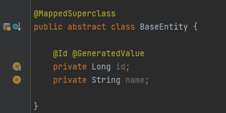

# 7.2 @MappedSuperClass

- 7.1에서 본 전략은 부모 클래스가 실제 물리 테이블과 매핑되어 있어야 한다.
- `@MappedSuperClass` 를 사용하면 부모 클래스는 물리 테이블과 매핑하지 않고 부모 클래스를 상속받은 자식만 물리 테이블로 생성할 수 있다.

- 2개의 자식 클래스가 BaseEntity를 상속받는다.

- 물리테이블은 아래와 같이 2개만 생성된다.

