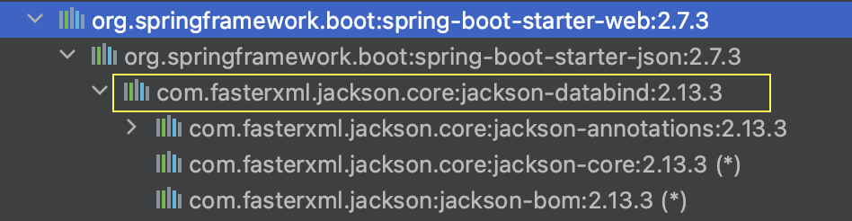

# Jackson을 활용한 다형성 예시

Gradle 프로젝트에서 `jackson-databind` 의존성을 추가합니다. 

```sql
implementation 'com.fasterxml.jackson.core:jackson-databind:2.13.3'
```

spring-boot-starter-web 의존성을 사용하고 있다면 자동으로 추가된다.



# JSON to Object

학생 클래스를 작성한다. setter가 없으면 매핑시에 에러를 발생시키기 때문에 꼭 작성하자.

```java
public class Shop {

    private String shopName;
    private int shopAge;
    private List<String> staffNames;
		
		//getter,setter 생략
	
}
```

ObjectMapper의 인스턴스를 통해서 JSON 형태로 작성된 String을 Object에 매핑할 수 있다.

```java
import com.fasterxml.jackson.core.JsonProcessingException;
import com.fasterxml.jackson.databind.ObjectMapper;
import gradle.project.practice.Shop;

public class App {

    public static void main(String[] args) throws JsonProcessingException {
        ObjectMapper mapper = new ObjectMapper();

        String jsonStudent = "{\"shopName\" : \"flowerShop\" , \"shopAge\":4 , \"staffNames\" : [ \"Anthony\" , \"Sunny\"] }";

        Shop shop = mapper.readValue(jsonStudent, Shop.class);

        System.out.println(shop);

    }
}
```

정상적으로 JSON 형태의 String이 Shop 오브젝트로 매핑되었다.


# 참고 사이트

[https://mkyong.com/java/how-to-convert-java-object-to-from-json-jackson/](https://mkyong.com/java/how-to-convert-java-object-to-from-json-jackson/)