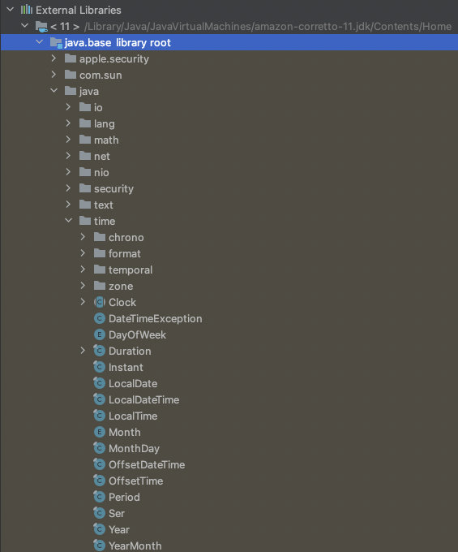

# LocalDateTime

java.base.java 하위에 time 패키지를 확인하면 시간과 관련된 클래스를 확인할 수 있다.

# 정의

- LocalDateTime은 Time-zone개념이 없는 ISO-8601 달력 시스템을 따라 만들어졌다.
- Time-zone은 특정 지역을 대표하는 시간을 의미한다.
- `2007-12-03T10:15:30` 과 같이 표기할 수 있다.
- 시간은 나노세컨드까지 표기가 가능하다. `2nd October 2007 at 13:45.30.123456789`
- 불변객체다. 즉, 한번 인스턴스화 되면 값을 변경할 수 없다.
- `year-month-day-hour-minute-second` 형태로 주로 표현한다.
- 이 클래스는 time-zone을 저장하거나 나타내지 않는다. 로컬 타임 기준으로 생일과 같은 특정 날짜를 표기하기 위해 사용한다. (지역설정 불가능. 로컬 시간만 나타낼 수 있음)
- offset이나 time-zone과 같이 추가적인 정보가 없으면 특정 타임라인에 대한 시간을 나타낼 수 없다.
- ISO-8601 달력 시스템은 현대에서 가장 많이 사용되고 있으며 윤년 규칙이 적용되어 있는 그레고리안 캘린더 시스템을 따른다.
- 과거의 날짜를 만들거나 아주 정확한 시간을 요구하는 경우에는 ISO-8601을 사용을 추천하지 않는다.
- 비교를 수행할땐 equals 메소드를 통해서 하도록 하자.

# 필드

- LocalDate와 LocalTime으로 이뤄져있다.
  

# 메소드

- 현재 시간을 구할때는 `now` 메소드를 사용한다.
- now는 ZoneId, Clock 객체를 통해 구한다.

- `of` 메소드를 통해서 LocalDateTime 인스턴스를 생성한다.
- `of`도 `now`처럼 오버라이딩 방식으로 여러개 작성되어 있다.
- Month가 Enum Type이다. 숫자로도 입력가능하도록 `of` 메소드가 구현되어 있음

- `ofInstant` 메소드를 통해서도 LocalDateTime을 구할 수 있다.
- `Instant`는 즉각적인 시간을 나타내는 시간 타입이다. 주로 애플리케이션에서 이벤트가 발생한 시간을 기록할때 사용한다.
- `ZoneId` 는 지역을 의미하며 `ZoneRules` 는 지역의 오프셋을 어떻게 관리할지에 대한 정보가 기록되어 있다. 대한 `ZoneOffset`은 Greenwich/UTC 시간으로 부터의 오프셋을 나타낸다.

