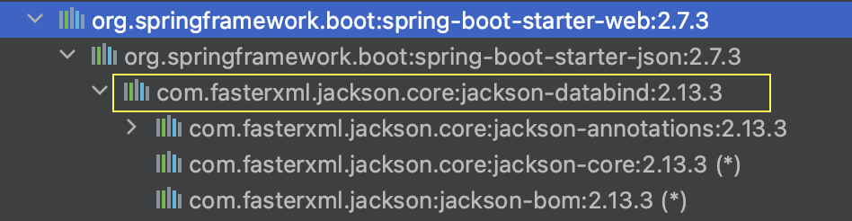

# 다형성이 적용된 Object로 JSON 전환하기

Gradle 프로젝트에서 `jackson-databind` 의존성을 추가한다.

```sql
implementation 'com.fasterxml.jackson.core:jackson-databind:2.13.3'
```

spring-boot-starter-web 의존성을 사용하고 있다면 자동으로 추가된다.



# JSON to Object

Shop 클래스를 작성한다. setter가 없으면 매핑시에 에러를 발생시키기 때문에 꼭 작성하자.

```java
public class Shop {

    private String shopName;
    private int shopAge;
    private List<String> staffNames;
		
		//getter,setter 생략
	
}
```

ObjectMapper의 인스턴스를 통해서 JSON 형태로 작성된 String을 Object에 매핑할 수 있다.

```java
import com.fasterxml.jackson.core.JsonProcessingException;
import com.fasterxml.jackson.databind.ObjectMapper;
import gradle.project.practice.Shop;

public class App {

    public static void main(String[] args) throws JsonProcessingException {
        ObjectMapper mapper = new ObjectMapper();

        String jsonShop = "{\"shopName\" : \"flowerShop\" , \"shopAge\":4 , \"staffNames\" : [ \"Anthony\" , \"Sunny\"] }";

        Shop shop = mapper.readValue(jsonShop, Shop.class);

        System.out.println(shop);

    }
}
```

정상적으로 JSON 형태의 String이 Shop 오브젝트로 매핑되었다.


# JSON to Inner Object

Shop 클래스에서 제품 목록을 관리해야할 경우아래와 같이 `List<Product>` 필드를 추가할 수 있다. 

가게에서 스마트폰 제품들을 관리하는 경우를 예시로 작성한다.

```java
public class Shop {

    private String shopName;
    private int shopAge;
    private List<String> staffNames;
    private List<Product> products; // <-- 추가!
		
		// getter,setter 생략
}
```

간단히 Product 클래스를 작성한다. 스마트폰과 관련된 정보들을 위한 필드를 작성한다.

```java
public class Product {

    private String productName;
		private String cpuName;    
		private int stockCount;
    private String color;
		
		//getter, setter 생략
}
```

아래와 같이 작성된 JSON 형태의 String을 Shop 타입으로 변환하는 코드를 작성한다.

```json
{
  "shopName": "phone shop",
  "shopAge": 4,
  "staffNames": [
    "Anthony",
    "Sunny"
  ],
  "products": [
    {
      "productName": "IPHONE 14",
      "cpuName": "A16",
      "stockCount": 10,
      "color": "BLACK"
    },
    {
      "productName": "IPHONE 13",
      "cpuName": "A15",
      "stockCount": 5,
      "color": "RED"
    }
  ]
}
```

```java
import com.fasterxml.jackson.core.JsonProcessingException;
import com.fasterxml.jackson.databind.ObjectMapper;
import gradle.project.practice.Shop;

public class App {

    public static void main(String[] args) throws JsonProcessingException {
        ObjectMapper mapper = new ObjectMapper();

        String jsonShop = "{\"shopName\" : \"phone shop\" , \"shopAge\":4 , "
            + "\"staffNames\" : [ \"Anthony\" , \"Sunny\"], "
            + " \"products\": [ {\"productName\": \"IPHONE 14\" , \"cpuName\": \"A16\" ,\"stockCount\": 10, \"color\":\"BLACK\"}, "
            + "{\"productName\" : \"IPHONE 13\" , \"cpuName\": \"A15\" ,\"stockCount\" : 5 , \"color\" : \"RED\"}]"
            + "}";

        Shop shop = mapper.readValue(jsonShop, Shop.class);

        System.out.println(shop);

    }
}
```

출력 결과


# 다형성이 적용된 Object로 JSON 전환하기

위에서 작성한 Shop에선 스마트폰 제품만 관리하고 있었다. 추가 요건으로 Shop에서 스마트폰의 케이스를 판매하기로 했다. 이런 경우에는 어떻게 처리하는게 좋을까?

가장 쉬운 방법은 Product 클래스에 케이스와 관련된 정보 필드를 추가하는것이다. 두번째 방법은 다형성을 활용하는 방법이다. 제품의 가장 기본적인 정보(이름,수량,색상)만 Product에서 관리하고 각 제품에 특화된 정보는 Product의 자식 클래스에서 관리하는 방법이다. 

만약 제품의 종류가 늘어날 가능성이 높은 상황이라면 두번째 방법을 사용하는게 좋다. 첫번째 방법을 사용한 경우에 제품이 추가될경우 기존의 Product 클래스를 지속적으로 수정해야 하는데 이때 의도치 않게 다른 제품과 관련된 코드에 영향을 줄수 있다. 두번째 방법을 사용하면 그냥 Product를 상속받는 자식 클래스만 추가하면 된다. (다만 관리해야하는 클래스가 많아진다.)

위에서 설명한 두번째 방법을 Jackson을 통해 구현해본다.

Product 클래스를 작성한다. 간단히 제품명,수량 정도만 기록하도록 했다. 

Jackson의 `@JsonTypeInfo` 와 `@JsonSubTypes` 어노테이션을 통해서 다형성을 가지는 Object의 JSON 매핑을 좀 더 수월하게 할수 있다.

`@JsonTypeInfo` 에서 use에는 NAME을 사용했다. 이뜻은 매핑할 자식 클래스를 찾을때 논리적으로 부여한 이름으로 찾겠다는것을 의미한다. 이를 위해 자식 클래스에 `@JsonTypeName` 어노테이션을 사용해야 하지만 property의 옵션을 `property = "productType"` 으로 작성하면 자식 클래스의 productType 필드를 통해 논리적 이름을 찾을 수 있도록한다.

`@JsonSubTypes` 에선 자식 클래스를 모두 작성하며, 각 자식 타입의 논리적 이름을 정의한다.

```java
import com.fasterxml.jackson.annotation.JsonSubTypes;
import com.fasterxml.jackson.annotation.JsonTypeInfo;
import com.fasterxml.jackson.annotation.JsonTypeInfo.Id;

@JsonTypeInfo(use = Id.NAME, property = "productType", visible = true)
@JsonSubTypes({
    @JsonSubTypes.Type(value = PhoneCaseProduct.class, name = "CASE"),
    @JsonSubTypes.Type(value = PhoneProduct.class, name = "PHONE"),
})
public class Product {

    private String productName;
    private int stockCount;
		
		// getter,setter,toString 생략

		
}
```

스마트폰과 케이스 제품에 대한 클래스를 작성한다. 

```java
public class PhoneProduct extends Product{

    private String productType;
    private String cpuName;
		
		// getter, setter,toString 생략

}
```

```java
public class PhoneCaseProduct extends Product{

    private String productType;
    private String texture;
		
		// getter, setter,toString 생략
}
```

전환할 JSON 데이터는 아래와 같다. 총 3개의 제품이 있으며, PHONE 타입 2개, CASE 타입이 1개 있다.

```json
`{
  "shopName": "phone shop",
  "shopAge": 4,
  "staffNames": [
    "Anthony",
    "Sunny"
  ],
  "products": [
    {
      "productType": "PHONE",
      "cpuName": "A16",
      "productName": "IPHONE 14",
      "stockCount": 10
    },
    {
      "productType": "PHONE",
      "cpuName": "A15",
      "productName": "IPHONE 13",
      "stockCount": 2
    },
    {
      "productType": "CASE",
      "texture": "JELLY",
      "productName": "IPHONE 13 SOFT CASE",
      "stockCount": 20
    }
  ]
}
```

매핑 코드를 작성한다.

```java
import com.fasterxml.jackson.core.JsonProcessingException;
import com.fasterxml.jackson.databind.ObjectMapper;
import gradle.project.practice.Shop;

public class App {

    public static void main(String[] args) throws JsonProcessingException {
        ObjectMapper mapper = new ObjectMapper();

        String jsonShop = "{\"shopName\" : \"phone shop\" , \"shopAge\":4 , "
            + "\"staffNames\" : [ \"Anthony\" , \"Sunny\"], "
            + " \"products\": [ {\"productType\": \"PHONE\" , \"cpuName\": \"A16\" ,\"productName\": \"IPHONE 14\" , \"stockCount\": 10}, "
            + "{\"productType\": \"PHONE\" , \"cpuName\": \"A15\" ,\"productName\": \"IPHONE 13\" , \"stockCount\": 2},"
            + "{\"productType\": \"CASE\" , \"texture\": \"JELLY\" ,\"productName\": \"IPHONE 13 SOFT CASE\" , \"stockCount\": 20}]"
            + "}";

        Shop shop = mapper.readValue(jsonShop, Shop.class);

        System.out.println(shop);

    }
}
```

3개의 제품에 대한 정보가 정상적으로 출력된다. 전환한 Object에 대해서 출력 할때 각 클래스에 대한 toString 메소드가 실행되므로 정상적으로 출력이 되지 않을땐 toString 코드를 점검하면 된다.


# 참고 사이트

[](https://mkyong.com/java/how-to-convert-java-object-to-from-json-jackson/)