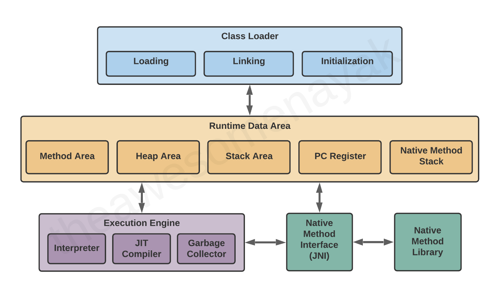
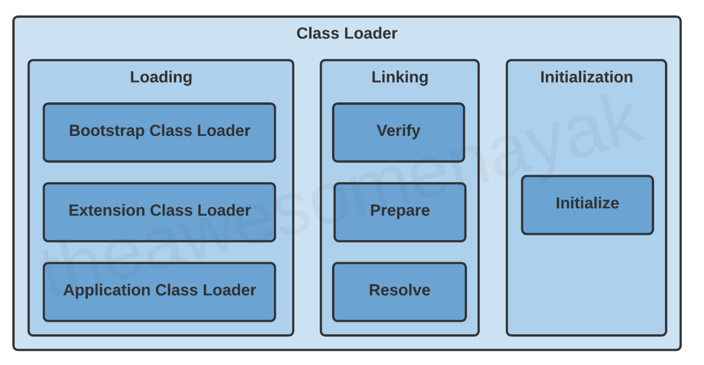

# Java Virtual Machine
## 구성
JVM은 아래와 같이 크게 5개의 컴포넌트로 구분이 가능하다. 

### Class Loader
- Java Compiler가 컴파일한 바이트 코드를 읽는역할을 한다.(.java -> .class)

### Runtime Data Area
- 런타임시에 사용되는 리소스를 적재하기 위한 공간이다.

### Execution Engine
- Runtime Data Area에 있는 정보들을 활용해서 실제 코드를 수행가능하도록 OS에 정보를 전달한다. 

### Native Method
- 자바의 일부 기능들은 C언어를 기반으로 하는 특정 메소드를 의존한다.(주로 자료 구조에 대한 알고리즘) JDK를 설치하고 bin파일을 살펴보면 dll 또는 so라는 확장자를 확인할 수 있는데 이 파일들이 그것이다.

## 컴포넌트별 상세 설명
### Class Loader
컴파일에 성공한 바이트 코드를 JVM에서 사용하기 위해선 JVM 내부로 해당 클래스 파일을 가져와야 하는데 그 역할을 Class Loader가 수행한다.

클래스 파일을 내부로 가져오는 과정에는 총 3개의 Phase를 거쳐야한다.

#### Loading
- Bootstrap Class Loader - 루트 클래스 로더이며 `Extension Class Loader`의  부모이다. `java.lang, java.net, java.util, java.io` 와 같은 표준 자바 패키지들을 로딩한다. 어떤 패키지를 가져오는지 자세히 알고 싶다면 `rt.jar` 내부를 보면 알 수 있다. (경로 - `$JAVA_HOME/jre/lib`)

- Extension Class Loader - `Bootstrap Class Loader`의 자식이며 동시에 `Application Class Loader`의 부모이다. Extension Class Loader는 표준 자바의 기능을 확장하는 패키지들을 로드한다. (경로 - `$JAVA_HOME/jre/lib/ext`)

- Application Class Loader - `Extension Class Loader`의 자식이다. `Application Class Loader`는 classpath에 있는 패키지들을 로딩한다. classpath의 default 설정은 현재 application이 실행된 위치이다. 단, 실행시 `-classpath` 또는 `-cp` 옵션을 설정하면 경로를 변경할 수 있다. 

JVM은 `ClassLoader.loadClass()` 메소드를 사용해서 class를 메모리에 적재한다. class를 찾는 방법은 fully qualified name을 기반으로 한다.(패키지명 + 클래스명)

부모 Loader에서 클래스 찾기를 실패한 경우 자식 Loader가 이를 수행하며 모든 Loader를 사용해도 클래스를 찾지 못했다면, `NoClassDefFoundError` 또는 `ClassNotFoundException`이 발생한다
