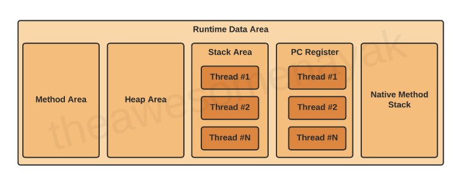
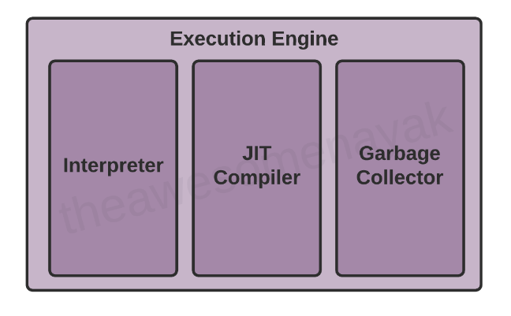

# Java Virtual Machine
원서 링크 - https://www.freecodecamp.org/news/jvm-tutorial-java-virtual-machine-architecture-explained-for-beginners/
# 구성
JVM은 아래와 같이 크게 5개의 컴포넌트로 구분이 가능하다. 


## Class Loader
- Java Compiler가 컴파일한 바이트 코드를 읽는역할을 한다.(.java -> .class)

## Runtime Data Area
- 런타임시에 사용되는 리소스를 적재하기 위한 공간이다.

## Execution Engine
- Runtime Data Area에 있는 정보들을 활용해서 실제 코드를 수행가능하도록 OS에 정보를 전달한다. 

## Native Method Interface/Library
- 자바의 일부 기능들은 C언어를 기반으로 하는 특정 메소드를 의존한다.(주로 자료 구조에 대한 알고리즘) JDK를 설치하고 bin파일을 살펴보면 dll 또는 so라는 확장자를 확인할 수 있는데 이 파일들이 그것이다.

# Class Loader
컴파일에 성공한 바이트 코드를 JVM에서 사용하기 위해선 JVM 내부로 해당 클래스 파일을 가져와야 하는데 그 역할을 Class Loader가 수행한다.

클래스 파일을 내부로 가져오는 과정에는 총 3개의 Phase를 거쳐야한다.

## Loading
- Bootstrap Class Loader - 루트 클래스 로더이며 `Extension Class Loader`의  부모이다. `java.lang, java.net, java.util, java.io` 와 같은 표준 자바 패키지들을 로딩한다. 어떤 패키지를 가져오는지 자세히 알고 싶다면 `rt.jar` 내부를 보면 알 수 있다. (경로 - `$JAVA_HOME/jre/lib`)

- Extension Class Loader - `Bootstrap Class Loader`의 자식이며 동시에 `Application Class Loader`의 부모이다. Extension Class Loader는 표준 자바의 기능을 확장하는 패키지들을 로드한다. (경로 - `$JAVA_HOME/jre/lib/ext`)

- Application Class Loader - `Extension Class Loader`의 자식이다. `Application Class Loader`는 classpath에 있는 패키지들을 로딩한다. classpath의 default 설정은 현재 application이 실행된 위치이다. 단, 실행시 `-classpath` 또는 `-cp` 옵션을 설정하면 경로를 변경할 수 있다. 

JVM은 `ClassLoader.loadClass()` 메소드를 사용해서 class를 메모리에 적재한다. class를 찾는 방법은 fully qualified name을 기반으로 한다.(패키지명 + 클래스명)

부모 Loader에서 클래스 찾기를 실패한 경우 자식 Loader가 이를 수행하며 모든 Loader를 사용해도 클래스를 찾지 못했다면, `NoClassDefFoundError` 또는 `ClassNotFoundException`이 발생한다

## Linking
클래스를 메모리에 올리고 나면, linking 작업이 수행된다. Linking Phase에선 인터페이스 또는 클래스 간의 의존성 관계를 연결한다. Linking 작업은 아래 3개의 작업으로 구성된다. 

- Verification - 이 작업에선 class파일이 constraint나 rule을 만족하는지 검사한다. 만약 Verification에 실패한다면 `VerifyException` Exception이 발생한다. 예를들어 애플리케이션이 Java 11을 사용해서 작성되었는데 Java 8 버전의 JVM으로 실행하려고 할때 verification 작업은 실패할 것이다.
  
- Preparation - interface나 클래스에 정의된 static fields를 메모리에 로딩한다. 값들은 모두 default 값으로 세팅된다. 만약 코드를 `private static final boolean enabled = true;` 같이 작성했더라도 일단 Preparation 단계에선 boolean의 기본값이 `false`가 세팅된다.

- Resolution - 심볼릭 참조를 런타임 상수 풀에 있는 실제 값으로 치환한다. (symbolic -> direct) (runtime constant pool가 뭐지????) 예를들어, A라는 클래스가 다른 클래스나, 상수 변수를 참조하고 있다면, 이를 실제 값으로 치환한다.

## Initialization
해당 Phase에선 클래스 또는 인터페이스의 initialization method를 실행한다. (`<clinit>`가 뭔지 찾아보기!!) 이 과정에서 클래스의 생성자를 호출하거나 static 블락을 실행하며 또한 static 변수에 값을 세팅한다.

Note : JVM은 멀티 쓰레드이다. 따라서 똑같은 클래스를 (거의) 동시에 초기화하는 경우가 발생한다. 이 경우 동시성 이슈가 있을 수 있으니, 코드를 작성할 때 이런 환경을 이해하고 Thread-safe하게 코드를 작성하도록 하자.

# Runtime Data Area
Runtime Data Area는 5개의 컴포넌트로 이뤄진다.



## Method Area
클래스 레벨의 데이터가 여기에 기록된다. 클래스 레벨의 데이터라 함은 런타임 상수 풀, 필드, 메소드 데이터, 메소드를 위한 코드, 생성자를 의미한다.

데이터를 저장하기에 메모리의 용량이 충분치 않다면 `OutOfMemoryError`가 발생한다.

아래 코드를 보자
```java
public class Employee {
  
  private String name;
  private int age;
  
  public Employee(String name, int age) {
  
    this.name = name;
    this.age = age;
  }
}
```

이 예시 코드에서 필드 레벨 데이터인 `name`과 `age` 그리고 생성자의 상세 정보들이 method area영역에 저장된다.

method area는 가상 머신이 실행될때 생성되며, JVM에는 1개의 method area영역만 존재한다.

## Heap Area
모든 Object와 Object와 연결되어 있는 인스턴스들이 여기에 저장된다. 코드를 수행하는 런타임 시점에 유동적으로 메모리에 인스턴스 및 배열이 적재된다. 

아래 코드에 따르면 Employee 클래스의 인스턴스가 heap 영역에 적재된다.
```java
Employee employee = new Employee();
```

heap 영역도 VM이 실행될때 생성되며 JVM 당 1개만 존재한다.

Note - Method 와 Heap 영역은 multiple 쓰레드를 위해서 메모리 공간을 공유한다. 여기에 저장된 데이터는 thread safe하지 않다(이거 맞는말인지 확인 해봐야할듯...?!)

확인결과 - Method Area와 Heap Area가 직접 메모리를 공유해서 사용한다는 뜻이 아니고, Thread가 Method Area와 Heap Area 양쪽에 접근해서 필요한 정보를 가져온다는 뜻이었음. (https://qr.ae/prSJFZ)

## Stack Area
JVM에서 쓰레드가 생성될때 마다, 각 쓰레드 별로 runtime stack이 생성된다. 쓰레드가 사용하게 되는 모든 변수, 메소드 콜, 부분적 결과(메소드의 결과값)들이 스택에 기록된다.

쓰레드가 JVM이 제공 가능한 사이즈 보다 더큰 stack을 요구하게 될 경우 `StackOverflowError`가 발생하게 된다.

모든 메소드 호출마다, Stack Frame이 만들어지며 메소드 호출이 끝나면 Stack Frame은 제거된다.

Stack Frame은 3개의 서브 파트로 구분된다.
- Local Variables - 각 Stack Frame은 local variable이라고 알려진 변수 배열을 가지게 된다. 배열의 크기는 컴파일 시점에 확정된다.
- Operand Stack - 각 Stack Frame은 Operand Stack라고 알려진 LIFO stack을 가지게 된다. Operand Stack은 runtime시에 발생하는 연산들을 처리하기 위한 workspace역할을 한다. 최대 사이즈는 compile 시점에 확정된다.
- Frame Data - 메소드와 관련된 symbol들이 저장되는 공간이다. (메소드의 파라미터, 변수, operand stack의 상태) exception의 경우에 사용하는 catch bloack에 대한 정보가 여기에 저장된다.

아래 예시코드를 한번 보자.

```java
double calculateNormalisedScore(List<Answer> answers) {
  
  double score = getScore(answers);
  return normalizeScore(score);
}

double normalizeScore(double score) {
  
  return (score – minScore) / (maxScore – minScore);
}
```

answer과 score 변수는 Local Variables 배열에 저장된다. Operand Stack은 뺄셈과 나눗셈 연산에 필요한 연산자와 변수를 담게 된다. Stack Area는 Thread간에 공유되지 않기 떄문에 Thread safe하다.

## Program Counter (PC) Registers
JVM은 다중 쓰레드를 지원한다. 각 쓰레드는 자신만의 PC Register를 가지고 있으며 PC Register는 현재 실행 중인 JVM 명령어의 주소를 가지고 있다.

명령어가 실행될떄 PC register는 다음 작업으로 업데이트 된다.

## Native Method Stacks
JVM은 native methods를 지원하는 stack들을 가지고 있다. 이 메소드들은 Java가 아닌 C, C++로 작성되어 있다. 

새로운 쓰레드 마다, 별도의 native method stack이 할당된다.

# Execution Engine
main 메모리에 바이트코드가 로드되면, 프로그램 실행이라는 디테일한 작업이 가능하다는 뜻이다. Execution Engine은 아래에 있는 3개의 클래스들을 실행하면서 코드를 실행한다.
하지만, 프로그램을 실행하기 전에 바이트 코드는 machine language 명령어로 변환될 필요가 있다.



## Interpreter
interpeter는 한줄 한줄 bytecode 명령어를 읽고 실행한다. 이런식으로 한줄씩 읽기때문에 interpreter의 작업은 느리다. 또다른 단점은 메소드가 여러번 호출될때 매번 새로운 메소드를 처리하는것과 같이 작업을 해야한다.

## JIT Compiler
JIT Compiler는 interpreter의 단점을 극복하기 위해 등장했다. Execution Engine은 처음에는 bytecode를 실행하기 위해서 interpreter를 사용한다. 그러다가 반복된 작업을 만나게 되면 JIT compiler를 사용한다.