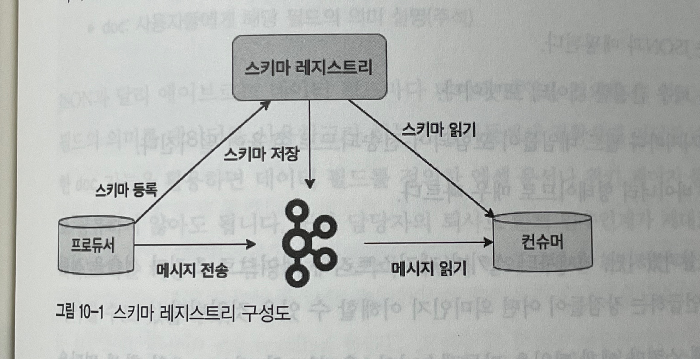
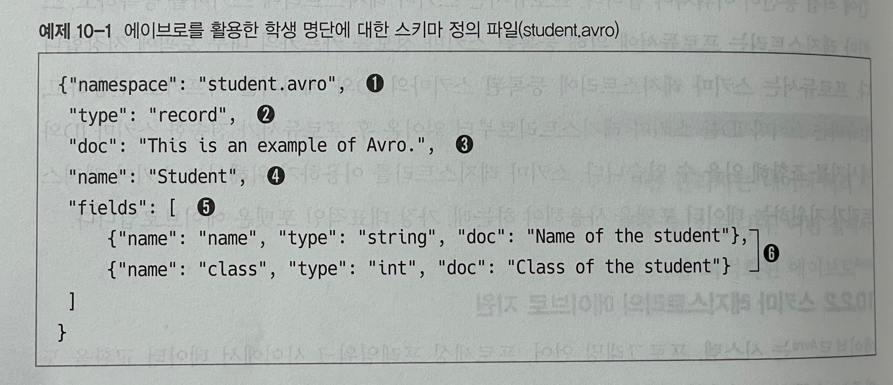

# 스키마란?

- 정보를 구성하고 해석하는 것을 도와주는 프레임워크 또는 개념을 의미한다.
- 주로 데이터베이스의 구조를 정의하고 표현 방법이나 전반적인 명세와 제약 조건을 기술하는 표준 언어로 활용 된다.
- 토픽으로 전송되는 메시지에 대해 미리 스키마를 정의한 후 전송함으로써 데이터베이스에서 얻을 수 있는 동일한 효과를 얻을 수 있다.

# 스키마의 유용성

- 관계형 데이터베이스의 경우 스키마가 미리 정의되어 있고, 관계형 데이터베이스에 데이터를 추가하기 위해선 반드시 사전에 정의된 스키마의 형태로 데이터를 입력해야 한다.
- Select와 같이 약속된 스키마가 존재하지 않는다면 개발자별로 테이블의 데이터를 읽는 방법을 달리 개발하게 될것이다!!
- 카프카에 스키마 개념이 없을때를 생각해보자.
- 만약 카프카의 사용자가 단 한명이라면 크게 문제될게 없겠지만, 다수의 사용자가 Topic을 Pub/Sub 하게 된다면 스키마가 있는게 좋다.
- 데이터를 컨슘하는 여러 서비스에게 데이터에 대한 정확한 정의와 의미를 알려주는 역할을 하는것이 바로 스키마다.

# 카프카와 스키마 레지스트리

- 카프카에서 스키마를 활용하는 방법은 스키마 레지스트리라는 별도의 애플리케이션을 이용하는 것이다.
- 스키마를 등록하고 관리하는 애플리케이션으로서, 2015년 2월에 처음 등장했다.

- 가장 흔히 사용되는 스키마 레지스트리로는 Avro가 있다.

