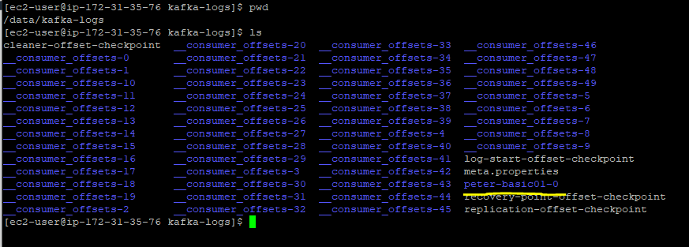

# 3.1 카프카 기초 다지기

## 리플리케이션

- 각 메시지들을 여러 개로 복제해서 카프카 클러스터내 브로커들에 분산시키는 동작을 뜻한다.
- 하나의 브로커가 종료 되더라도 다른 브로커에 메세지가 있기 때문에 안정성을 유지할 수 있다.
- 토픽 생성시 `--replication-factor` 옵션을 통해 리플리케이션 개수를 지정할 수 있다.
- 3을 입력했으면 원본 1개와 복사본 2개의 토픽을 만들어낸다. ( 사실 Topic이 아니라 partition이 복제 되는것임! Topic은 Partition을 묶기위한 추상적인 개념이다 )

## 파티션

- 하나의 토픽이 한 번에 처리할 수 있는 한계를 높이기 위해 토픽 하나를 여러 개로 나눠 병렬 처리가 가능하게 만든 것을 파티션이라고 한다. (분산처리 가능)
- 나뉜 파티션 수만큼 컨슈머를 연결할 수 있다.
- 파티션의 번호는 0부터 시작한다.
- 한번늘린 파티션은 줄일 수 없다. 초기에 적은 개수의 파티션을 생성후 조금씩 늘려가는 걸 추천한다.

## 세그먼트

- 파티션 마다 N개의 세그먼트 로그 파일이 존재한다.
- 파티션별로 폴더가 생성되며 해당 폴더에 들어가면 파티션에서 처리했던 메시지를 확인할수 있다.
- `/data/kafka-logs` 경로에서 파티션별 폴더가 생성된것을 확인할 수 있다.



- 아래의 명령어를 통해서 producer를 생성해서 peter-basic01 Topic으로 메세지를 전송한다.

```bash
/usr/local/kafka_2.12-2.6.0/bin/kafka-console-producer.sh \
--bootstrap-server peter-kafka01.foo.bar:9092 \
--topic peter-basic01
```

- Producer에서 Hello World!!!! 메세지를 peter-basic01 Topic으로 Pub한다.


- peter-basic01의 0번째 파티션의 세그먼트를 확인한다.


