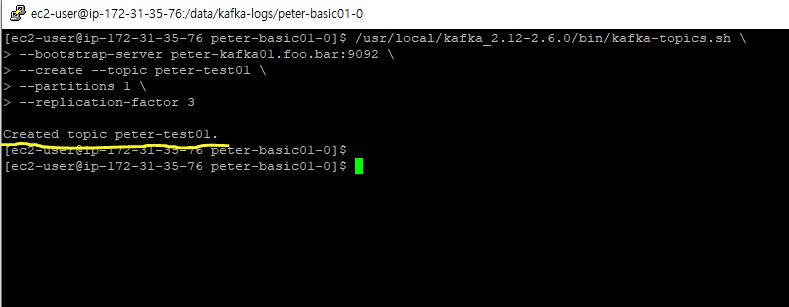

# 4.1 카프카 리플리케이션

- 카프카는 초기 설계 단계에서부터 일시적인 하드웨어 이슈 등으로 브로커 한두 대에서 장애가 발생하더라도 안정적인 서비스가 운영될 수 있도록 설계됐다.
- 카프카는 안정성 확보를 위해 리플리케이션이라는 동작을 수행하게 된다.

# 리플리케이션 동작 개요

- 카프카의 리플리케이션 동작을 위해 토픽 생성 시 필숫값으로 `replication factor` 옵션을 사용해한다.
- 아래의 명령어를 통해 peter-test01 토픽을 생성한다.

```bash
/usr/local/kafka_2.12-2.6.0/bin/kafka-topics.sh \
--bootstrap-server peter-kafka01.foo.bar:9092 \
--create --topic peter-test01 \
--partitions 1 \
--replication-factor 3
```



- 아래 명령어를 통해서 토픽의 상세정보를 출력한다.

```bash
/usr/local/kafka_2.12-2.6.0/bin/kafka-topics.sh \
--bootstrap-server peter-kafka01.foo.bar:9092 \
--topic peter-test01 \
--describe
```

- 첫번째 줄에는 토픽의 파티션수와 리플리케이션의 수를 나타낸다.
- 두번째 줄에는 토픽의 파티션에 대한 정보가 출력되며, 몇번 브로커에 Replicas되었는지 출력된다.
- 파티션 단위로 Replication되는 모습을 확인할 수 있다.


- 프로듀서를 생성해서 토픽에 메시지를 Pub한다.

```bash
/usr/local/kafka_2.12-2.6.0/bin/kafka-console-producer.sh \
--bootstrap-server peter-kafka01.foo.bar:9092 \
--topic peter-test01
```


- 아래 명령어를 통해서 세그먼트 파일의 내용을 확인해본다.

```bash
/usr/local/kafka_2.12-2.6.0/bin/kafka-dump-log.sh \
--print-data-log \
--files /data/kafka-logs/peter-test01-0/00000000000000000000.log
```

- 시작 오프셋 위치, 메시지 카운트, 메시지 내용 등을 확인할 수 있다.


# 리더와 팔로워

- 토픽 상세보기 명령어의 수행결과를 보면 leader 항목을 볼 수 있다.
- Replication을 수행하면 리더를 선출하며, 리더에서만 모든 읽기와 쓰기가 가능하다.
- 즉, 프로듀서는 모든 Replication에 메세지를 보내는것이 아닌 리더에게만 메세지를 보낸다.
- 컨슈머도 오직 리더에서만 메시지를 가져온다.
- 팔로워들은 리더에 장애가 발생할 경우를 대비해서 지속적으로 리더의 메시지를 복사한다.

# ISR(InSyncReplica)

- 리더와 팔로워는 ISR(InSyncReplica)라는 논리적 그룹으로 묶여있다.
- ISR에 있는 팔로워만 리더가 될 수 있다.
- 리더는 ISR에 존재하는 팔로워가 리더의 메시지를 복사할때까지 기다린다.
- 리더는 팔로워가 리더의 메시지를 잘 복사했는지 감시한다. 문제가 있다고 판단되는 팔로워는 ISR에서 추방한다.
- ISR 내에 있는 모든 팔로워가 리더의 메시지를 복사완료 했다면 커밋을 표시한다.
- 마지막 커밋 오프셋 위치는 `하이워터마크(high watermark)` 라고 부른다.
- 컨슈머는 커밋된 메시지만 읽을 수 있다.
  
- 아래 명령어를 통해서 마지막 커밋 오프셋 위치를 확인할 수 있다.

```bash
cat /data/kafka-logs/replication-offset-checkpoint
```

- 0은 파티션 번호를 의미한다. 1은 커밋된 오프셋 번호를 뜻한다.


# 리더와 팔로워 리플리케이션 동작 원리

- 카프카는 리더와 팔로워 간의 리플리케이션 동작을 처리할 때 서로의 통신을 최소화할 수 있도록 설계되었다.
- 팔로워는 리더의 메시지를 복사히기 위해 리더에게 fetch 요청을 보낸다.
- 리더는 모든 팔로워가 fetch 요청을 보냈다는 사실을 알고 있다. 여기서 포인트는 리더가 팔로워들이 올바르게 복사했다는것을 알진 못한다는 점이다.
- 래빗MQ의 트랜잭션 모드에서는 mirror(카프카의 팔로워 역할)가 메시지를 받았는지에 대한 ACK를 리더에게 보내 정상적으로 메시지를 받았음을 알린다.
- 카프카는 성능을 위해 ACK 통신을 제거했다.
- 팔로워는 지속적으로 카프카에게 자신이 원하는 오프셋에 대한 정보를 요청하게 되는데 리더는 해당 정보를 통해서 팔로워가 어디까지 데이터를 수신했는지를 알 수 있게된다.
- 리더는 팔로워에게 메시지를 보내면서 자신이 어디까지 commit을 완료했는지 팔로워에게 알린다.
- 리더와 팔로워 간의 push방식이 아니라 pull 방식으로 동작하기때문에 부하를 많이 줄일 수 있다.

### message1 복제

1. Producer가 리더에게 message1을 보낸다.
2. 팔로워들은 오프셋 0번에 대한 fetch 요청을 보낸다.
3. 리더는 팔로워들에게 오프셋 0에 해당하는 message1을 보낸다. (리더는 팔로워가 올바르게 message1을 수신했는지 알지 못함!!!)

### message2 복제

1. Producer가 리더에게 message2를 보낸다.
2. 팔로워들은 오프셋 1번에 대한 fetch 요청을 보낸다.
3. 리더는 팔로워들의 요청 오프셋이 1번인걸 보고 오프셋 0번을 제대로 수신했다고 판단한다.
4. 따라서 리더는 자신의 오프셋 0번에 해당하는 message1을 커밋한다.
5. 리더는 팔로워에게 message2와 함께 자신의 커밋 오프셋도 함께 보낸다.
6. 팔로워는 리더로부터 받은 커밋 오프셋 위치로 자신의 커밋 오프셋을 수정한다.

# 리더에포크와 복구

- 리더에포크(LeaderEpoch)는 카프카의 파티션들이 복구 동작을 할 때 메시지의 일관성 유지를 위해 사용된다.

## 리더에포크가 없는 경우 발생하는 문제점

### 팔로워의 오프셋 0 요청

1. 리더가 message1을 producer로 부터 받는다.
2. 팔로워는 message1의 복사 요청을 보낸다. ( = 오프셋0에 대한 데이터를 달라고 한다. )
3. 리더는 팔로워에게 message1을 보낸다.
4. 팔로워는 message1을 복사하며 오프셋 0을 커밋한다.

### 팔로워의 오프셋 1 요청

1. 리더가 message2를 producer로 부터 받는다.
2. 팔로워는 message2의 복사 요청을 보낸다. ( = 오프셋 1에대한 데이터를 달라고 한다.)
3. 리더는 팔로워들이 오프셋 0을 잘 받았다고 판단하고 자신의 오프셋 0을 커밋한다.
4. 팔로워에게 message2와 자신의 커밋 위치를 보낸다.
5. 팔로워는 오프셋 0을 커밋하며 message2를 저장한다.

### 팔로워의 오프셋 2 요청

1. 팔로워는 리더에게 오프셋 2에 대한 요청을 보낸다.
2. 리더는 팔로워의 오프셋 요청을 확인하고 자신의 커밋 오프셋을 1로 변경한다.
3. 리더는 새로운 메시지가 들어와서 복제 작업이 수행되기 전에는 팔로워에게 자신의 커밋 위치를 보내지 않는다. (아래 사진 확인)


1. 이때 팔로워에서 장애 발생후 복구 되었다고 하자.
2. 리더에포크를 쓰지 않으면 커밋 이후에 들어왔던 message2는 신뢰할 수 없는 메세지로 판단하고 모두 삭제된다.
3. 팔로워는 message2에 대한 요청을 다시 보낸다. 이때 리더에 장애가 발생한다.
4. 남아있던 팔로워가 새로운 리더로 승격된다. 그러나 새로운 리더는 message2를 가지고 있지않기때문에 데이터 손실이 발생한다!!!


## 리더에포크로 문제 해결 케이스1

1. 팔로워가 장애에 복구된 경우 커밋 오프셋 이후에 있는 데이터를 바로 삭제하지 않는다.
2. 장애에 복구된 팔로워는 리더에게 리더에포크 요청을 보내서 리더의 커밋 오프셋과 메시지를 받게된다.

## 리더에포크로 문제 해결 케이스2

- 뉴리더가 데이터를 받고나서 팔로워(구 리더)가 장애에서 복구된 경우 하이워터마크에만 의존한다면 아래와 같은 일이 벌어진다.
- 실제 데이터는 다르지만 하이워터마크는 일치하기때문에 데이터에 문제가 없다고 판단한다.


- 리더에포크를 도입하면 뉴리더는 자신이 팔로워 였을때 오프셋과 뉴리더일때의 오프셋을 기억하고 있는다.
- 팔로워(구 리더)가 리더에포크 요청을 보내면 뉴리더는 자신의 팔로워 시절 오프셋과 비교해서 데이터를 보낸다
- 뉴리더는 0번 오프셋까지 유효하다고 팔로워에게 알린다.
- 리더에 의한 데이터 일관성을 따라야하기 때문에 팔로워에 있는 message2는 삭제한다.
- 팔로워는 기존의 동작대로 오프셋1에 대한 데이터를 요청해서 message3을 복사할 준비를한다. (데이터 복구 작업 시작)


