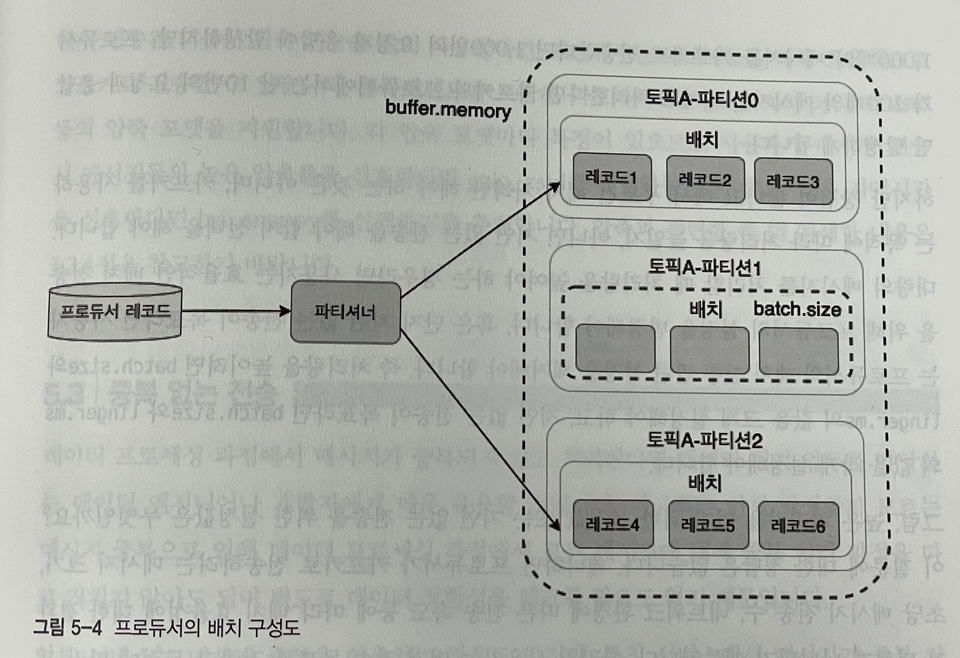

# 5.2 프로듀서의 배치

- 파티셔너는 배치 처리를 위해서 토픽의 파티션별로 데이터를 보관하고 있는다.
- 프로듀서는 배치 전송을 위해 아래 옵션들을 제공한다.
- `buffer.memory` 프로듀서의 버퍼 메모리 사이즈를 나타낸다. 기본값은 32MB이다.
- `batch.size` 배치 전송을 위해 메시지들을 묶는 단위를 나타낸다. 기본값은 16KB이다.
- `linger.ms` 배치 전송을 위해 버퍼 메모리에서 대기하는 메시지들의 최대 대기시간을 설정하는 옵션이다. 기본값은 0이다. 즉, 배치전송을 위해 기다리지 않고 메시지들이 즉시 전송된다.

- 배치를 사용함으로써 Topic과 요청,응답의 횟수를 크게 줄일 수 있다.
- 다만 지연없는 처리가 목표라면 배치 사이즈나 지연시간을 작게 설정해야한다.