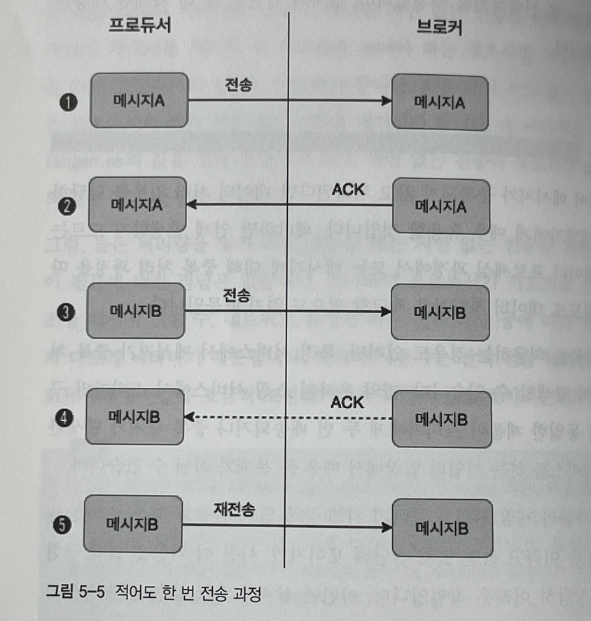

# 5.3 중복 없는 전송

- 카프카는 개발 편의성을 높이기 위해 중복 없이 전송(멱등성)할 수 있는 기능을 제공한다.
- 메시지 시스템에서는 아래와 같이 3개의 전송방식이 존재한다.
    - 적어도 한 번 전송 (at-least-once)
    - 최대 한 번 전송 (at-most-once)
    - 정확히 한 번 전송 (exactly-once) - 5.4에서 다룸

# 적어도 한 번 전송(at-least-once)

- 브로커는 프로듀서로부터 메시지를 받을때 이상없이 데이터를 수신했음을 알리기 위해 프로듀서로 ACK를 날린다.
- 만약 4번에서처럼 ACK를 날리는 과정에서 문제가 발생한다면 프로듀서는 메시지B를 재전송한다.
- 따라서 브로커는 데이터의 중복은 있을지언정 데이터를 받지 못하는 경우는 없게 된다.
- **카프카의 기본 동작 방식이다.**



# 최대 한 번 전송(at-most-once)

- 프로듀서는 ACK 수신여부와 상관없이 데이터를 단 한번만 브로커에게 전송한다.(ACK는 사실 없어도 되는데 예제와 비교를 위해 그려넣었음)
- 데이터의 중복을 제거할 수 있는 방법이지만, 유실이 발생할 수 있다.
- 데이터가 손실되더라도 높은 처리량이 더 중요한 서비스인 경우 필요한 전략


# 카프카의 중복없는 전송

- 전체적인 맥락은 적어도 한번 전송과 같다.
- 차이점은 브로커로 메시지를 보낼때 PID와 메시지 번호를 함께 보낸다.
- 4번처럼 장애가 발생해서 프로듀서가 ACK를 받지 못하면 메시지를 재전송 하게된다.
- 브로커는 메시지의 PID와 메시지 번호를 확인해서 중복이 되면 브로커에 기록하지 않는다.
- 아무래도 브로커에서 중복 메시지를 비교하는 작업이 추가되다보니 약 20%의 성능 감소가 발생한다.
- 성능에 그다지 민감한 서비스가 아니라면 해당 옵션을 사용하길 권장한다.


# 중복없는 전송 실습

- 프로듀서 생성시 사용할 설정 파일인 producer.config을 생성한다.
- `enable.idempotence` 는 프로듀서가 중복없는 전송을 수행할지 결정하는 옵션. 기본값은 false이다. true로 설정했다면 아래에 나오는 3개의 옵션은 반드시 작성해야한다.
- `max.in.flight.requests.per.connection` 는 ACK를 받지 않은 상태에서 하나의 커넥션에서 보낼 수 있는 최대 요청 수. 기본값은 5이며 1~5 중 하나로 세팅해야한다.
- `retries` 는 ACK를 받지 못한 경우 ACK요청 재시도 횟수를 설정한다. 0보다 큰값으로 설정해야한다.
- `acks` 프로듀서 acks와 관련된 옵션.


- peter-test04 토픽을 생성한다.

```bash
/usr/local/kafka_2.12-2.6.0/bin/kafka-topics.sh \
--bootstrap-server peter-kafka01.foo.bar:9092 \
--create --topic peter-test04 \
--partitions 1 \
--replication-factor 3
```

- 프로듀서를 생성한다.

```bash
/usr/local/kafka_2.12-2.6.0/bin/kafka-console-producer.sh \
--bootstrap-server peter-kafka01.foo.bar:9092 \
--topic peter-test04 \
--producer.config /home/ec2-user/producer.config
```

- exactly once1 메시지를 전송한다.


- peter-test04 토픽의 0번 파티션 세그먼트 폴더를 확인한다. 만약 snapshot 파일이 없다면 리더 브로커를 종료하면 된다.


- dump 명령어를 통해서 snapshot 정보를 확인한다.

```bash
/usr/local/kafka/bin/kafka-dump-log.sh \
--print-data-log \
--files /data/kafka-logs/peter-test04-0/00000000000000000001.snapshot
```

- PID와 시퀀스 번호, 오프셋 정보등을 확인할 수 있다.

