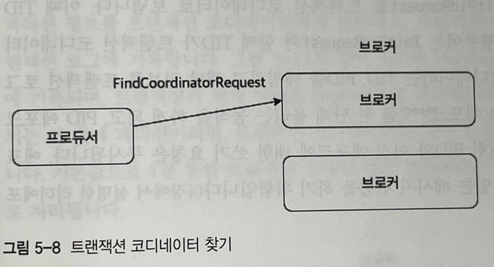

# 5.4 정확히 한 번 전송

- 데이터의 중복없이 한 번 전송하는 전략.
- 주로 은행 같은 곳에서 필요한 전송 방식이다.
- 중복 없는 전송은 정확히 한 번 전송의 하위 개념이다.
- 카프카에는 정확히 한 번 전송을 담당하는 별도의 프로세스가 있으며 이를 트랜잭션 API라고 부른다.

# 디자인

- 정확히 한 번 전송에서 메시지들은 원자적(Atomic)으로 처리된다.
- 원자성 보장을 위해 카프카 서버에는 트랜잭션 코디네이터가 존재한다.
- 트랜잭션 코디네이터는 프로듀서가 전송한 메시지를 관리한다.
- 또한 메시지의 커밋 또는 중단 등을 표기한다.
- 트랜잭션 코디네이터는 이런 정보를 토픽을 만들어 내부적으로 관리하는데 토픽 이름은 `__transaction_state` 이다.
- 당연히 `__transaction_state` 도 토픽이기 때문에 파티션 수(기본값 50)와 리플리케이션 팩터(기본값 3)를 설정할 수 있다.
- 프로듀서가 직접 `__transaction_state` 에 데이터를 기록하는게 아님을 알아야한다.
- 프로듀서는 트랜잭션 관련 정보를 트랜잭션 코디네이터에게 알리고 트랜잭션 코디네이터가 정보를 `__transaction_state` 에 기록하는 방식이다.
- 컨슈머들은 메시지가 정상적으로 커밋된 것인지 또는 실패한 것인지 식별할 수 있어야한다.
- 카프카에서는 이를 식별하기 위해 컨트롤 메시지라는 특별한 타입의 메시지를 추가로 사용한다.
- 컨트롤러 메시지는 오직 브로커와 컨슈머의 통신을 위해서만 사용된다.

# 단계별 동작

- 프로듀서는 `FindCoordinatorRequest` 를 브로커에 날려서 트랜잭션 코디네이터의 위치를 찾는다. 만약 트랜잭션 코디네이터가 존재하지 않으면 신규로 자동 생성된다.



- 프로듀서는 `initTransaction()` 메소드를 통해서 트랜잭션 코디네이터에 `initPidRequest` 를 보낸다. Transaction ID를 코드에서 작성했다면 함께 보낸다. ( TID = Transaction ID )
- 트랜잭션 코디네이터는 프로듀서가 보낸 TID와 자신이 만든 PID를 묶어서 관리한다.
- 성공적으로 매핑이 되었다면 PID를 1 증가시킴으로써 데이터 중복을 방지한다.


- `beginTransaction()` 메소드를 통해서 새로운 트랜잭션을 시작한다.
- 트랜잭션 코디네이터에 알리지 않으며 첫번째 메시지를 보낼때 트랜잭션 코디네이터에게 알리게 된다. 프로듀서 내부적으로만 트랜잭션이 시작되었다는걸 알고 있는 상태이다.


- 프로듀서는 트랜잭션 코디네이터에 상태를 전달한다.
- TID와 토픽의 파티션 정보를 트랜잭션 코디네이터에게 전달한다.
- 트랜잭션 코디네이터는 TID와 파티션 정보를 묶어서 관리한다.
- 트랜잭션 코디네이터는 전달받은 상태를 Ongoing(사용중)으로 표시한다.


- 프로듀서는 대상 토픽으로 메시지를 전송한다.
- 메시지에는 PID,에포크, 시퀀스 번호가 포함되어 전송된다.


- 프로듀서는 `commitTransaction()` 또는 `aborTransaction()` 메소드를 호출해서 트랜잭션이 완료됨을 알린다.
- 트랜잭션 코디네이터는 트랜잭션 로그에 `PrepareCommit` 또는 `PrepareAbort` 를 기록한다.


- 트랜잭션 코디네이터는 토픽의 파티션에 트랜잭션 커밋 표시를 기록한다.
- 컨트롤 메시지를 활용한다.
- 트랜잭션 코디네이터는 프로듀서가 메시지를 보낸 파티션에 컨트롤러 메시지를 보낸다.


- 트랜잭션 코디네이터에 Committed라고 트랜잭션 로그에 기록한다.
- 프로듀서에게 해당 트랜잭션이 완료됨을 알린다.
- 컨슈머는 read_committed 설정을 통해서 트랜잭션에 성공한 메시지들만 읽을 수 있다.


# 프로듀서 예제 코드

- 먼저 gradle 프로젝트를 생성하고 아래와 같이 의존성 및 빌드 방법을 세팅한다.


- 프로듀서 예제 코드를 작성한다.

```java
package com.soojong.kafka;

import org.apache.kafka.clients.producer.KafkaProducer;
import org.apache.kafka.clients.producer.ProducerConfig;
import org.apache.kafka.clients.producer.ProducerRecord;
import org.apache.kafka.common.serialization.StringSerializer;

import java.util.Properties;

public class ExactlyOnceProducer {

    public static void main(String[] args) {
        String bootstrapServers = "peter-kafka01.foo.bar:9092";
        Properties props = new Properties();
        props.setProperty(ProducerConfig.BOOTSTRAP_SERVERS_CONFIG , bootstrapServers);
        props.setProperty(ProducerConfig.KEY_SERIALIZER_CLASS_CONFIG,StringSerializer.class.getName());
        props.setProperty(ProducerConfig.VALUE_SERIALIZER_CLASS_CONFIG, StringSerializer.class.getName());
        
        // 아래 5개 설정은 정확히 한번 전송을 위한 옵션
        props.setProperty(ProducerConfig.ENABLE_IDEMPOTENCE_CONFIG, "true");
        props.setProperty(ProducerConfig.ACKS_CONFIG, "all");
        props.setProperty(ProducerConfig.MAX_IN_FLIGHT_REQUESTS_PER_CONNECTION, "5");
        props.setProperty(ProducerConfig.RETRIES_CONFIG, "5");
        props.setProperty(ProducerConfig.TRANSACTIONAL_ID_CONFIG, "peter-transaction-01");

        KafkaProducer<String,String> producer = new KafkaProducer<>(props);

        producer.initTransactions(); // 프로듀서 트랜잭션 초기화
        producer.beginTransaction(); // 프로듀서 트랜잭션 시작
        try{
            for(int i=0; i<1; i++){
                ProducerRecord<String, String> record =
                        new ProducerRecord<>("peter-test05", "Apache Kafka is a distributed streaming platform - " + i);
                producer.send(record);
                producer.flush();
                System.out.println(" Message sent successfully");
            }
        } catch (Exception e){
            producer.abortTransaction(); // 프로듀서 트랜잭션 중단
            e.printStackTrace();
        } finally {
            producer.commitTransaction(); // 프로듀서 트랜잭션 커밋
            producer.close();
        }

    }
}
```

# 예제 실습

- peter-test05 토픽을 생성한다.

```bash
/usr/local/kafka_2.12-2.6.0/bin/kafka-topics.sh \
--bootstrap-server peter-kafka01.foo.bar:9092 \
--create --topic peter-test05 \
--partitions 1 \
--replication-factor 3
```

- 위에서 작성했던 Producer 코드를 전송한다.

```bash
scp -i kp-ec2.pem producer-1.0-SNAPSHOT.jar ec2-user@13.125.178.190:/home/ec2-user

# scp -i [공개키] [보낼파일] [타겟서버계정]@[타겟서버주소]:[저장위치]
```


- jar 파일을 실행해서 Topic으로 메시지를 보낸다.


- 토픽 리스트를 조회해본다.

```bash
/usr/local/kafka_2.12-2.6.0/bin/kafka-topics.sh \
--bootstrap-server peter-kafka01.foo.bar:9092 \
--list
```

- `__transaction_state` 토픽을 확인할 수 있다.


- 컨슈머를 생성하는데 내부 토픽을 읽기 위해서 `exclude.internal.topics=false`옵션이 추가된 config 파일을 생성한다.


- 컨슈머를 생성한다.

```bash
/usr/local/kafka/bin/kafka-console-consumer.sh \
--bootstrap-server peter-kafka01.foo.bar:9092 \
--topic __transaction_state \
--consumer.config /home/ec2-user/consumer.config \
--formatter "kafka.coordinator.transaction.TransactionLog\$TransactionLogMessageFormatter" \
--from-beginning
```

- 노란색 상자
    - 프로듀서가 트랜잭션 코디네이터에 트랜잭션 초기화 요청을 하면 발생하는 메시지다.
    - PID는 12000이며, state는 Empty인것을 알수 있다.
    - topicPartition=Set()에도 아무 값이 없다.
- 초록색 상자
    - 프로듀서가 트랜잭션 코디네이터에게 상태표시를 전달하면 발생하는 메시지다.
    - state가 Ongoing으로 변경된 것을 확인할 수 있다.
    - topicPartitions 부분을 보면 peter-test05-0에서 트랜잭션이 진행되고 있음을 알 수 있다.
- 파랑색 상자
    - 트랜잭션 종료 요청시에 발생하는 메시지다.
    - state는 PrepareCommit으로 변경된 것을 확인할 수 있다.
- 빨강색 상자
    - 트랜잭션 완료시에 발생하는 메시지다.
    - state는 CompleteCommit으로 변경된 것을 확인할 수 있다.


- 토픽의 로그를 확인해본다.

```bash
/usr/local/kafka/bin/kafka-dump-log.sh \
--print-data-log \
--files /data/kafka-logs/peter-test05-0/00000000000000000000.log
```

- 노랑색 상자
    - 프로듀서가 보낸 내용이 기록된 메시지이다.
    - 이전에 봤던 메시지와 PID가 같은것을 확인할 수 있다.
    - 그 외에도 `isTransactional : true` 를 통해서 메시지가 트랜잭션 메시지임을 알 수있다.
- 파랑색 상자
    - 컨트롤러 메시지이다.
    - 노랑색 상자의 로그와 달리 payload가 없다.
    - `endTxnMarker : COMMIT` 로그를 확인할 수 있다.

