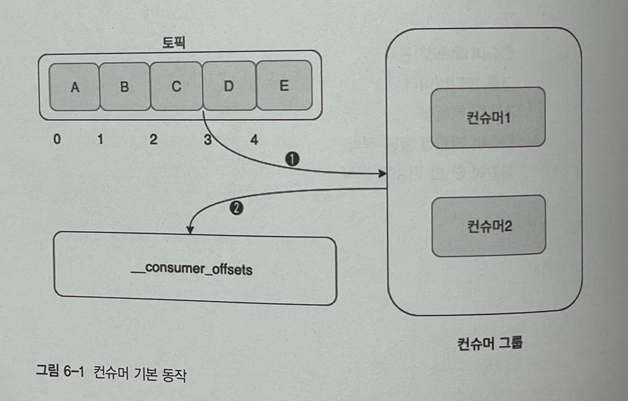

# 6.1 컨슈머 오프셋 관리

- 컨슈머의 동작 중 가장 핵심은 오프셋 관리다.
- 컨슈머가 메시지를 어디까지 가져왔는지를 표시하는 것은 매우 중요하다.
- 새로운 컨슈머가 기존 컨슈머의 역할을 대신하는 경우 기존 컨슈머의 오프셋 위치를 정확히 알 고 있어야한다.
- 카프카에서 메시지의 위치를 나타내는 위치를 오프셋(offset)이라고 한다.
- 컨슈머 그룹은 자신의 오프셋 정보를 카프카에서 가장 안전한 저장소인 토픽에 저장한다.
- `__consumer_offsets` 토픽에 각 컨슈머 그룹별로 오프셋 위치 정보가 기록된다.
- 컨슈머 그룹은 `__consumer_offsets` 에 컨슈머 그룹, 토픽, 파티션 등의 내용을 통합해서 기록하한다.
- 오프셋값은 컨슈머가 마지막까지 읽은 위치가 아니라 다음으로 읽어야 할 위치를 말한다.
- 아래 그림에서 C까지 읽었다면 `__consumer_offsets` 에는 3이 기록된다.
- `__consumer_offsets` 의 default 파티션 개수는 50이며, 레플리케이션 팩터의 fefault는 3이다.

