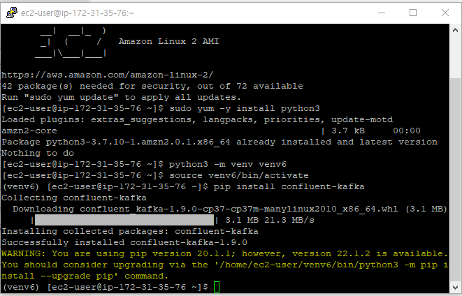

# 6.3 스태틱 멤버십

- 하드웨어 점검이나 소프트웨어 업데이트 등을 이유로 컨슈머들을 재시작 하고 싶은 경우가 있다.
- 이때, 컨슈머가 재시작 할때마다 리밸런싱 작업이 일어나게 되며 리밸런싱 작업동안 기존의 컨슈머들이 중지된다.
- 이런 리소스 소모를 줄이기 위해 카프카 2.3 버전부터 스태틱 멤버십 개념을 도입했다.
- 스태틱 멤버십은 컨슈머 그룹 내에서 컨슈머가 재시작 등으로 그룹에서 나갔다가 다시 합류하더라도 리밸런싱이 일어나지 않게 한다.
- 스태틱 멤버십 기능이 적용된 컨슈머는 그룹에서 떠날 때 그룹 코디네이터에게 알리지 않으므로 리밸런싱이 발생하지 않는다.
- 위 2개 예시를 보면 알수 있듯이 2번의 리밸런싱을 회피할 수 있다.
- 아파치 카프카 2.3 이후 버전에서만 지원하는 기능이다.
- 그룹 코디네이터가 컨슈머를 식별할 수 있도록 인스턴스별로 고유한 ID를 부여해야한다.
- `session.timeout.ms` 는 그룹 코디네이터가 컨슈머와 주고받는 하트비트 시간을 의미하는데 컨슈머의 재시작 시간보다 높게 설정해서 리밸런싱을 방지하도록 한다.

# 스태틱 멤버십이 적용되지 않은 경우 실습

- 이번 실습은 파이썬으로 진행하기 때문에 각 브로커에 파이썬을 설치한다.

```bash
sudo yum -y install python3
python3 -m venv venv6 # 파이썬에서 제공하는 가상환경 라이브러리 생성
source venv6/bin/activate
pip install confluent-kafka
```



- 가상환경내에서 kafka 설치를 완료했다면 python으로 작성된 예제 소스코드를 가져와서 실행한다.

```bash
sudo yum -y install git
git clone https://github.com/onlybooks/kafka2
cd kafka2/chapter6
python consumer_standard.py
```

- 파티션이 3개 있는 peter-test06 토픽을 생성한다.

```bash
/usr/local/kafka_2.12-2.6.0/bin/kafka-topics.sh \
--bootstrap-server peter-kafka01.foo.bar:9092 \
--create --topic peter-test06 \
--partitions 3 \
--replication-factor 3
```

- venv6 환경에 접속해서 Producer를 실행한다. 자동으로 10개의 메시지를 발행한다.


- Consumer에서 결과를 확인한다.


- 카프카에서 제공하는 `kafka-consumer-groups.sh` 명령어를 통해서 컨슈머 그룹의 상세보기를 확인할 수 있다.

```bash
/usr/local/kafka/bin/kafka-consumer-groups.sh \
--bootstrap-server peter-kafka01.foo.bar:9092 \
--group peter-consumer01 \
--describe
```

- 컨슈머 그룹에 속한 컨슈머가 토픽의 어떤 파티션에 매핑되어 있는지 알 수 있다.


- 컨슈머를 하나 종료하고 다시 명령어를 실행해본다.
- IP가 76으로 끝나는 컨슈머가 떠나고 IP가 25로 끝나는 컨슈머가 해당 역할을 대체한것을 확인할 수 있다. 즉, 리밸런싱이 일어났다!
- 리밸런싱 과정에선 모든 컨슈머가 멈추고 파티션까지 새로 할당하기 때문에 고비용의 작업이다. 따라서 리밸런싱을 최소화 하는것이 성능 최적화의 핵심 중 하나다.


# 스태틱 멤버십이 적용된 경우 실습

- 아래와 같이 `group.instance.id` 를 통해 컨슈머에 스태틱 멤버십 기능을 부여한다.


- 컨슈머를 모두 실행하고 아래 명령어로 컨슈머의 상세정보를 조회 해본다.

```bash
/usr/local/kafka/bin/kafka-consumer-groups.sh \
--bootstrap-server peter-kafka01.foo.bar:9092 \
--group peter-consumer02 \
--describe
```

- CONSUMER-ID가 이전과 달리 코드에서 직접 지정한 값으로 변경된 것을 확인할 수 있다.


- 컨슈머 하나를 강제 종료하고 다시 조회 해본다.
- `session.timeout.ms` 를 30초로 지정했기 때문에 30초 이전에 조회를 한 경우에는 리밸런싱 작업이 일어나지 않아 그대로 정보가 존재하게 된다.
- 30초 동안 하트비트가 없던 127로 끝나는 IP를 가진 컨슈머가 그룹에서 제거 되었으며, 리밸런싱이 일어났다.
- 실무에서 컨슈머의 재실행 시간을 고려해 적절한 `session.timeout.ms` 값을 셋팅하는 것이 중요하다.

