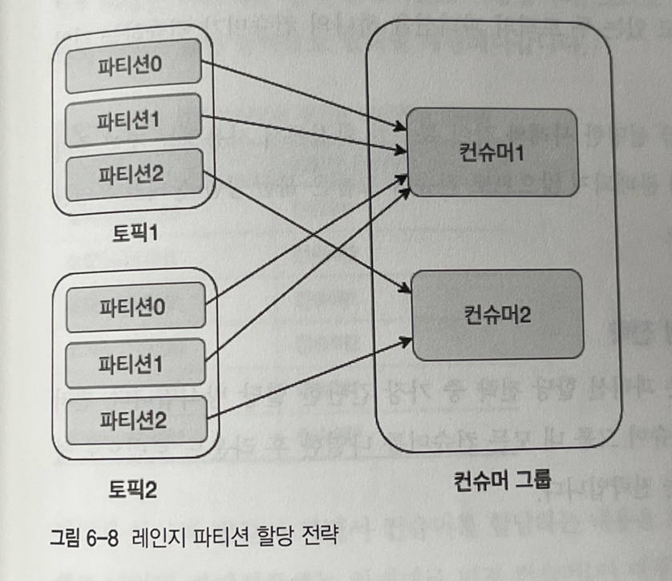

# 6.4 컨슈머 파티션 할당 전략

- 대상 토픽의 어느 파티션으로부터 레코드를 읽어올지 결정하는 전략
- 컨슈머 그룹의 리더 컨슈머가 정해진 파티션 할당 전략에 따라 각 컨슈머를 파티션에 매핑시킨다.
- 컨슈머 파티션 할당 전략은 4개가 존재한다.

# 컨슈머 파티션 할당 전략 종류

- 레인지 파티션 할당 전략
    - 카프카의 기본 전략이다.
    - 토픽별로 할당 전략을 사용한다.
    - 동일한 키를 이용하는 2개 이상의 토픽을 컨슘할때 유용하다.
- 라운드 로빈 파티션 할당 전략
    - 사용 가능한 파티션과 컨슈머들을 라운드 로빈으로 할당한다. 균등분배가 가능한 전략이다.
- 스티키 파티션 할당 전략
    - 컨슈머가 컨슘하고 있는 파티션을 계속 유지하는 전략
- 협력적 스티키 파티션 할당 전략
    - 스티키 방식과 비슷하지만 재조정시에 전체가 컨슈머가 멈추지 않는다.

# 레인지 파티션 할당 전략

- RangeAssignor는 파티션 할당 전략 중 기본값이다.
- 각 토픽별로 할당 전략을 사용한다.
    1. 컨슈머가 먼저 토픽을 구독한다. 
    2. 구독하는 토픽에 있는 파티션을 나열한다.
    3. 컨슈머를 순서대로 정렬한다.
    4. 전체 파티션 수를 컨슈머의 수로 나눈다. 컨슈머들은 파티션을 쪼개서 가져가지만 정확히 나누어 지지 않는다면 앞쪽의 컨슈머들이 남는 파티션을 가져가게 된다.
- 아래 그림에서도 알 수 있듯이 토픽1에 1개의파티션이 남기때문에 컨슈머 1에 할당된것을 확인할 수 있다.

- 동일한 파티션 수를 가진 2개 이상의 토픽을 구독할때 유용할 수 있다. 예를들어 2개 토픽의 파티션 0번에 똑같은 abc 코드가 들어가는 경우 컨슈머 1번에서 한번에 처리할 수 있다.
- 이처럼 특수한 경우에만 사용하는게 좋다.
- 위의 예시처럼 불균등한 배분이 발생할 가능성이 높다.

# 라운드 로빈 파티션 할당 전략

- 가장 간단한 할당 방식이다.
- 구독하고 있는 토픽의 모든 파티션과 컨슈머 그룹내 컨슈머를 모두 정렬한다.
- 라운드 로빈 방식으로 파티션을 할당한다.

- 레인지 파티션 할당 전략에 비해 더욱 균등하게 파티션을 매핑한다.

# 스티키 파티션 할당 전략

- 가능한 한 균형 잡힌 파티션 할당과 재할당이 발생할 때 되도록 기존의 할당된 파티션 정보를 보장하는것이 목적이다. 2가지 목적중 첫번째가 우선순위가 높다.
- 최초 모습은 라운드 로빈 할당 방식과 비슷하다.
    
    
    
- 여기서 컨슈머2가 컨슈머 그룹에서 제외된 경우를 살펴보자.
- 라운드 로빈 파티션 할당 전략을 사용하면 아래와 같이 재할당이 일어난다.
- 모든 파티션과 컨슈머를 순서대로 배치하는 불필요한 작업이 발생한다.
    
    
    
- 스티키 파티션 할당 전략을 사용하면 아래와 같이 재분배 된다.
- 기존 컨슈머 1과 3에 할당된 파티션은 전혀 변동이 없고, 컨슈머2에 할당된 파티션이 균등하게 분배된다.
- 최소한의 움직임으로 컨슈머들을 재할당 하기 때문에 라운드 로빈보다 효율적이다.
    
    
    
- 스티키 파티션 할당 전략은 아래와 같은 로직을 따른다.
- 컨슈머들에 할당된 파티션 수의 차이는 1
- 기존에 존재하던 파티션 할당은 최대한 유지한다.
- 재할당 동작 시 유효하지 않은 모든 파티션 할당은 제거한다.
- 할당되지 않은 파티션들은 균형을 맞추는 방법으로 컨슈머들에 할당

# 협력적 스티키 파티션 할당 전략

- 결과만 보면 스티키 파티션 할당 전략과 같다.
- 스티키 파티션 할당 전략에서 컨슈머 그룹 내부의 리밸런싱 동작을 고도화한 방법이다.
- 앞서본 전략들은 내부적으로 EAGER라는 리밸런스 프로토콜을 사용한다.
- EAGER 프로토콜은 컨슈머 리밸런싱 동작 시 컨슈머에 할당된 모든 파티션을 항상 취소한다.
- 모든 파티션을 취소하는 이유는 아래와 같다.
1. 컨슈머들의 파티션 소유권 변경
    - 컨슈머 그룹내에 컨슈머들은 같은 파티션을 구독할 수 없다.
    - A 컨슈머가 구독하고 있던 0번 파티션을 B 컨슈머로 재 할당 하기 위해선 A 컨슈머가 구독하고 있던 0번 파티션과 연결을 끊는 작업이 필요하다. (파티션 할당이 순간적으로 취소된다.)
2. 그룹 내에서 여러 파티션들에 대해 소유권 변경 작업 로직을 단순하게 구현하기 위해서.
- 일반적인 리밸런싱 동작을 보면 중지 과정에서 다운타임이 발생한다. 즉, 순간적으로 모든 파티션과 컨슈머 간의 연결이 끊어진다.

- 이런 비효율을 제거하고자 아파치 카프카 2.3버전의 커넥터부터 협력적 스티키 파티션 할당 전략이 적용됐다.
- 협력적 스티키 파티션 할당 전략은 COOPERATIVE(협력적) 리밸런싱 프로토콜을 사용한다.
- 기존의 할당 전략과 달리 몇번의 리밸런싱이 발생하게 되지만 기존 연결을 끊지 않는다!!
- 따라서 기존에 동작하고 있는 컨슈머에 전혀 영향을 주지 않는다.
- 아파치 카프카 2.5버전에 안정화 되었다.

