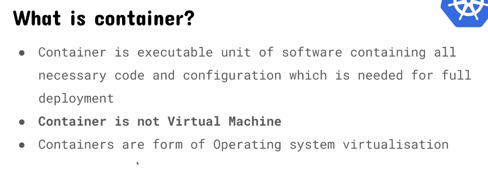

# 섹션 2: Container basics

# Container



.png)

.png)

.png)

.png)

.png)

# Docker

Docker 팀은 OCI를 만든 사람들이다. (Open Container Initiative - 컨테이너 표준을 관리함.)

Docker Container is running instance of Docker Image.

Docker Container is just a process

# Docker Image

Docker Image is an unchangable file. It consists of immutable layers.

It is a template to create the docker containers.

# How do we store images?

Images are files like anything else. Docker Registry is like a git for source code.

DockerHub is one of the most popular public places to store image.

If you have public image, you can extend the image. Docker is immutable file so you are just extending files.

# 설치


Mac인 경우는 Mac for Desktop을 설치하면 된다.

`sudo docker run hello-world` 명령어를 실행해봄. 


- 퍼블릭 레지스트리에 있는 hello-world를 가져와서 실행함.
- 이미지를 pulling하고 컨테이너로 만드는것까지 함.

# Dockerfile 예시


Dockerfile은 이미지를 레이어처럼 쌓은 파일이라고 보면 됨. (참고로 이미지는 immutable함)

```other
FROM python # 별도의 태그를 작성하지 않으면 최신버전을 사용한다.

WORKDIR /app # 도커엔진 내에 있는 /app로 이동한다

COPY requirements.txt requirements.txt # 로컬 파일을 도커엔진에 있는 /app으로 복사한다

RUN pip install -r requirements.txt # pip install을 실행해서 requirements.txt내 정의된 라이브러리를 설치한다

COPY . /app # 현재경로에 있는 파일들을 /app으로 복사한다

EXPOSE 8000 # 컨테이너 실행시 8000 port를 사용한다.

ENTRYPOINT [ "python", "manage.py" ] # 컨테이너 실행시 python manage.py 명령어를 실행시킨다.
CMD ["runserver", "0.0.0.0:8000"] # runserver 0.0.0.0:8000을 실행한다


```


# 명령어


`docker image ls` 명령어로 이미 로컬에 있는 이미지 목록 조회 가능.

# 숙제


도커 설치시에 봤던 GPG 키가 무엇인가?

sudo없이 docker 명령어를 실행할수 있도록 세팅하라.

`docker exec -ti a80ebd9d01cc python manage.py migrate`  명령어는 무슨 의미인가?
