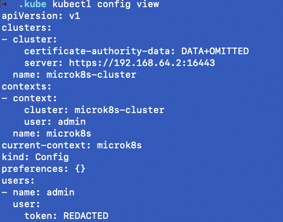

# 섹션 4: Kubernetes basics

# Node

Kubernetes의 노드는 클러스터를 구성하는 (Logical or Physical) Machine이다.

클러스터 내에는 최대 5000개의 Node가 존재할 수 있으나 현실적으로 이만큼 생성할 일은 없다. 그냥 참고차 알아두자.

## Type of Node

- control plane 노드 - 쿠버네티스의 기능들이 있는 노드. Worker 노드를 관리하는 노드. AWS는 control plane을 래핑한 서비스를 제공하기도 함. 이런 서비스들을 사용하면 control plane 노드의 가용성을 어느정도 보장받을 수 있음.
- Worker 노드 - application이 실행되는 노드

# Kube api server

Kube api는 REST api이며, 클러스터를 관리하는 기능들을 제공한다. 클러스터를 제어하기 위한 End Point라고 생각하면 된다. kubectl은 로컬에 있는 클라이언트이며 Kube api server로 클러스터 제어를 위한 요청들을 보낸다.

일반적으로 Kube api server는 control plane 노드에서 Pod 형태로 동작한다.

# EKS

AWS에서 제공하는 kubernetes 관리 service이다. control plane자체는 AWS에서 관리하며 우리는 worker node에만 집중하면 된다. AWS에서 control plane의 가용성을 보장해줌!!!

# Etcd(distributed key value storage)

쿠버네티스 클러스터를 백업하는 데이터베이스임. Key-value 형태로 데이터를 저장한다. distributed라는 이름에서 알 수 있듯이 multi node에서 동시에 실행되고 있다. kube api server가 직접 통신하고 있기 떄문에 client쪽에서 직접 통신할 필요는 없다. 1초에 10,000회 쓰기가 가능한 빠른 저장소임.

control plane 노드가 1개 있다면 Etcd도 1개 있다고 생각하면 됨.

Raft protocol을 사용한다.(이 부분은 다시 학습을 해보자)

# Kublet

Kublet은 Node의 심장같은 존재다. 모든 노드가 Kublet을 가지고 있다. kube api가 다른 노드와 통신할때 각 노드에 있는 kublet과 통신을 수행한다.

# Namespace

2개의 분리된 Application을 서로 간섭받지 않는 환경에 배포하려면 어떻게 해야할까?

## 방법1 - 클러스터 분리
첫번째는 완전히 분리된 2개의 Cluster를 사용하는 것이다. 그러나 이 방법은 비용적인 측면에서 효율적이지 못하다.

## 방법2 - Namespace 사용
Namespace를 사용하면 Node level, Resource level에 대한 논리적인 구분이 가능해진다.

또한 User에게 특정 namespace에 대한 권한 부여가 가능하다. 

따라서 Namespace를 사용하면 물리적 리소스 뿐만아니라 관리 리소스도 Save할수 있게된다.

`kubectl get namespaces`를 통해서 현재 존재하는 namespace 목록을 확인할 수 있다.

`kubectl create ns [namespace명]`를 통해서 새로운 namespace를 생성할 수 있다.

`kubectl describe namespaces [namespace명]`를 통해서 namespace의 상세 정보를 조회할 수 있다.

`kubectl get ns [namespace명] -o yaml`을 통해서 yaml 버전의 naespace 정보를 확인할 수 있다.

`kubectl config view`를 통해서도 현재 config 확인이 가능하다. (중요정보는 인코딩되어 출력됨!)

`kubectl delete ns [namespace명]`을 통해서 namespace를 삭제할 수 있다.

# Kubeconfig

Kubectl과 Kube API 서버의 통신은 secured한 상태로 이뤄지는데 위해선 Kubeconfig 파일이 필요하다.

Kube API는 Rest API로 구성되어 있기 때문에 HTTPS 통신을 사용한다.

## Kubectl이 Kube API에 접근하기 위해서 수행하는 동작

앞서 말한대로 통신을 위해서 Kubeconfig 파일을 찾는다. 별도로 경로 세팅을 한게 아니라면 기본적으로 `~/.kube/config`파일을 읽는다.

별도의 config 파일을 사용하도록 하려면 `kubectl get ns --kubeconfig=/path/to/config`명령어를 사용하면 된다.

### Clusters section
현재 kubectl이 접근할 cluster 정보가 정의 된다. 

### Users section
token 기반 인증을 사용할 경우 token 필드가 필요하다.

username/password와 client-key-data 인증 방식도 가능하다.

### Contexts section
Combination of Cluster and User

이 영역에서 Cluster와 User를 1대1로 매핑을 할 수 있다.

여기서 namespace 작성이 가능한데 namespace가 `default`인 경우는 아래 사진처럼 아무런 표기를 하지 않아도 된다.

### 그 외
kind - The type of Kubernetes object.

apiVersion - Kube API서버로 요청시 사용할 API의 버전을 나타낸다.

cueenr-context - The current context we are operating in.

## Context에 namespace 부여하기.

`kubectl config set-context --current --namespace=kube-system` 를 통해서 현재 context의 namespace를 kube-system로 변경한다.

### 그래서 뭐가 달라지는데?

Cluster와 User만 존재하는 경우와 달리 Namespace가 추가됨으로써 논리적인 구분을 통해서 요청을 수행할 수 있게된다.

즉, Kube API로 요청을 보낼때 다음 3가지를 만족하는 Node에만 명령이 적용된다.
- Cluseter
- Namespace
- User
