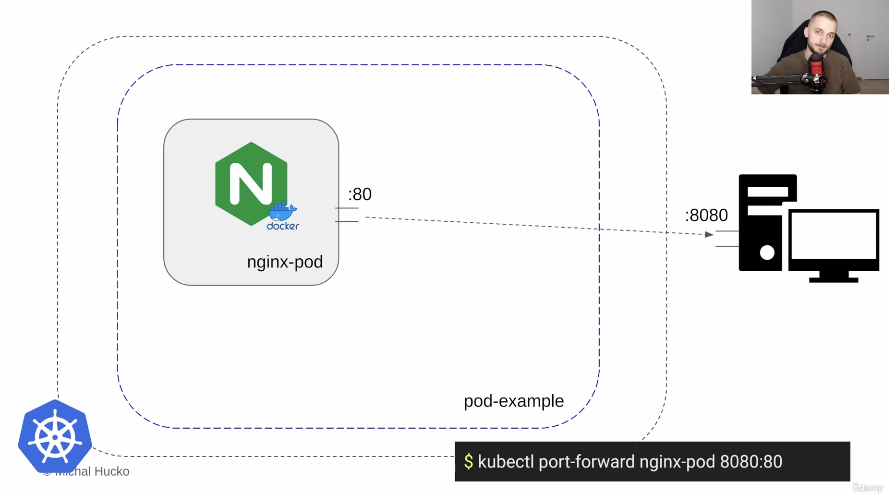

# Pod란?

Pod is the smallest deployable unit of computing in Kubernetest.

# Cluster는 어디서 이미지를 가져올까?

Cluster는 로컬 또는 원격에서 구성 될수 있다.

Cluster내에서 필요한 이미지가 없다면 원격 Registry에 접근하게 되는데 기본적으로 Docker hub를 사용하게 된다. 

뿐만 아니라 대부분의 Cloud 회사들은 자체적인 원격 Registry를 구성할 수 있도록 해준다. (예. AWS의 ECR)

# 예제 그림

`kubectl run nginx-pod --image=nginx --port 80` 명령어를 통해서 원격 registry로 부터 nginx 이미지를 내려받고 nginx-pod라는 이름의 Pod내에 컨테이너화 한다. port 옵션을 통해서 Pod의 80번 포트와 컨테이너의 80번 포트를 연결한다.

이렇게 관리하게 된 이유는 Pod내 Multiple 컨테이너 구성이 가능하기 때문이다.

`kubectl port-forward nginx-pod 8080:80` 명령어를 통해서 클러스터 외부 서버와 연결 한다.

외부 서버에서 nginx-pod로 접속 할떄는 80번 포트를 사용하고, nginx-pod에서 외부서버로 접속할떄 8080 포트를 사용해야 한다.

# 실습

`kubectl create ns pod-example` 명령어를 통해서 테스트용 namespace를 만든다.