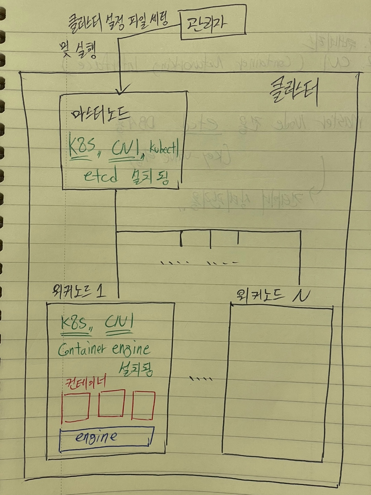
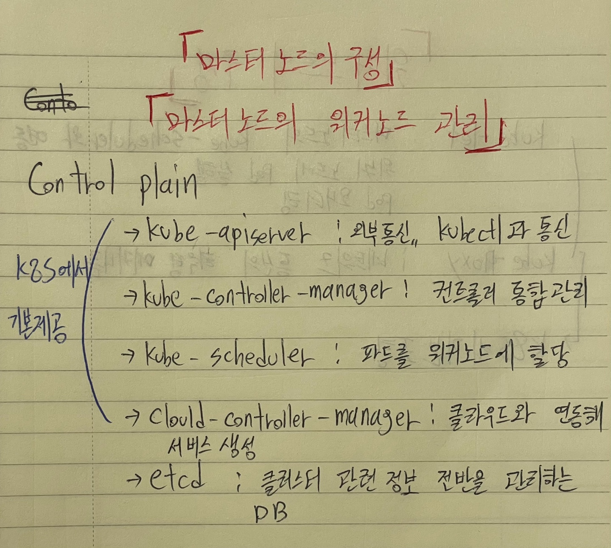
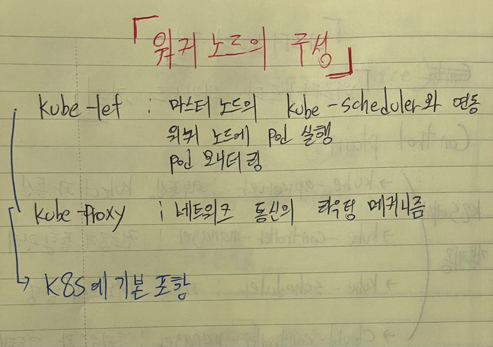

마스터 노드와 워커 노드에서 말하는 `노드`는 서버를 생각하면 된다.

마스터 노드와 워커 노드로 구성된 것을 `클러스터`라고 부른다.

마스터와 워커의 차이는 역할에 있는데 마스터 노드는 관리자로부터 명령어를 받아서 직접 워커를 제어하는 역할을 한다.

워커 노드는 마스터 노드의 명령을 받아서 컨테이너를 생성하고 실행한다.

위 설명에서 알 수 있듯이 마스터 노드는 명령을 전달하는 역할을 하기 때문에 컨테이너 엔진 설치는 필요없다. (워커 노드는 컨테이너 엔진 설치 필요)

노드의 역할 별로 필요한 구성을 아래 그림에서 설명한다.

