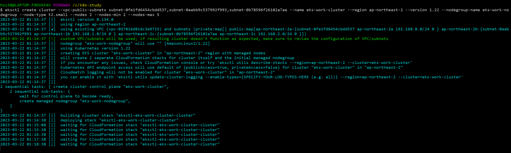
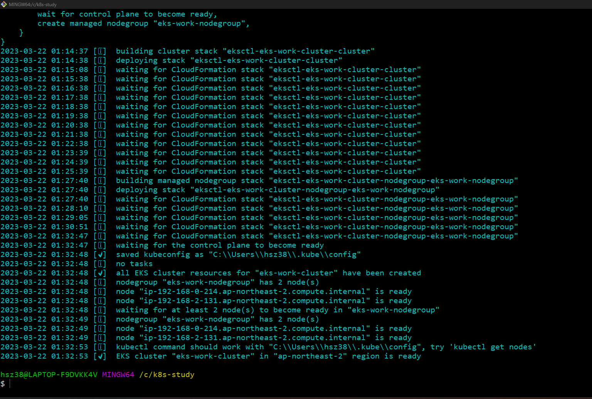
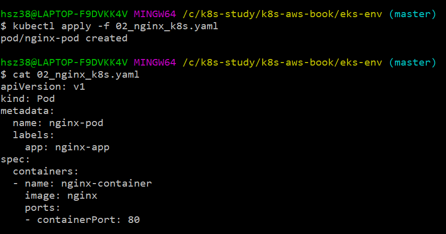
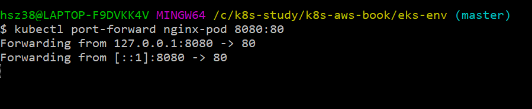
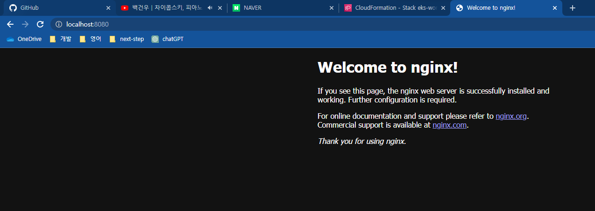

# 2장 실습을 하면서 입력한 명령어들을 모아둠

EKS 환경구축을 위한 명령어를 실행하면 `checking aws sts access – cannot get role arn for current session`와 같은 에러가 발생한다. 
내 로컬 PC에서 내 AWS 클라우드에 대한 각종 권한이 없기 때문에 발생한 에러이다.

IAM에서 User에 Policy를 부여해한다. 일단 테스트로 `AdministratorAccess`(전체권한)을 부여했다.

로컬에서 credential 설정을 위해서 `aws configure` 명령어를 사용하면 된다.
credential 확인은 `aws configure list`이다.

```shell
eksctl create cluster \
--vpc-public-subnets subnet-0fe1fd6454cbdd537,subnet-0aabb9c537992f993,subnet-0b78596f26102a7ae \
--name eks-work-cluster \
--region ap-northeast-2 \
--version 1.22 \
--nodegroup-name eks-work-nodegroup \
--node-type t2.small \
--nodes 2 \
--nodes-min 2 \
--nodes-max 5
```

아래와 같이 진행되면 성공이다.


성공


현재 활성화된 컨텍스는 조회한다.
kubectl config get-contexts


Nginx Pod를 생성한다


`kubectl get pods` 명령어를 통해서 생성된 파드를 조회한다

내 로컬의 8080 포트로 접근시 pod의 80 포트로 포워딩 하도록 한다.


포트 등록이 성공적으로 되었다면 아래와 같이 nginx 기본 페이지에 접근할 수 있다.


`kubectl delete pod nginx-pod` 명령어를 통해서 pod를 삭제한다