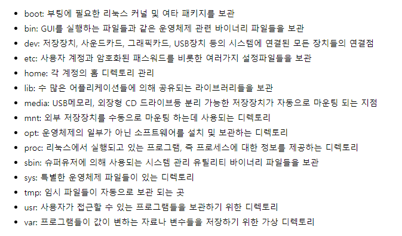

## 정의
File system이란 파일(자료)를 사용자가 쉽게 접근 및 발견 할 수 있도록 운영체제가 시스템의 디스크상에 일정한 규칙을 가지고 보관하는 방식.

리눅스의 대표적인 파일 시스템은 ext3, ext4, xfs등이 있다. 

### ext4의 특징

    16TB까지만 지원하던 ext3과는 달리 더 큰 용량을 지원하며, 삭제된 파일 복구,

    파일 시스템 속도가 훨씬 빨라진 파일시스템

리눅스의 파일 시스템은 루트 파일 시스템(/) 아래에 계층적으로 모든 파일과 디렉토리가 만들어진다

아래는 리눅스의 루트 파일시스템 아래에서 관리하는 파일 및 폴더의 용도.

## 기타

### Linux의 디스크 명명 규칙

    /dev/sda → 첫 번째 디스크

    /dev/sdb → 두 번째 디스크

    /dev/sdc → 세 번째 디스크

    /dev/sdd → 네 번째 디스크

### Linux의 파티션 명명 규칙

    /dev/sda1 → 1번 디스크의 1번 파티션

    /dev/sda2 → 1번 디스크의 2번 파티션

    /dev/sdb3 → 2번 디스크의 3번 파티션

    /dev/sdc4 → 3번 디스크의 4번 파티션
