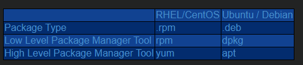

## rpm
rpm은 Redhat Package Manager의 약자이다.  
초기의 리눅스에서는 모든 패키지를 tar와 gzip으로 묶인 소스 파일을 가지고 직접 컴파일 한 후에 수동으로 설치해야 했다.  
이때 만약 A라는 패키지(프로그램)을 개발하는데에 B라는 패키지가 사용되었다면 B패키지를 먼저 수동으로 설치 후 A패키지를 수동으로 설치해 주어야 했습니다.  
만약 하나의 패키지가 아니라 이런식으루 줄줄이 여러 패키지에 의존하는 경우 문제는 더욱 더 복잡해 졌습니다
  
윈도우처럼 리눅스에도 패키지(설치파일)들을 자동으로 알맞은 디렉토리에 저장하며, 빌드를 해주는 프로그램 RPM(Redhat Package Manager)이 있습니다  
윈도우로 치면 exe파일과 같다고 보면 된다. 
rpm명령어를 통해 .rpm 파일을 실행하면 적절한 위치에 패키지를 풀고 컴파일도 실행해준다.  
하지만 의존하고 있는 패키지가 현재 환경에 존재하고 있지 않은 경우 설치에 실패한다.  

## yum
yum은 Yellowdog Update Manager의 약자  
rpm은 컴파일시 필요한 패키지가 없다면 에러가 발생하는데 반해 yum은 저장소를 통해 필요한 패키지의 다운로드를 수행한다.  
당연히 yum은 저장소와 연결되어 있어야한다.( 외부에서 가져오는 경우 인터넷 연결은 필수다 )  

## 기타
아래는 운영체제마다 사용하는 Package Manager Tool이다.

