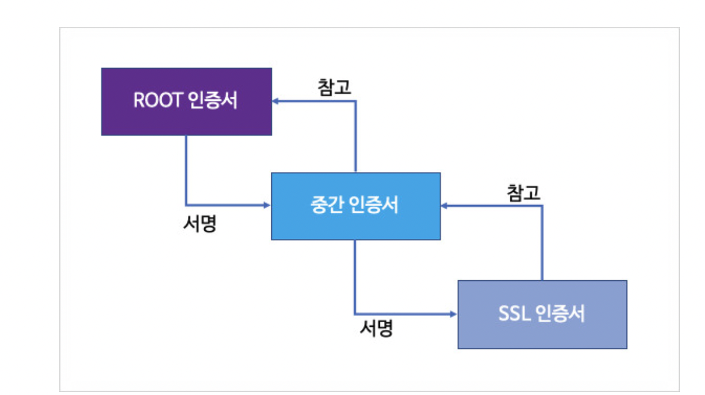

# CA 인증서

# Root CA 인증서 기초

- SSL 인증서를 통해 클라이언트와 서버 사이의 통신을 보안화 할 수 있다.
- SSL은 대칭키 암호화 방식과 공개키 암호화 방식을 사용한다.
- SSL 인증서는 인증기관(CA)에서 ROOT 인증으로부터 출발한다.
- 인증서는 ROOT, Intermidate, Leaf 3단계로 구성되며 이를 인증 체인이라고 한다.
- 사용자가 구입한 SSL인증서는 Leaf 인증서를 말한다.
- 3개의 인증서는 하위 인증서를 서명하고 하위의 인증서는 상위의 인증서를 참고하는 방식을 사용한다.
- 인증서 체인의 최 상위에는 ROOT인증서가 있고, 최 하위에는 Leaf인증서가 있다.

- Root 인증서는 자체 서명한 인증서로 공개키 기반 암호화 전략을 사용합니다. 신뢰할 만한 인증 기관이 발행한다.
- 중간 인증서는 Root 인증서와 Leaf 인증서 사이에 구분을 만들어 위험을 완화하도록 설계된 인증서다.
- 아래는 네이버 블로그가 사용하는 인증서이다.
- Root 인증서는 DigiCert라는 미국 회사가 인증서를 만들었다.
- 중간 인증서는 DigCert SHA2 Secure Server CA
- Leaf 인증서는 blog.naver.com 도메인 전용 인증서

## 참고 링크

[ROOT CA 인증서는 무엇인가?](https://brunch.co.kr/@sangjinkang/47)

# SSL 원리

- 세상에는 무조건 신뢰할 수 있는 기관이 존재한다.
- Root CA을 발급하는 기관을 의미한다.
- Root CA 발급 기관은 비밀키를 가지고 있고, 공개키를 전세계에 공유한다.
- 공개키는 OS 또는 웹 브라우저에 내장되어 있다.

- 인증서에는 다양한 내용이 기록되어 있는데 핵심은 `인증서의 내용을 해쉬화한 값을 암호화한 값`이다. (지문)
- 인증서는 계층 구조를 가지며 보통은 3 계층으로 이뤄진다.

- 자신만의 인증서를 만들고 싶은 Google은 Root CA 발급기관에게 내용물을 전달하고 Root CA는 Google의 내용물을 암호화 한다.
- 그리고 Root CA는 비밀키를 Google에게 전달한다. (세상 사람들은 이미 공개키를 가지고 있기 때문)
- 사람들은 Google에 접근할때 기존에 가지고 있던 공개키를 통해서 Google의 CA를 복호화를 한다.

- Google CA를 최상위 Root CA의 공개키로 복호화가 가능하며 이를 Chain of Trust라고 한다.
- 아래는 3단계 체인의 예시를 보여준다.
- 보통은 2단계까지는 신뢰 가능한 기관이다. 따라서 브라우저도 이를 내장하고 있다.
- 3단계는 내가 직접 만든 인증서를 발급하는데 브라우저가 이를 복호화 할 수 있는 공개키가 없다면 인증서 에러가 발생한다.

