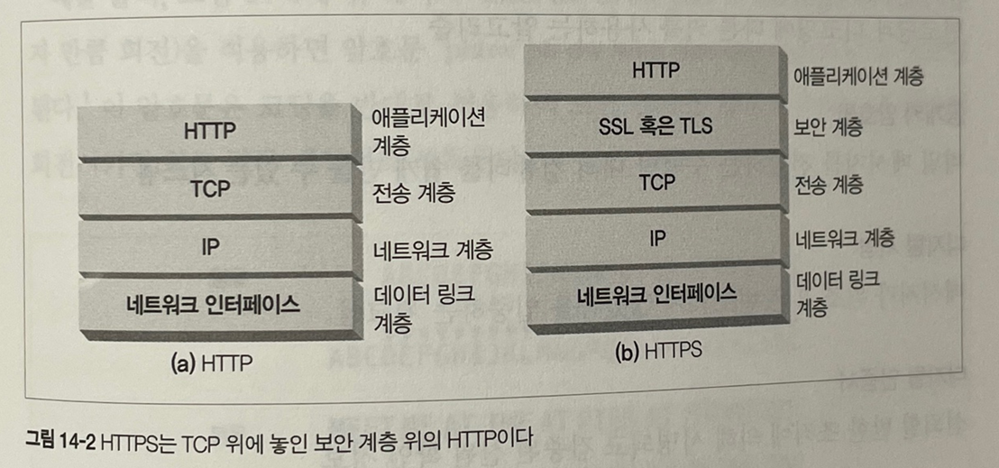

# 14. 보안 HTTP

# 14.1 HTTPS

HTTPS는 HTTP를 안전하게 만드는 방식 중에서 가장 인기 있는것이다. HTTPS를 사용하면 HTTP 요청과 응답 데이터는 네트워크로 보내지기 전에 암호화된다.

HTTPS는 HTTP의 하부에 전송 레벨 암호 보안 계층을 제공함으로써 동작한다. 이 보안 계층은 `안전 소켓 계층(Secure Sockets Layer, SSL)` 이라 불린다. 인코딩 및 디코딩 작업은 대부분 SSL 라이브러리 안에서 이어나며, HTTPS를 사용하기 위해서 웹 클라이언트와 서버가 프로토콜을 처리하는 로직을 별도로 작성할 필요는 없다.

14.2와 14.3은 기본적인 암호화 기법을 소개하는 내용이라 생략함.

# 14.4 공개키 암호법

한 쌍의 호스트가 하나의 인코딩/디코딩 키를 사용하는 대신, 공개키 암호 방식은 두 개의 비대칭 키를 사용한다.

하나는 호스트의 메시지를 인코딩하기 위한것이고, 다른 하나는 그 호스트의 메시지를 디코딩하기 위한 것이다. `인코딩 키는 모두를 위해 공개되어 있다!!` (공개키 암호 방식이라 불리는 이유다)

모든 사람이 X에게 보내는 메시지를 같은 키로 인코딩할 수 있지만, X를 제외한 누구도 그 메시지를 디코딩 할 수 없다.

## 14.4.1 RSA

공개키 비대칭 암호의 과제는 악당이 아래 내용을 알고 있다 해도 비밀 키를 유추할 수 없도록 해야한다.

- 공개키
- 가로채서 얻은 암호문의 일부
- 메시지와 그것을 암호화한 암호문

위 모든 요구조건을 만족하는 공개키중 유명한것이 MIT에서 만든 RSA 알고리즘이다.

## 14.4.2 혼성 암호체계와 세션키

공개키 암호 방식의 알고리즘은 계산이 느린 경향이 있어 실제로는 대칭과 비대칭 방식을 섞어쓰고 있다. 노드들 사이의 안전한 의사소통 채널을 수립할때는 공개 키 암호를 사용하고 안전한 채널을 통해 임시의 무작위 대칭 키를 생성해서 교환하는 방식을 사용한다.

1. 채널 형성 시에만 비대칭 암호 방식 (공개키)
2. 채널 형성 후에는 대칭 암호 방식 (비공개키)

# 14.5 디지털 서명

디지털 서명은 누가 메시지를 섰는지, 그 메시지가 위조되지 않았음을 증명하기 위해 메시지에 서명을 하는 것을 말한다. 인터넷 보안 인증서의 핵심 개념이다.

## 14.5.1 서명은 암호 체크섬이다.

디지털 서명은 메시지에 붙어있는 특별한 암호 체크섬이다. 이는 2가지 이점을 가진다.

1. **서명은 메시지를 작성한 저자가 누군지 알려준다.** 저자는 극비 개인 키를 갖고 있기 때문에 오직 저자만이 이 체크섬을 계산할 수 있다.
2. **서명은 메시지 위조를 방지한다.** 만약 공격자가 메시지를 수정하면 체크섬이 변경된 것이기 때문에 저자의 비밀키로 메시지가 변경되었음을 알 수 있게된다.

디지털 서명은 보통 비대칭 공개키에 의해 생성된다. 개인 키는 소유자만이 알고 있기 때문에, 저자의 개인 키는 일종의 ‘지문’처럼 사용된다.

아래의 그림을 순서대로 설명하면 다음과 같다.

1. 노드 A는 메시지를 고정된 길이의 요약(digest)로 만든다.
2. 요약된 내용에 사용자의 개인 키를 통해서 ‘서명’ 함수를 적용한다.
3. 서명을 메시지에 붙여서 노드 B에 전송한다.
4. 노드 B는 자신이 가진 공개키로 서명을 해제한다. 평문 메시지를 요약해서 서명에 있는 요약본과 내용이 같은지 확인한다. 이를 통해 노드B는 메시지가 변조 되었는지 확인할 수 있고, 노드A가 올바른 개인키로 서명을 한것이 맞는지 검증할 수 있게된다.

# 14.6 디지털 인증서

디지털 인증서 인터넷의 신분증 역할을 한다. 또한 신뢰할 수 있는 기관으로부터 보증 받은 사용자나 회사에 대한 정보를 담고 있다.

## 14.6.1 인증서의 내부

디지털 인증서에는 인증 기관에 의해 디지털 서명된 정보가 담겨있다.

- 대상의 이름(사람, 서버, 조직 등)
- 유효기간
- 인증서 발급자
- 인증서 발급자의 디지털 서명

아래는 일반적인 인증서의 포맷이다.

## 14.6.2 X.509 v3 인증서

디지털 인증서에는 전 세계적인 표준이 존재하지 않는다. 하지만 대부분의 인증서가 X.609라 불리는 표준화된 서식에 저장하고 있다.

## 14.6.3 서버 인증을 위해 인증서 사용하기
