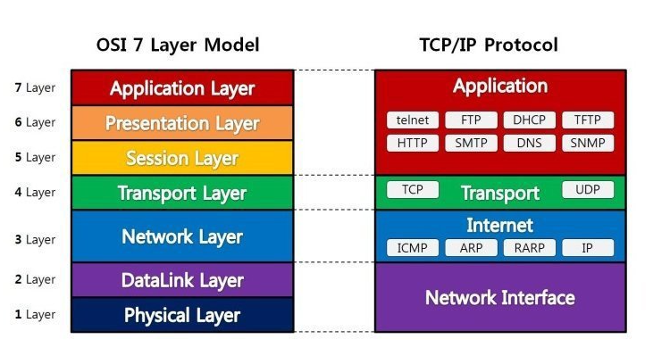
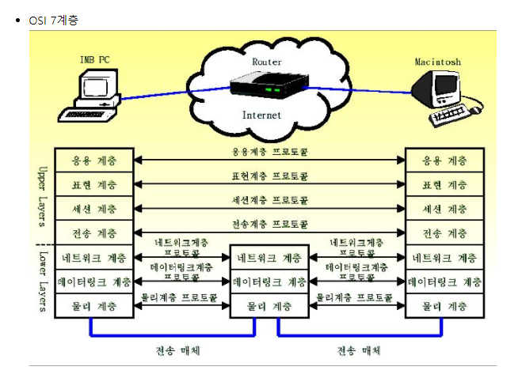
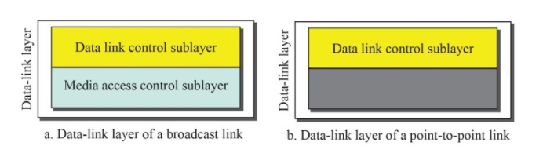

# OSI 7 Layer Model

# 1 Layer - Physical Layer

전기적이고 기계적인 작업을 수행한다. 이 계층에서 사용되는 통신단위는 비트이다. 비트는 0과1로 표현되는데 전기적으로 on/off를 의미한다. 

데이터를 분석은 하지 않고 순수 전달을 위한 작업만 한다. 

Physical Layer에 속하는 대표적인 장비는 케이블, 리피터, 허브등이 있다. 

타 기기와 연결되는 접점이다.

# 2 Layer - DataLink Layer

물리계층을 통해 송수신된 정보의 오류와 흐름을 관리한다. 안전한 정보전달을 수행할 수 있도록 도와주는 역할을한다. 오류 발견 및 재전송 기능을 가지고 있다.

DataLink Layer에는 2개의 Sub-Layer가 존재하는데 그중에 하나가 Media Access Control Layer다. 

해당 Sub-layer에는 MAC Address라는 물리적 주소가 설정되어 있다. 

이더넷은 DataLink Layer에서 사용되는 가장 대표적인 통신 규격이다.  

DataLink Layer에 속하는 대표적인 장비는 브릿지, 스위치 등이 있다.

# 3 Layer - Network Layer

데이터를 목적지까지 가장 안전하고 빠르게 전달하는 기능(라우팅)이 Network Layer의 핵심이다. 

데이터를 연결하는 다른 네트워크를 통해 전달함으로써 인터넷이 가능하게 만드는 계층이다.

논리적인 주소 구조(IP), 곧 네트워크 관리자가 직접 주소를 할당하는 구조를 가진다. 

# 4 Layer - Transport Layer

통신을 활성화하기 위한 계층이다. 보통 TCP프로토콜을 이용하며, 포트를 열어서 응용프로그램들이 전송을 할 수 있게 한다. TCP/UDP프로토콜을 사용한다

사용자들이 신뢰성있는 데이터를 주고 받을 수 있도록 해 주어,상위 계층들이 데이터 전달의 유효성이나 효율성을 생각하지 않도록 해준다.

전송 계층은 특정 연결의 유효성을 제어하고, 일부 프로토콜은 상태 개념이 있고(stateful), **연결 기반(connection oriented)**이다. 이는 **전송 계층이 패킷들의 전송이 유효한지 확인하고 전송 실패한 패킷들을 다시 전송한다는 것**을 뜻한다. 가장 잘 알려진 전송 계층의 예는 TCP이다.

# 5 Layer - Session Layer

데이터가 통신하기 위한 논리적인 연결을 말한다. 통신을 하기위한 대문이라고 보면 된다.

세션 계층(Session layer)은 양 끝단의 응용 프로세스가 통신을 관리하기 위한 방법을 제공한다.

**동시 송수신 방식(duplex), 반이중 방식(half-duplex), 전이중 방식(Full Duplex)**의 통신과 함께, 체크 포인팅과 유휴, 종료, 다시 시작 과정 등을 수행한다. 이 계층은 **TCP/IP 세션을 만들고 없애는 책임**을 진다.

# 6 Layer - Presentation Layer

코드 간의 번역을 담당하여 사용자 시스템에서 데이터의 형식상 차이를 다루는 부담을 응용 계층으로부터 덜어 준다.

MIME 인코딩이나 암호화 등의 동작이 이 계층에서 이루어진다. 예를 들면, EBCDIC로 인코딩된 문서 파일을 ASCII로 인코딩된 파일로 바꿔 주는 것, 해당 데이터가 TEXT인지, 그림인지, GIF인지 JPG인지의 구분 등이 표현 계층의 몫이다.

# 7 Layer - Application Layer

최종 목적지로서 HTTP, FTP, SMTP, POP3, IMAP, Telnet 등과 같은 프로토콜이 있다.

해당 통신 패킷들은 방금 나열한 프로토콜에 의해 모두 처리되며 우리가 사용하는 브라우저나, 메일 프로그램은 프로토콜을 보다 쉽게 사용하게 해주는 응용프로그램이다.
