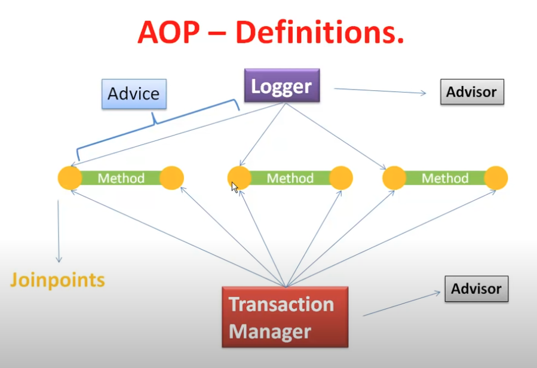

# 5.1. AOP Concepts

[Core Technologies](https://docs.spring.io/spring-framework/docs/current/reference/html/core.html#aop)

The key unit of modularity in OOP is the class, whereas in AOP the unit of modularity is the aspect.

Aspects enable the modularization of concerns that cut across multiple types and objects.

- `Aspect` : A modularization of a concern that cuts across multiple classes. In Spring AOP, aspects are implemented by using regular classes or regular classes annotated with the `@Aspect` annotation
- `Join point` : A point during the execution of a program. In Spring AOP, a join point always represents a method execution. Join point is where can be applied Advice.
- `Advice` : Action taken by an aspect at a particular join point. Different types of advice include “around”, “before” and “after” advice.
- `Pointcut` : A predicate that matches join points. Advice is associated with a pointcut expression and runs at any join point matched by the pointcut.
- `Introduction` : Declaring additional methods or fields on behalf of a type.
- `Target object` : An object being advised by one or more aspects. Also referred to as the “advised object”
- `AOP proxy` : An object created by the AOP framework in order to implement the aspect contracts(advise method executions and so on). In the Spring Framework, an AOP proxy is a JDK dynamic proxy or a CGLIB proxy.
- `Weaving` : linking aspects with other application types or objects to create an advised object. This can be done at compile time, load time, or at runtime. Spring AOP, like other pure Java AOP frameworks, performs weaving at runtime.

