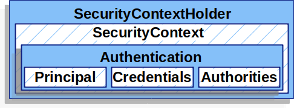

# Servlet Authentication Architecture

아래 사이트를 번역함.

[Servlet Authentication Architecture](https://docs.spring.io/spring-security/reference/servlet/authentication/architecture.html)

# **SecurityContextHolder**

`SecurityContextHolder` 는 Spring Security의 인증(Authentication)의 핵심 모델이다. `SecurityContextHolder` 는 `SecurityContext` 를 포함하고 있다.



Spring Security는 `SecurityContextHolder` 에 인증된 사용자 정보를 저장한다. Spring Security는 어떤방식으로 `SecurityContextHolder` 에 내용이 채워지는지 신경쓰지 않으며, 단지 내부에 값이 있다면 이를 현재 인증된 사용자로 판단할 뿐이다.

인증된 사용자를 만드는 가장 빠른방법은 직접 `SecurityContextHolder` 에 인증 정보를 세팅하는 것이다.

```java
SecurityContext context = SecurityContextHolder.createEmptyContext(); //1
Authentication authentication =
    new TestingAuthenticationToken("username", "password", "ROLE_USER"); //2
context.setAuthentication(authentication);

SecurityContextHolder.setContext(context); //3
```

1. 비어있는 `SecurityContext` 를 하나 만든다. `SecurityContextHolder.getContext().setAuthentication(authentication)` 로 직접 세팅하게 되면 쓰레드간 경쟁상태(Race Condition)이 발생할 수 있기때문에 위 코드처럼 작성해야한다.
2. 인증을 위한 객체를 하나 만들었다. `SecurityContext` 에는 Authentication 인터페이스의 구현체를 셋팅할 수 있다. 여기선 테스트를 위해 간단한 방법의 `TestingAuthenticationToken` 를 사용했다. 일반적으론 `UsernamePasswordAuthenticationToken(userDetails, password, authorities)` 이 많이 사용된다.
3. `SecurityContextHolder` 에 `SecurityContext` 를 세팅한다. Spring Secuirty는 이 정보를 통해서 인가(Authorization)작업을 수행할 수 있다.

인증된 정보에서 데이터를 얻어오기 위해 `SecurityContextHolder` 에 직접 접근할 수 있다.

```java
SecurityContext context = SecurityContextHolder.getContext();
Authentication authentication = context.getAuthentication();
String username = authentication.getName();
Object principal = authentication.getPrincipal();
Collection<? extends GrantedAuthority> authorities = authentication.getAuthorities();
```

기본적으로 `SecurityContextHolder` 은 ThreadLocal을 사용하기 때문에 항상 하나의 Thread에서만 동작함을 보장할 수 있다. 따라서 꼭 메소드를 통해서 인증 정보를 파라미터로 던지지 않아도 된다!!! ( 위 코드에서도 getContext를 사용하기만 하면 현재 Thread에서 인증된 사용자 정보만 가져올 수 있다. )

# SecurityContext

`SecurityContext` 는 `SecurityContextHolder` 에 의해 관리되며 `SecurityContext` 는 `Authentication` 객체를 관리한다.

# **Authentication**

Spring Security의 `Authentication` 은 2가지 목적을 가지고 있다.

- `AuthenticationManager` 에 `Authentication` 를 넣음으로써 사용자에 대한 인증정보를 제공한다.
- 현재 인증된 사용자에 대한 정보를 제공한다. 현재 인증된 `Authentication` 은 `SecurityContext` 에 포함되어 있다.

`Authentication` 은 아래의 3가지 내용을 포함하고 있다.

- `Principal` - 사용자를 식별한다.
- `credentials` - 일반적으로 패스워드를 의미한다. 사용자 인증을 완료하면 유출방지를 위해 제거한다.
- `authorities` - 사용자의 Role이나 Scope를 설정할 때 사용한다. `GrantedAuthority` 객체를 통해서 사용자의 권한을 관리할 수 있다.

# **GrantedAuthority**

`GrantedAuthority` 는 사용자에게 부여된 상위 수준 권한이다. (인증된 사용자들 중에서 Role이나 Scope를 설정해야할 때 사용한다.)

`GrantedAuthority`는 `Authentication.getAuthorities()` 메소드를 통해서 얻을 수 있다. 이 메소드는 `GrantedAuthority` 오브젝트를 컬렉션 타입으로 제공한다. `GrantedAuthority` 는 흔히 권한을 뜻하게되며 일반적으로 “역할(role)”을 의미한다. 예를들면 `ROLE_ADMIN` `ROLE_HR_SUPRVISOR` 와 같은 식이다. 역할들은 이후에 배울 인가(Authorization)에서 자세히 다룬다. Spring Security의 다른 부분들은 이런 `Authorities` 들을 해석할 수 있으며, 반드시 존재할것으로 생각하고 동작한다. username/password 방식의 인증 방식을 사용하게될 경우 `GrantedAuthority` 는 `UserDetailsService` 를 통해 얻을 수 있다.

`GrantedAuthority` 는 일반적으로 애플리케이션에 광범위하게 적용된다. (덕분에 특정 도메인별로 권한을 부여하지 않아도 되며 메모리 누수를 막을 수 있다.)

# **AuthenticationManager**

`AuthenticationManager` 는 Spring Security가 어떻게 인증 Filter를 관리할지 정의하는 API이다. 반환된 `Authentication`은 `AuthenticationManager`가 실행한 컨트롤러(예. Spring Security의 Filter)에 의해 `SecurityContextHolder`에 세팅된다. Spring Security의 Filter를 도입하지 않았다면 직접 `SecurityContextHolder` 에 인증정보를 세팅할 수 있으며, 이 경우엔 `AuthenticationManager` 가 필요없다.

`AuthenticationManager` 인터페이스의 구현체 중 일반적인 구현체는 `ProviderManager` 이다.

# **ProviderManager**

`AuthenticationManager` 인터페이스의 구현체 중 가장 일반적으로 사용되는 구현체는 `ProviderManager` 이다. `ProviderManager` 는 `AuthenticationProvider` 목록을 관리한다.

각 AuthenticationProvider는 인증작업이 성공인지, 실패인지, 판단불가인지 판단할 수 있다. 만약 결정을 내릴 수 없다면 다른 `AuthenticationProvider`로 작업을 넘긴다. 만약 어떤 `AuthenticationProvider`도 인증을 수행하지 못한다면 `ProviderNotFoundException`이 발생한다.

`ProviderNotFoundException`은 `AuthenticationException`를 확장한다.


각 `AuthenticationProvider`를 통해 특화된 인증들을 처리할 수 있게된다. 예를들어 0번째 `AuthenticationProvider`에선 username/password 기반의 인증을 처리하고 1번째 `AuthenticationProvider`에선 SAML방식의 인증을 수행할수 있다. 따라서 `AuthenticationManager` 를 사용하면 다양한 인증을 하나의 Bean에서 관리할 수 있게된다.

# **AuthenticationProvider**

`AuthenticationProvider`는 List형태로 `ProviderManager`에 의해 관리된다. 각 `AuthenticationProvider`는 서로 다른 인증 방법을 제공한다. 예를 들어 `DaoAuthenticationProvider`는 username/password 기반의 인증을 지원한다. 반면에 `JwtAuthenticationProvider`는 JWT token 방식의 인증을 지원한다.

# **Request Credentials with** AuthenticationEntryPoint

`AuthenticationEntryPoint`는 사용자가 보낸 credential(주로 비밀번호) 정보에 대한 응답을 보낼때 사용한다.

사용자는 username/password 같은 방법을 통해 credential 정보를 포함해서 포함해서 Request를 보내기도 한다. 이런 경우에는 이미 Request에 credential 정보가 포함되어 있기때문에 Spring Security는 추가적인 credential를 요청하는 HTTP Response를 수행할 필요가 없다.

다른 경우, 사용자가 인증되지 않은채 Request를 수행할 수 있다. 이땐 AuthenticationEntryPoint의 구현체가 사용자에게 credential 정보를 요청하게 된다. `AuthenticationEntryPoint` 구현체는 주로 log in 페이지로 리다이렉트하거나 응답 헤더에 `WWW-Authenticate`를 담아 반환 할것이다.

# **AbstractAuthenticationProcessingFilter**

`AbstractAuthenticationProcessingFilter`는 기본적으로 Filter로 동작하며, 사용자의 credential 정보를 인증하는데 역할을 한다. credential 정보가 인증되기 전에 Spring Security는 먼저 `AuthenticationEntryPoint`를 통해 credential 정보를 가져온다.

그다음, `AbstractAuthenticationProcessingFilter`는 인증 요청에 대한 확인작업을 수행한다.


1. 사용자로부터 credential 정보가 들어왔을때, `AbstractAuthenticationProcessingFilter`는 인증이 필요한 HttpServletRequest로부터 Authentication 객체를 만든다. `Authentication`의 타입은 `AbstractAuthenticationProcessingFilter`의 서브클래스에 따라 결정된다. 예를들어 `UsernamePasswordAuthenticationFilter` 서브클래스를 사용한다면 `Authentication` 타입으로 UserPasswordAuthenticationToken을 만들것이다.
2. 그다음 `Authentication`은 `AuthenticationManager`로 전달된다.
3. 만약 인증에 실패한다면
   1. `SecurityContextHolder`는 Clear된다.
   2. `RememberMeService`의 `loginFail` 메소드가 실행된다. 만약 remember-me 기능이 설정되어 있지 않다면 실행되지 않는다.
   3. `AuthenticationFailureHandler`가 실행된다.
4. 만약 인증에 성공하게 된다면
   1. `SessionAuthenticationStrategy`가 새로운 로그인을 인식한다.
   2. `SecurityContextHolder`에 `Authentication`정보가 세팅된다. 그다음 `SecurityContextPersistenceFilter` 가 `SecurityContext` 정보를 `HttpSession`에 저장한다.
   3. `RememberMeServices`의 `loginSuccess` 메소드가 실행된다. 만약 remeber-me 기능이 설정되어 있지 않다면 실행되지 않는다.
   4. `ApplicationEventPublisher` 가 `InteractiveAuthenticationSuccessEvent` 를 발생시킨다.
   5. `AuthenticationSuccessHandler` 가 실행된다.
