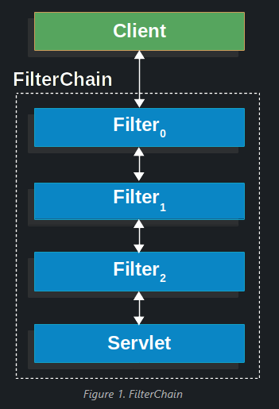

# Spring Security Architecture

아래의 문서를 번역 했다. 괄호안에 있는 문장은 나의 생각 또는 추가 정보를 의미한다.

[Spring Security Architecture](https://docs.spring.io/spring-security/reference/servlet/architecture.html)

# A Review of Filters

Spring Security의 서블릿 Filter를 베이스로 동작한다.따라서 서블릿 Filter의 기본적인 역할을 파악하는게 중요하다.

아래의 그림은 사용자의 HTTP Request가 Filter를 통과하는 모습을 보여준다.



사용자는 Request를 Application으로 보내면 컨테이너는 `Filter`와 `Servlet`을 가지고 있는 `FilterChain` 을 만든다. `Servlet`은 Request의 URI의 경로를 기반으로 동작하는 `HttpServletRequest` 를 처리하게 된다. (`ServletRequest` 인터페이스는 사용자가 보낸 정보를 Servlet이 이용할 수 있는 형태로 재정의된 형태다. `HttpServletRequest` 는 `ServletRequest` 의 구현체다. )

Spring MVC에선 `Servlet`은 `DispatcherServlet`의 인스턴스를 의미한다.

대부분의 경우 `Servlet` 은 1개의 `HttpServletRequest` 와 `HttpServletResponse` 를 처리한다. 하지만 아래와 같은 경우 1개 이상의 `Filter` 가 필요한 경우도 있다.

- 하위 `Filter` 나 `Servlet` 가 작동하는것을 사전에 막기위한 용도. 이 경우에는 보통 `Filter` 가 `HttpServletResponse` 를 작성하게 된다.
- `HttpServletRequest` 와 `HttpServletResponse` 를 하위 `Filter` 나 `Servlet` 을 위해 수정해야하는 경우.

```java
public void doFilter(ServletRequest request, ServletResponse response, FilterChain chain) {
		// do something before the rest of the application
    chain.doFilter(request, response); // invoke the rest of the application
    // do something after the rest of the application
}
```

`Filter` 는 오직 하위의 `Filter` 와 `Servlet` 에 영향을 끼치기 때문에 `Filter` 의 순서를 신중하게 정해야한다.

# **DelegatingFilterProxy**

Spring은 `Filter` 의 구현체인 `DelegatingFilterProxy` 를 제공한다.


`DelegatingFilterProxy` 는 서블릿 컨테이너의 라이프사이클과 Spring의 `ApplicationContext` ( Spring의 Bean Container) 를 연결하는 역할을 한다.

서블릿 컨테이너에는 표준에 부합하는 `Filter` 들을 등록할 수 있으며, 표준에 부합하지 못하는 Spring의 Bean은 인식하지 못한다.

`DelegatingFilterProxy` 는 이런 Spring Bean형태의 Filter를 서블릿 컨테이너에서 사용할 수 있도록 해준다. (Bean Filter의 인스턴스를 Delegate라고 부른다)


`DelegatingFilterProxy` 는 `ApplicationContext`에 있는 Bean Filter0을 실행 시킬수 있다.

`DelegatingFilterProxy` 를 사용하는 슈도 코드를 아래와 같이 작성할 수 있다.

```java
public void doFilter(ServletRequest request, ServletResponse response, FilterChain chain) {
	// Lazily get Filter that was registered as a Spring Bean
	// For the example in DelegatingFilterProxy
  // delegate는 Filter0 의 인스턴스.
	Filter delegate = getFilterBean(someBeanName);
  // Spring Bean인 Filter0이 필터작업을 수행한다.
	delegate.doFilter(request, response);
}
```

`DelegatingFilterProxy` 를 사용함으로써 얻을 수 있는 또다른 장점은 `Filter` Bean 인스턴스를 찾는 작업을 지연(delaying)할 수 있다는 점이다. 이 부분이 꽤 중요한데 컨테이너를 시작하기 전에 `Filter` 인스턴스를 등록하는 작업을 수행하기 때문이다. 하지만 Spring은 일반적으로 Spring Bean을 Load할때 `ContextLoaderListener` 를 사용하는데 `ContextLoaderListener` 는 `Filter` 인스턴스가 등록되기전까지도 Bean을 Load하지 않을 수 있다. ( DelegatingFilterProxy 내부에 어떤 Filter Bean을 쓸지를 Runtime시까지 미룰 수 있게 된다는 뜻!! )

# FilterChainProxy

Servlet 방식을 지원하는 Spring Security는 `FilterChainProxy` 를 포함하고 있다. `FilterChainProxy` 는 Spring Security에 의해 제공되는 특별한 Filter이다. `FilterChainProxy` 는 `SecurityFilterChain` 을 통해서 다수의 `Filter` 를 제공할 수 있다.

`FilterChainProxy` 도 하나의 Filter Bean이기 때문에 `DelegatingFilterProxy` 에 포함되어 있다.


# **SecurityFilterChain**

`FilterChainProxy` 는 `SecurityFilterChain` 를 통해 Spring Security에서 사용하는 Filter가 무엇인지 찾을 수 있다.


`SecurityFilterChain` 에 있는 `Security Filter` 는 Bean이며 `DelegatingFilterProxy` 가 아닌 `FilterChainProxy` 에 등록된다. `FilterChainProxy` 는 서블릿 컨테이너 또는 `DelegatingFilterProxy` 에 직접 등록됨으로써 몇가지 장점을 제공하게 된다.

첫째, Spring Security와 관련된 필터가 한곳에 모여있기 때문에 시작접을 손쉽게 찾을 수 있다. 만약 Spring Security와 관련해서 에러가 발생한다면 `FilterChainProxy` 시작부분에 Break Point를 세팅하고 디버깅을 시작하면 된다.

둘째, `FilterChainProxy` 는 Spring Security를 사용하는데 있어 핵심이며, 선택사항이 아닌 작업들을 실행해준다. (필수적인 작업들을 알아서 대신 해준다는 뜻으로 이해함.)

예로 메모리 누수를 방지하기 위해 `SecurityContext` 를 비워준다거나, 일반적인 보안 공격에 대비하기 위해 Spring Security의 `HttpFirewall` 을 적용하는 등의 동작을 대신해준다.

추가로, `FilterChainProxy` 는 유연한 방식으로 언제 `SecurityFilterChain` 를 실행시킬지 결정할 수 있다. 서블릿 컨테이너에서, `Filter` 는 URL 기반으로 동작하게 되지만 `FilterChainProxy` 는 `RequestMatcher` 를 활용해서 `HttpServletRequest` 기반으로 `Filter`를 동작시킬 수 있다.

`FilterChainProxy` 는 어떤 `SecurityFilterChain` 를 실행시킬지 결정할 수 있다. 이 기능을 통해서 하나의 어플리케이션을 분리해서 보안에 대한 설정을 부여할 수 있게된다.


위는 Multiple `SecurityFilterChain` 를 사용한 모습이며, 사용자의 Request에 따라 어떤 `SecurityFilterChain` 을 사용할지 결정할 수 있다.

만약, `/api/message` 라는 Request를 처리한다면, 0번째 `SecurityFilterChain` 만 실행되며 N번째 `SecurityFilterChain` 는 패턴 조건을 만족하지만 실행되지 않는다. (첫번째로 매칭되는 `SecurityFilterChain` 만 실행됨)

만약 URL이 `/messages/` 라면 0번째 `SecurityFilterChain` 는 작동하지 않으며, 패턴을 만족하는 `SecurityFilterChain` 을 찾기위해서 순차적으로 탐색을 계속한다. 위 그림에서 N번째 `SecurityFilterChain` 이전에 패턴을 만족하는 `SecurityFilterChain` 가 없다면 N번째 `SecurityFilterChain` 가 실행될것이다.

위 그림에서 잘 보면 0번 `SecurityFilterChain` 에는 3개의 `Security Filter` 가 있고 N번째 `SecurityFilterChain` 에는 4개의 `Security Filter` 가 있다. 이뜻은 각 `SecurityFilterChain` 마다 독립된 `Security Filter` 를 적용할 수 있음을 뜻한다. 어떤 경우는 0개의 `Security Filter` 를 적용할 수도 있다.

# **Security Filters**

지금까지 내용을 보면 `Security Filter` 은 `SecurityFilterChain` 내에 존재하게 되며`SecurityFilterChain` 은 `FilterChainProxy` 에 의해 관리된다. 여기서 `Security Filter` 의 순서가 중요하게 작용한다. 일반적으로 Spring Security의 `Filter` 의 순서에 대해 학습할 필요는 없으나, 알아두면 나쁠건 없다.

아래는 Spring Security에서 사용하는 Filter의 순서다.

- [ForceEagerSessionCreationFilter](https://docs.spring.io/spring-security/reference/servlet/authentication/session-management.html#session-mgmt-force-session-creation)
- ChannelProcessingFilter
- WebAsyncManagerIntegrationFilter
- SecurityContextPersistenceFilter
- HeaderWriterFilter
- CorsFilter
- CsrfFilter
- LogoutFilter
- OAuth2AuthorizationRequestRedirectFilter
- Saml2WebSsoAuthenticationRequestFilter
- X509AuthenticationFilter
- AbstractPreAuthenticatedProcessingFilter
- CasAuthenticationFilter
- OAuth2LoginAuthenticationFilter
- Saml2WebSsoAuthenticationFilter
- [UsernamePasswordAuthenticationFilter](https://docs.spring.io/spring-security/reference/servlet/authentication/passwords/form.html#servlet-authentication-usernamepasswordauthenticationfilter)
- OpenIDAuthenticationFilter
- DefaultLoginPageGeneratingFilter
- DefaultLogoutPageGeneratingFilter
- ConcurrentSessionFilter
- [DigestAuthenticationFilter](https://docs.spring.io/spring-security/reference/servlet/authentication/passwords/digest.html#servlet-authentication-digest)
- BearerTokenAuthenticationFilter
- [BasicAuthenticationFilter](https://docs.spring.io/spring-security/reference/servlet/authentication/passwords/basic.html#servlet-authentication-basic)
- RequestCacheAwareFilter
- SecurityContextHolderAwareRequestFilter
- JaasApiIntegrationFilter
- RememberMeAuthenticationFilter
- AnonymousAuthenticationFilter
- OAuth2AuthorizationCodeGrantFilter
- SessionManagementFilter
- [ExceptionTranslationFilter](https://docs.spring.io/spring-security/reference/servlet/architecture.html#servlet-exceptiontranslationfilter)
- [FilterSecurityInterceptor](https://docs.spring.io/spring-security/reference/servlet/authorization/authorize-requests.html#servlet-authorization-filtersecurityinterceptor)
- SwitchUserFilter
