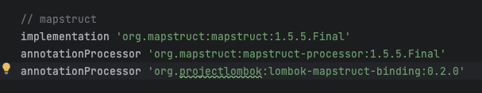

# Spring에서 Mapstruct 의존성 추가시 주의사항

mapsturct를 통한 객체간 매핑을 할때 Lombok 어노테이션을 사용하면 어노테이션을 무시한채 매핑을 시도한다. 이 문제를 해결하기 위해 `org.projectlombok:lombok-mapstruct-binding` 의존성을 추가로 지정해줘야 한다.

# Mapping을 위한 최소한 세팅

Source 객체에는 Getter 메소드만 있으면 된다.

Target 객체에는 전체 필드 생성자 또는 Builder, Setter와 같이 값 세팅을 위한 메소드가 있어야한다.