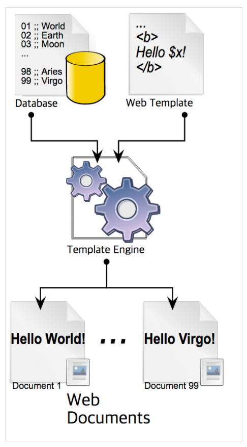

**템플릿 양식**과 **데이터 모델에 따른 입력**을 합성하여 결과문서를 출력하게 해주는 소프트웨어

웹 템플릿 엔진은 결과 문서로 웹문서가 출력된다. 

웹 템플릿에 ${x} 같은 식으로 작성해두고, 데이터와 함께 템플릿 엔진에 넣으면 ${x}에 적절한 값이 매핑되면서 화면을 만들어 낸다. 

참고 사이트

[[Template Engine] 템플릿 엔진(Template Engine)이란 - Heee's Development Blog](https://gmlwjd9405.github.io/2018/12/21/template-engine.html)
