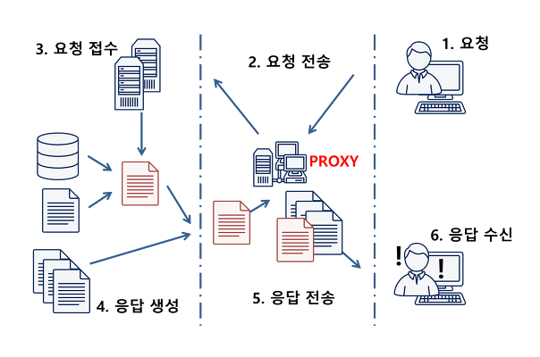
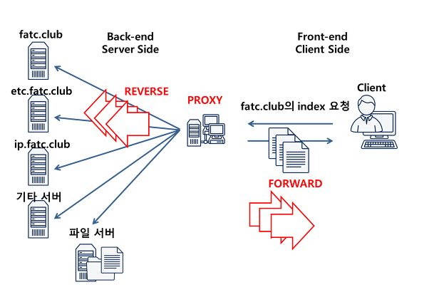

- 사용자와 WAS 간에 Proxy Server를 둚으로써 WAS가 중복된 처리를 하지 않도록 캐싱 역할을 수행한다.
- 우리가 일반적으로 알고 있는 Proxy Server는 Forward Proxy이다. 두 용어를 혼용해서 쓴다.

- 서버단에 다수의 WAS가 있는 경우 Proxy 서버는 사용할 서버를 선택하게 되는데 이를 Backward Proxy라고 한다.
- 주로 도메인 주소를 통해 구분한다.
- 하나의 Proxy Server가 Forward , Backward를 모두 다 할 수 있다.

