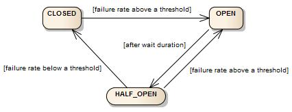

# Resilience4j Circuit Breaker

# 기본 개념

- 서킷 브레이커는 `CLOSED, OPEN, HALF_OPEN` 3가지의 상태를 가진다
- 여기에 2개의 특수한 상태인 `DISABLED, FORCED_OPEN` 이 있다.

- 서킷 브레이커는 Sliding window를 통해 호출 횟수를 저장 또는 집계한다.
- count-based 방식과 time-based 방식을 제공한다.
- count-based 방식은 가장 최근 N번의 호출 횟수를 집계한다.
- time-based 방식은 가장 최근 N초의 호출 횟수를 집계한다.

# **Count-based sliding window**

- Count-based sliding window는 N사이즈의 원형 배열로 구현된다.
- sliding window의 사이즈가 10이라면 원형 배열은 항상 10개의 측정값을 가지고 있다.
- 새로운 요청을 수행할때마다 집합을 수정한다.
- 가장 오래된 측정값이 퇴출된다.

# **Time-based sliding window**

- Time-based sliding window는 N개의 부분 원형 배열로 이뤄진다.
- window size가 10이라면 10개의 부분 원형 배열을 가지게 된다.
- 부분 원형 배열을 bucket이라고 한다.
- 각 bucket은 특정 epoch 초 내에 발생한 모든 요청들을 집계한다.
- 헤드 bucket은 현재 epoch초를 저장하고 있다. (=가장 최신정보를 저장한다. )
- 그외 bucket은 헤드 bucket 이전의 시간에서 발생한 호출 정보를 저장한다.
- 가장 오래된 bucket이 퇴출된다.
- bucket은 `실패 요청 수` , `느린(slow) 요청 수` , `전체 요청 수` 를 기록하고 있다.
- `모든 요청에 대한 전체 시간`을 기록하고 있다.

# **Failure rate and slow call rate thresholds**

- 실패 측정값이 설정한 threshold과 같거나 크면 서킷 브레이커의 상태는 CLOSED에서 OPEN 상태가 된다. (예. 측정된 요청값중 50%가 실패하는 경우)
- 모든 Exception은 실패로 간주된다. (디폴트 설정)
- 사용자는 어떤 Exception을 실패로 간주할지 설정할 수 있다.

- 느린 호출의 비율이 설정한 threshold보다 크거나, 같으면 서킷 브레이커의 상태는 CLOSED에서 OPEN으로 변경된다. ( 예. 측정된 요청의 값들 중 50%가 5초를 넘는경우 )
- 응답속도가 늦은 외부 시스템에 대한 로딩을 줄일 수 있다. (자체적인 대기 시간을 설정하기 때문.)
- 최소 측정 숫자를 지정하면 해당 숫자만큼 호출을 받기전까진 실패 측정을 하지 않는다.
- 최소 측정 숫자를 10으로 했다면 9개의 실패 요청이 들어오더라도 그때까지 서킷 브레이커는 아무 작업도 하지 않는다.

- 서킷 브레이커가 OPEN 상태일때 `CallNotPermittedException`을 사용해서 요청을 거부할 수 있다.
- 대기 시간이 경과하면 CircuitBreaker 상태가 OPEN에서 HALF_OPEN으로 변경되고 백엔드를 여전히 사용할 수 없거나 다시 사용할 수 있게 되었는지 확인하기 위한 구성 가능한 호출 수를 허용합니다.
- 승인된 요청이 완료되기 전까진 추가적인 요청은 `CallNotPermittedException` 에 의해 차단된다.
- 실패 비율, 느린 요청 비율이 threshold보다 같거나 크면 상태는 다시 OPEN으로 변경된다.
- 그 반대의 경우 CLOSED 상태로 변경된다.

- 서킷 브레이커는 2개의 특수한 상태를 더 제공한다.
- DISABLED는 모든 접근을 허용한다.
- FORCED_OPEN은 모든 접근을 차단한다.
- 이 2개의 상태를 벗어나는 방법은 상태 전환 트리거를 사용하거나, 서킷 브레이커를 리셋하는 방법뿐이다. ( 앞서 봤던 상태와 달리 특정 로직에 의해 살아나는 상태가 아님! )

# **configure a CircuitBreaker**

### slidingWindowType

- 기본값은 COUNT_BASED이다.
- COUNT_BASED,TIME_BASED를 사용하면 경우 `slidingWindowSize` 만큼의 요청을 집계하며, threshold를 만족하는지 검사한다.

### slidingWindowSize

- 기본값은 100이다.
- 서킷 브레이커가 CLOSED 상태일때, 집계할 요청의 개수를 뜻한다.

### slowCallDurationThreshold

- 기본값은 60000 [ms]이다. (60초)
- 느린 요청을 나누는 기준이 되는 값이다.

### minimumNumberOfCalls

- 기본값은 100이다.
- 서킷 브레이커 상태 검사를 위한 최소한의 요청 개수를 뜻한다.

### failureRateThreshold

- 기본값은 50이다.
- 실패 비율을 나타낸다. 만약 집계한 요청 100개 중 50개 이상이 실패라면 (50%이상) 서킷브레이커를 OPEN상태로 바꾼다.

### automaticTransitionFromOpenToHalfOpenEnabled

- 기본값은 false이다.
- true로 세팅하면, 서킷브레이커가 자동으로 OPEN 상태에서 HALF_OPEN 상태로 변경되며 이 과정에서 트리거를 위한 어떤 요청도 필요하지 않는다.
-

# 참고사이트

[CircuitBreaker](https://resilience4j.readme.io/docs/circuitbreaker)
